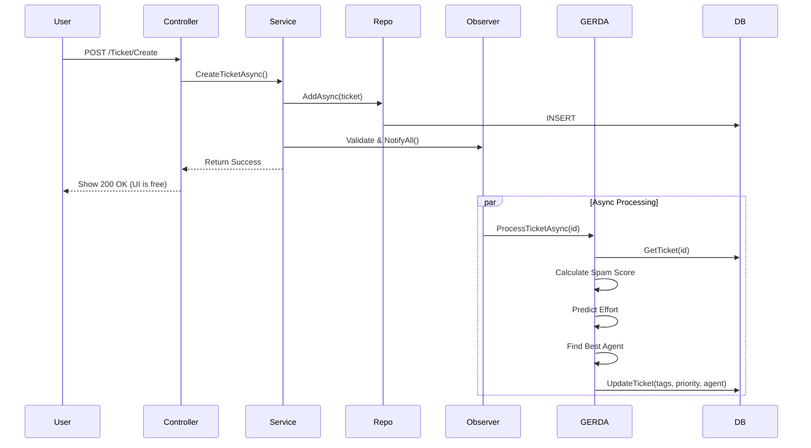

# Gedetailleerde Architectuur & Design Beslissingen - Ticket Masala

**Versie:** 1.1 (Uitgebreid)  
**Datum:** 5 december 2025  
**Auteur:** Architect Agent  
**Status:** Living Document  

---

## 1. Executive Summary & Architecturale Visie

Ticket Masala is ontworpen als een **Modulaire Monoliet** die specifiek gericht is op de **Privésector** (Enterprise & KMO's). De kernfilosofie is "Operational Excellence through AI Augmentation". Dit betekent dat we geen AI bouwen om mensen te vervangen, maar om menselijke bottlenecks (dispatching, triage, forecasting) te elimineren.

### Waarom deze architectuur?
In tegenstelling tot microservices (die operationele complexiteit toevoegen) of een klassieke "Dirty Monolith" (waar alles aan elkaar hangt), kiezen we voor een structuur waarbij modules logisch gescheiden zijn maar fysiek samen worden gedeployed.

*   **Complexiteit:** Laag houden. Snel up-and-running voor bedrijven.
*   **Privacy:** Bedrijfsgevoelige data verlaat nooit de server (On-Premise AI).
*   **Onderhoudbaarheid:** Duidelijke scheiding tussen "Domme" UI en "Slimme" Service Layer.

---

## 2. Architecturale Drivers (De "Waarom" vragen)

### 2.1 Waarom Lokale ML.NET en geen OpenAI/Azure AI?
Dit is de belangrijkste architecturale beslissing.
*   **Privacy (GDPR & IP):** Bedrijven willen hun interne support tickets en klantdata vaak niet naar publieke cloud API's sturen. ML.NET draait in-process. Data verlaat het geheugen niet.
*   **Kosten:** Geen per-token kosten. Voorspelbaar budget.
*   **Snelheid:** Geen netwerk latency. Voorspellingen in milliseconden.
*   **Onafhankelijkheid:** Geen vendor lock-in.

### 2.2 Waarom het Repository Pattern?
Hoewel EF Core al een abstractie is, gebruiken we repositories (`ITicketRepository`) om:
*   **Testbaarheid:** We kunnen de database mocken in unit tests.
*   **Query Centralisatie:** Complexe LINQ queries staan op één plek.
*   **Switchability:** Mogelijkheid om data naar een andere store te verplaatsen.

### 2.3 Waarom Observer Pattern voor AI (GERDA)?
We willen niet dat het aanmaken van een ticket traag wordt omdat de AI aan het nadenken is.
*   **Ontkoppeling:** `TicketService` hoeft niet te weten dat GERDA bestaat.
*   **Asynchronous Processing:** De User Interface blijft responsief ("Fire and Forget").
*   **Extensibility:** Makkelijk nieuwe observers toevoegen.

---

## 3. Layer-by-Layer Deep Dive

### 3.1 Presentation Layer (`/Controllers`, `/Views`)
*   **Rol:** Puur faciliteren van HTTP interactie.
*   **Regel:** Controllers mogen **GEEN** business logica bevatten.
*   **ViewModels:** We gebruiken specifieke ViewModels (bv. `TicketDetailViewModel`) en geen Domain Models in de Views.

### 3.2 Application Layer (`/Services`)
Dit is het hart van de applicatie.
*   **Orchestration:** Services roepen repositories aan, valideren regels, en sturen events.
*   **Voorbeeld:** `TicketService.CreateTicketAsync` doet:
    1.  Validatie
    2.  Repository save
    3.  Notify Observers (waardoor GERDA start)

### 3.3 Domain Layer (`/Models`)
Hier definiëren we de "waarheid".
*   **Anemic vs Rich:** Momenteel leunt het model naar "Anemic".

### 3.4 Infrastructure Layer (`/Data`, `/Repositories`)
*   **Database Agnostic:** SQLite in productie (Fly.io) en SQL Server in development.

---

## 4. GERDA AI Subsystem (Deep Dive)

GERDA is geen enkele class, maar een samenwerking van 5 gespecialiseerde modules.

### 4.1 Grouping (Spam & Cluster Detectie)
*   **Techniek:** K-Means Clustering (ML.NET).
*   **Implementatie:** `GroupingService`.
*   **Logica:**
    1.  Pak laatste 100 tickets.
    2.  Featurize tekst (Hashing).
    3.  Zoek clusters met kleine afstand.
    4.  Als cluster > 5 tickets van dezelfde auteur in < 1 uur -> **SPAM ALERT**.

### 4.2 Estimating (Inspanningsschatting)
*   **Techniek:** Multi-class Classificatie (SDCA Maximum Entropy).
*   **Implementatie:** `EstimatingService`.
*   **Training:** Leert van historische tickets waar `EstimatedEffortPoints` handmatig is ingevuld.

### 4.3 Ranking (Prioritering)
*   **Techniek:** WSJF (Weighted Shortest Job First).
*   **Formule:** `Score = Cost of Delay / Job Size`.
*   **Implementatie:** `RankingService`.
*   **Doel:** Objectieve prioritering voor maximale business value.

### 4.4 Dispatching (Toewijzing)
*   **Techniek:** Matrix Factorization (Recommendation Engine).
*   **Implementatie:** `DispatchingService`.
*   **Logica:**
    *   Input: User-Ticket interactie historie.
    *   Output: Score (0.0 - 1.0) hoe goed een Agent bij een Ticket past.
    *   Factoren: Auteur historie, Ticket Type specialisatie, Huidige Workload.
    *   *Constraint:* Wijs niet toe als Agent Workload > MaxCapacity.

### 4.5 Anticipation (Forecasting)
*   **Techniek:** Time Series SSA (Singular Spectrum Analysis).
*   **Implementatie:** `AnticipationService`.
*   **Horizon:** 30 dagen vooruit.
*   **Use Case:** Resource planning. Als de forecast voorspelt "volgende week +40% tickets", krijgt de manager nu een alert.

---

## 5. Data Flow Diagrammen

### 5.1 Ticket Creation & AI Enrichment Flow

---

## 6. Security & Compliance Implementatie

### 6.1 Authenticatie
We gebruiken **ASP.NET Core Identity**.
*   **Kosten:** Gratis inbegrepen.
*   **Simpelheid:** Geen externe dependency.
*   **Controle:** We bezitten de user tabel.

### 6.2 Autorisatie (RBAC)
We gebruiken **Role-Based Access Control**.
*   `[Authorize(Roles = "Admin")]` -> Harde eis.
*   **Multi-tenancy Lite:** Data isolatie per Department/Tenant. Cruciaal voor SaaS-gebruik of afdelingsscheiding.

### 6.3 Audit Trail
Alle kritieke acties (Create, Update, Delete, Login) worden gelogd via de `IAuditService`.
*   Implementatie: `.xml` files of Database tabel (`AuditLogs`).
*   Inhoud: `Who`, `What`, `When`, `OldValue`, `NewValue`.
*   **Compliance:** Noodzakelijk voor audits (ISO, SOC2).

---

## 7. Deploy & Operations Strategie

### 7.1 Docker & Fly.io
De applicatie is container-ready.
*   `Dockerfile`: Multi-stage build.
*   `fly.toml`: Configuratie voor cloud deployment.
*   **Volume Mounts:** Persistent storage voor DB en files.

### 7.2 Configuratie Management
`masala_config.json` is een sleutelcomponent.
*   Hierin staan de "Business Rules" (bv. SLA days = 7).
*   Dit stelt beheerders in staat om regels aan te passen zonder nieuwe release.

---

## 8. Toekomstige Roadmap & Bottlenecks

### 8.1 Huidige Bottlenecks
1.  **Database Locking:** SQLite is prima voor kleine deployments, maar voor grotere scale-ups is migratie naar SQL Server of PostgreSQL nodig.
2.  **Memory Usage:** ML.NET modellen groeien mee met de data.

### 8.2 Refactoring Kandidaten
1.  **CQRS:** Splitsen van Read en Write modellen voor performance.
2.  **Hangfire:** Robuustere background job processing.

---

## 9. Code Walkthrough voor Ontwikkelaars

### Waar begin ik?
1.  **`Program.cs`**: Bekijk de DI container opbouw.
2.  **`Data/DbSeeder.cs`**: Begrijp het datamodel via testdata.
3.  **`Services/TicketService.cs`**: Kernlogica.
4.  **`Services/GERDA/GerdaService.cs`**: AI Hub.

### Debugging Tips
*   **AI werkt niet?** Check logs op "Insufficient training data".
*   **Login faalt?** Check `DbSeeder` logs.
*   **Uploads werken niet?** Check schrijfrechten.

---

*Einde documentatie. Voor vragen, contacteer de Lead Architect.*
