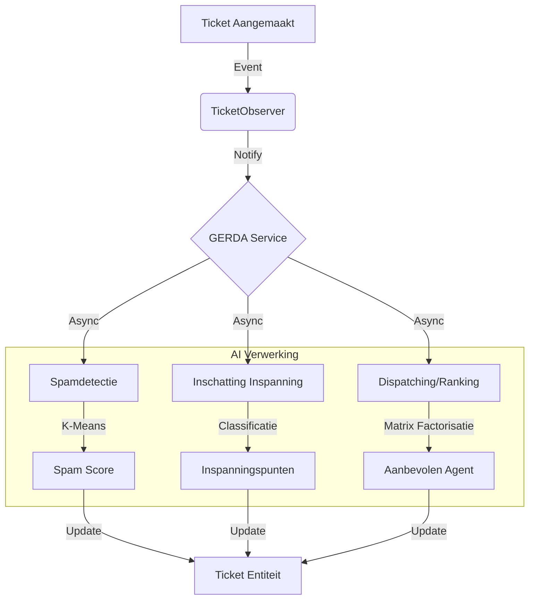
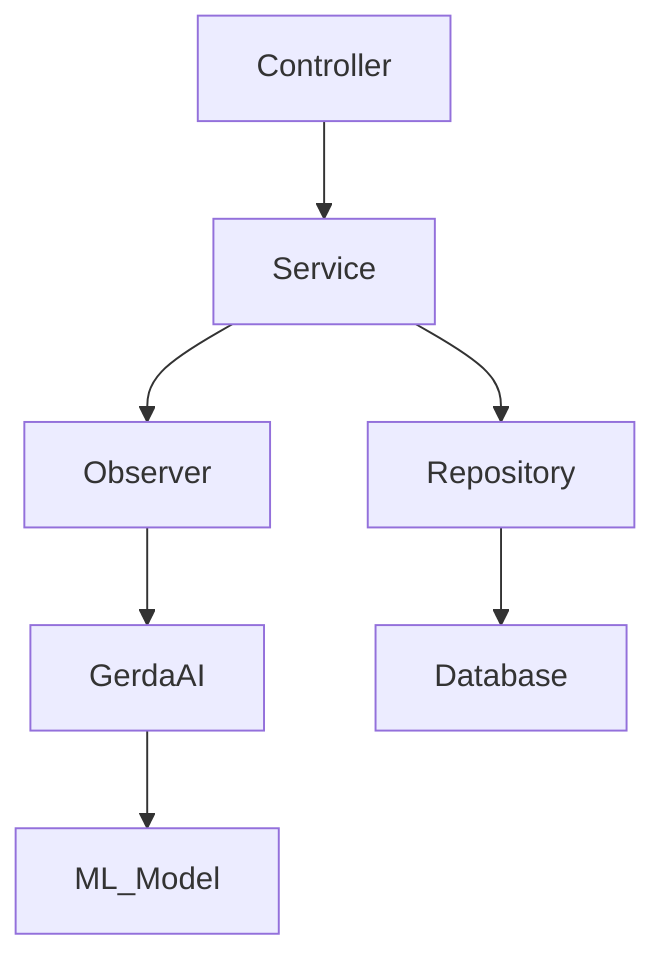

# Architectuur Overzicht - Ticket Masala

**Versie:** 1.0  
**Datum:** 2025-12-05  
**Auteur:** Architect Agent

---

## 1. Architectuur op Hoog Niveau
Ticket Masala volgt een **Gelaagde Architectuur (Layered Architecture)** patroon met een sterke focus op **Domain-Driven Design (DDD)** principes en **AI Integratie** als een overkoepelend aspect.

### Kernlagen (Core Layers)
1.  **Presentatielaag (Web)**: ASP.NET Core MVC (Controllers, Views, ViewModels). Behandelt gebruikersinteractie en rendering.
2.  **Applicatielaag (Services)**: Bedrijfslogica orkestratie (TicketService, ProjectService). Coördineert tussen de UI en Datalagen.
3.  **Domeinlaag (Models)**: Kern bedrijfsentiteiten (Ticket, Project, Customer, Employee). Regels en datastructuren.
4.  **Infrastructuurlaag (Data/Repositories)**: Data toegang (EF Core), Externe Integraties (Bestandssysteem, potentiële API's).

### Overkoepelende Applicatieonderdelen (Cross-Cutting Concerns)
-   **GERDA AI**: Een intelligente servicelaag die domeingebeurtenissen observeert (bv. TicketCreated) en asynchrone verwerking uitvoert (Spamdetectie, Dispatching, Forecasting).
-   **Identiteit & Authenticatie**: Rol-gebaseerde beveiliging (Admin, Employee, Customer) die door alle lagen heen werkt.

---

## 2. GERDA AI Integratie
GERDA (Groups, Estimates, Ranks, Dispatches, Anticipates) is geïntegreerd via het **Observer Pattern**.

### Belangrijkste Componenten:
-   **Observer**: Ontkoppelt de kern ticketing logica van de AI verwerking. `TicketService` hoeft niet te weten *hoe* de AI werkt, alleen dat het waarnemers (observers) moet informeren.
-   **ML.NET**: Gebruikt voor on-device machine learning (Forecasting, Classificatie) om privacy te waarborgen (geen data verlaat de server).
-   **Background Queue**: Zware AI taken worden verplaatst naar achtergrondprocessen om de UI responsief te houden.

---

## 3. Data Flow & Afhankelijkheden

### Ticket Levenscyclus Flow
1.  **Invoer**: Gebruiker (via Web) of Systeem (via Email/API) maakt een Ticket aan.
2.  **Opslag**: `EfCoreTicketRepository` slaat de initiële staat op.
3.  **Observatie**: `GerdaTicketObserver` onderschept het aanmaak event.
4.  **Verrijking**: GERDA AI analyseert tekst, voorspelt metadata (Type, Prioriteit).
5.  **Dispatching**: AI berekent Agent Affiniteitsscores en beveelt toewijzing aan.
6.  **Oplossing**: Agent werkt aan ticket, logt tijd/opmerkingen. Review workflow lus indien nodig.

### Afhankelijkheidskaart (Dependency Map)

---

## 4. Technische Beperkingen & Beslissingen
-   **Monolithic First**: Bewust ontworpen als een modulaire monoliet om deployment (Docker/Fly.io) en onderhoud voor de doelklant (Privésector) te vereenvoudigen.
-   **Lokale AI**: ML.NET gekozen boven Cloud API's (OpenAI) om strikt te voldoen aan GDPR/Privacy eisen en terugkerende kosten te elimineren.
-   **Configuratie-Gedreven**: Kritieke gedragingen (Spam drempelwaardes, SLA definities) worden beheerd via `masala_config.json`, wat runtime aanpassingen mogelijk maakt zonder code deployment.

---

## 5. Toekomstige Schaalbaarheid
-   **Verticale Schaling**: De huidige architectuur ondersteunt het opschalen van de enkele instantie.
-   **Horizontale Schaling**: 
    -   **Sessie Status**: Vereist Redis voor gedistribueerde sessies als meerdere web nodes worden gebruikt.
    -   **Achtergrondtaken**: Momenteel in-memory. Voor schaalbaarheid, verplaatsen naar Hangfire/Quartz met persistente opslag.
    -   **Database**: SQL Server is de bottleneck; overweeg 'Read Replicas' voor rapportage (Qlik integratie).
