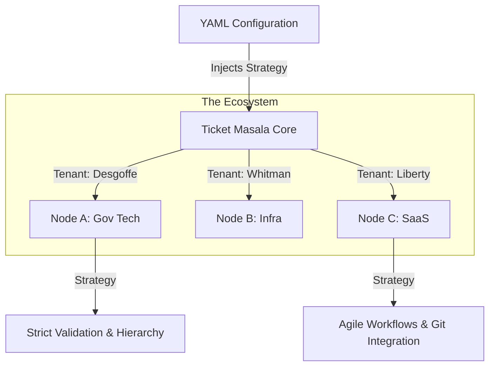

# Ticket Masala


> **"One Core. Infinite Skins."**
>
> A polymorphic workflow engine that adapts its business logic, security constraints, and UI to the domain it serves—from strict government bureaucracy to agile software development.


---

## The Concept

Ticket Masala is not just a ticketing system; it is a **Configuration-Driven Multi-Instance Platform**.

Instead of building separate applications for different departments (HR, IT, Government), Ticket Masala uses a single **Modular Monolith** core that injects different "Personalities" at runtime.

### Architecture

The system supports **Physical Isolation** (for security) and **Logical Partitioning** (for efficiency).



---

## Key Features

### 1. Polymorphic Workflow Engine

The system behaves differently based on the active domain:

* **Government Mode (Desgoffe):** Enforces strict hierarchy, formal language, and bureaucratic steps (e.g., "Mayor's Stamp" approval).
* **Tech Mode (Liberty):** Enables agile workflows, git-style commits, and rapid iteration.

### 2. GERDA (Heuristic Inference Engine)

*Not just a chatbot.* GERDA is an embedded heuristic agent that:

* **Triages Tickets:** Analyzes sentiment and complexity to route tickets to the correct "Hemisphere" (e.g., Support vs. DevOps).
* **Estimates Effort:** Uses historical data to predict resolution time.
* **Enforces Compliance:** Automatically flags requests that violate domain-specific rules (e.g., GDPR violations in the Tax domain).

### 3. Data Sovereignty & Security

* **Federated Deployment:** Supports air-gapped deployment for high-security environments.
* **SQLite WAL Mode:** Optimized for single-file deployment with high concurrent read performance.
* **Role-Based Access Control (RBAC):** Granular permissions down to the field level.

---

## Technology Stack

* **Core:** .NET 10
* **Web Framework:** ASP.NET Core MVC with **HTMX** for high-performance interactivity.
* **Database:** Entity Framework Core + SQLite (Write-Ahead Logging enabled).
* **AI/ML:** Local Heuristic Engine (GERDA).
* **Containerization:** Docker & Fly.io.

---

## Getting Started

### Prerequisites

* .NET 10.0 SDK
* Docker (Optional)

### Option 1: Local Development

No external database required. The app initializes a local SQLite instance on first run.

```bash
# Clone the repository
git clone https://github.com/garamatic/ticket-masala.git
cd ticket-masala

# Build
dotnet build

# Run (Seeds database automatically with 'Desgoffe' and 'Liberty' data)
dotnet run --project src/TicketMasala.Web/

```

Access the portal at `http://localhost:5054`.

### Option 2: Docker Composition

```bash
docker-compose up --build

```

---

## Demo Accounts (Seeded)

<details>
<summary><strong>Click to expand User List</strong></summary>

| Role | Domain | Email | Password | Context |
| --- | --- | --- | --- | --- |
| **The Bureaucrat** | Desgoffe | `gustave@desgoffe.gov` | `Admin123!` | Mayor. Can stamp permits. Strict view. |
| **The Citizen** | Desgoffe | `jean.dupont@email.com` | `Customer123!` | Can only file complaints. No dashboard. |
| **The DevOps Lead** | Liberty | `arthur@liberty.tech` | `Employee123!` | Sees PRs, Bugs, and CI/CD pipelines. |
| **The Support Rep** | Liberty | `sarah@liberty.tech` | `Employee123!` | Sees Customer Tickets and SLAs. |
| **The Foreman** | Whitman | `jack@whitman.infra` | `Employee123!` | High contrast UI. Big buttons. |

</details>

---

## 📂 Project Structure

A **Modular Monolith** designed for separation of concerns:

```
src/
├── TicketMasala.Web/
│   ├── Engine/                # THE BRAIN
│   │   ├── GERDA/             # AI & Heuristics Logic
│   │   ├── Tenants/           # Tenant Resolution Strategy
│   │   └── Workflows/         # State Machines (Gov vs Tech)
│   ├── Controllers/           # MVC Endpoints
│   └── Views/                 # Razor Pages (Polymorphic UI)
├── config/
│   ├── masala_domains.yaml    # The "Brain Transplant" Config
│   └── seed_data.json         # Mock Data

```

---

## Documentation

* **Architectural Deep Dive:** [masala-doc.fly.dev](https://masala-doc.fly.dev)
* **Live Ecosystem Demo:** [ticket-masala.fly.dev](https://ticket-masala.fly.dev)
* **Garamatic Industries (Vendor):** [garamatic-web.fly.dev](https://www.google.com/search?q=https://garamatic-web.fly.dev)

---

## The Team

**Engineered by Garamatic Industries** (Student Team):

* **Charlotte Schröer:** *Pixel Perfectionist (Frontend Architecture)*
* **Maarten Görtz:** *C# Centurion (Core Logic)*
* **Wito De Schrijver:** *Guardian of the Zeros (Security & Infra)*
* **Juan Benjumea:** *Architecture & Integration*

---

*Educational Project for Applied CS (2025-2026). Incorporates architectural patterns for Project Atom.*
