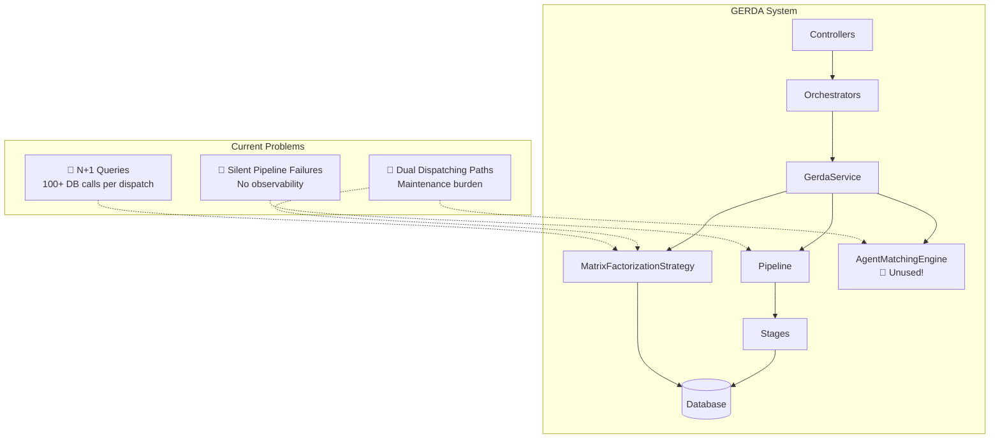
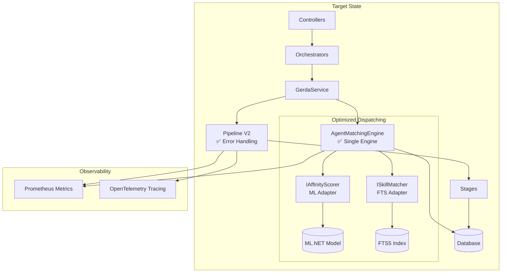
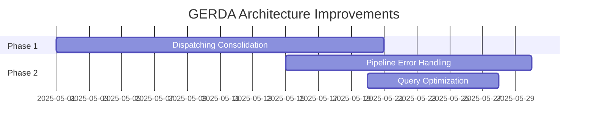

# GERDA Architecture Roadmap 2025

**Status**: Proposed  
**Last Updated**: 2025-04-27  
**Related Issues**: #7, #8, #9

---

## Executive Summary

This roadmap consolidates three architectural improvements for the GERDA AI system identified during the comprehensive code review:

| Priority | Issue | Title | Impact | Effort |
|----------|-------|-------|--------|--------|
| 🔴 High | #7 | [Dispatching Consolidation](https://github.com/Garamatic/ticket-masala/issues/7) | Maintainability | 20 days |
| 🟡 Medium | #8 | [Pipeline Error Handling](https://github.com/Garamatic/ticket-masala/issues/8) | Reliability | 15 days |
| 🟡 Medium | #9 | [Query Optimization](https://github.com/Garamatic/ticket-masala/issues/9) | Performance | 8 days |

**Total Investment**: ~43 days (can be parallelized)

---

## The Big Picture

### Current Architecture



### Target Architecture



---

## Issue #7: Dispatching Consolidation

### The Problem

Two competing implementations exist:

1. **MatrixFactorizationDispatchingStrategy** (~400 lines)
   - ML.NET Matrix Factorization
   - FTS5 skill matching
   - Multi-factor scoring
   - Directly coupled to `MasalaDbContext`

2. **AgentMatchingEngine** (~200 lines) 🔴 **UNUSED**
   - Clean, generic design
   - Configurable weights
   - Proper separation of concerns
   - Has a dead method in `DispatchingService`

### The Solution

**Adapter Pattern Consolidation**

```
┌────────────────────────────────────────────────────────────────┐
│                    AgentMatchingEngine                         │
│                    (Primary Engine)                              │
├────────────────────────────────────────────────────────────────┤
│  ┌──────────────────┐        ┌──────────────────┐              │
│  │ IAffinityScorer  │        │ ISkillMatcher    │              │
│  │                  │        │                  │              │
│  │ • MatrixFactor   │        │ • FTS5 Matcher   │              │
│  │   Scorer (ML)    │        │ • String Matcher │              │
│  │ • NullScorer     │        │ • NullMatcher    │              │
│  └──────────────────┘        └──────────────────┘              │
└────────────────────────────────────────────────────────────────┘
```

### Benefits

| Metric | Before | After |
|--------|--------|-------|
| Code paths | 2 (confusing) | 1 (clear) |
| Lines of code | ~650 | ~450 |
| Testability | Medium | High |
| Extensibility | Hard | Easy (add new scorers) |

### Implementation

See [RFC #7](https://github.com/Garamatic/ticket-masala/issues/7) for:
- 5-phase migration plan
- Interface definitions
- Backward compatibility strategy
- 20-day timeline

---

## Issue #8: Pipeline Error Handling

### The Problem

```csharp
// Current: Silent failure
foreach (var stage in _stages)
{
    try
    {
        await stage.ExecuteAsync(ticketGuid, context);
    }
    catch (Exception ex)
    {
        _logger.LogError(ex, "Stage failed...");  // ❌ Swallowed!
        // Caller never knows!
    }
}
```

**Impact**:
- Can't distinguish "disabled" from "failed"
- No way to implement circuit breakers
- Partial failures invisible to monitoring
- Downstream code makes wrong decisions

### The Solution

**PipelineResult Pattern**

```csharp
public class PipelineResult
{
    public bool IsSuccess { get; }  // True if no critical failures
    public bool HasPartialFailure { get; }  // True if some stages failed
    public IReadOnlyList<StageResult> StageResults { get; }
    public GerdaPipelineContext Context { get; }
}

public class StageResult
{
    public string StageName { get; }
    public StageStatus Status { get; }  // Completed/Failed/TimedOut/Skipped
    public bool IsCritical { get; }  // Stop pipeline on failure?
    public Exception? Error { get; }
    public TimeSpan Duration { get; }
}
```

### Per-Stage Configuration

```csharp
public class DispatchingStage : IGerdaStage
{
    public bool ContinueOnError => true;   // Dispatch failure OK, continue
    public int TimeoutMs => 10000;       // 10 second timeout
}

public class GroupingStage : IGerdaStage
{
    public bool ContinueOnError => false;  // Grouping failure critical, stop!
}
```

### Benefits

- Full visibility into stage execution
- Configurable "fail fast" vs "best effort"
- Per-stage timeouts (prevents hung pipelines)
- Rich metrics for monitoring

### Implementation

See [RFC #8](https://github.com/Garamatic/ticket-masala/issues/8) for:
- Full `PipelineResult` design
- `IGerdaStageV2` interface
- Observability integration (Prometheus, OpenTelemetry)
- Migration path (backward compatible)
- 15-day timeline

---

## Issue #9: Query Optimization

### The Problem

**N+1 Anti-Pattern** in dispatching:

```csharp
foreach (var employee in employees)  // 50 agents = 50 iterations
{
    var customer = await _context.Users.FindAsync(ticket.CreatorGuid.ToString()); // ❌ Query #3-52
    var ftsResult = await _context.Database.SqlQueryRaw<double>(...);             // ❌ Query #53-102
}
```

**Performance Impact**:
- 50 agents: **103 database queries**
- 20ms latency each: **~2 seconds total**
- User experience: Noticeable delay

### The Solution

**Batch & Parallel Strategy**

```csharp
// STEP 1: 3 queries total (parallel execution)
var (employees, customer, workloads) = await Task.WhenAll(
    _context.Users.AsNoTracking().OfType<Employee>().ToListAsync(),
    _context.Users.AsNoTracking().FirstOrDefaultAsync(u => u.Id == creatorId),
    _context.Tickets.AsNoTracking().GroupBy(...).ToDictionaryAsync(...)
);

// STEP 2: CPU-bound parallel scoring (no DB calls)
Parallel.ForEach(employees, employee =>
{
    var score = CalculateScore(employee, customer, workloads); // Pure CPU
});
```

### Expected Results

| Metric | Before | After | Improvement |
|--------|--------|-------|-------------|
| SQL Queries | 103 | 3 | **97%** |
| Total Time | ~2s | ~80ms | **96%** |
| Allocations | High | Low | **~80%** |

### Implementation

See [RFC #9](https://github.com/Garamatic/ticket-masala/issues/9) for:
- 6 optimization strategies
- Benchmark tests
- `OptimizedDispatchingStrategy` implementation
- Rollback plan with feature flags
- 8-day timeline

---

## Recommended Execution Order



### Dependency Graph

```
Dispatching Consolidation (#7)
         │
         ▼
    ┌────┴────┐
    ▼         ▼
Pipeline   Query
Error      Optimization
(#8)       (#9)
           (depends on new engine)
```

**Rationale**:
1. **Dispatching Consolidation first** - Establishes the clean architecture
2. **Pipeline Error Handling** - Can be done in parallel with consolidation
3. **Query Optimization last** - Depends on the new consolidated engine

---

## Success Metrics

### System-Level

| Metric | Current | Target | How to Measure |
|--------|---------|--------|----------------|
| Dispatch P95 latency | ~2s | <100ms | Prometheus histogram |
| Pipeline failure visibility | None | Full | Stage failure rate metric |
| Code duplication | 2 paths | 1 path | Code coverage reports |
| Database queries per dispatch | 103 | <5 | EF Core logging |

### Quality Gates

- [ ] All existing tests pass
- [ ] No regression in recommendation quality
- [ ] Performance benchmarks met
- [ ] Monitoring dashboards updated
- [ ] Documentation updated

---

## Quick Wins (While Waiting)

These can be done immediately without major refactoring:

```csharp
// 1. Add AsNoTracking() to existing queries (1 day)
var employees = await _context.Users
    .AsNoTracking()  // ✅ Add this
    .OfType<Employee>()
    .ToListAsync();

// 2. Cache customer lookup outside loop (1 day)
var customer = await _context.Users
    .AsNoTracking()
    .FirstOrDefaultAsync(u => u.Id == ticket.CreatorGuid.ToString());

foreach (var employee in employees)
{
    // Use cached customer, no query
    var score = CalculateScore(employee, customer);
}

// 3. Add database index (migration, 1 day)
migrationBuilder.CreateIndex(
    name: "IX_Tickets_ResponsibleId_Status",
    table: "Tickets",
    columns: new[] { "ResponsibleId", "TicketStatus" });
```

**Impact**: 30-40% improvement with minimal effort

---

## Appendix: Related Documentation

- [Issue #7 - Dispatching Consolidation](https://github.com/Garamatic/ticket-masala/issues/7)
- [Issue #8 - Pipeline Error Handling](https://github.com/Garamatic/ticket-masala/issues/8)
- [Issue #9 - Query Optimization](https://github.com/Garamatic/ticket-masala/issues/9)
- [GERDA Architecture Deep-Dive](docs/gerda-architecture-review.md) (original review)

---

*This roadmap is a living document. Update as work progresses.*
