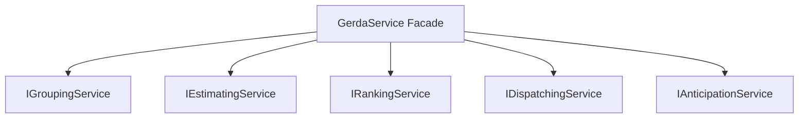
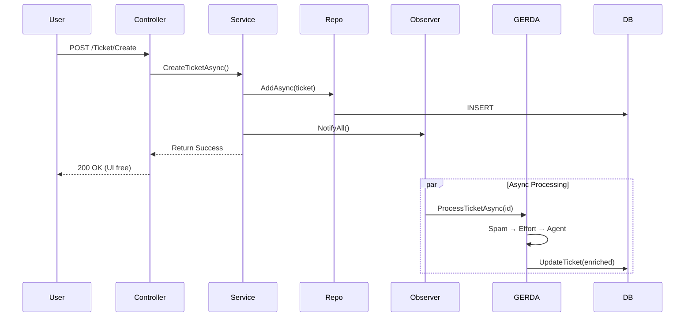
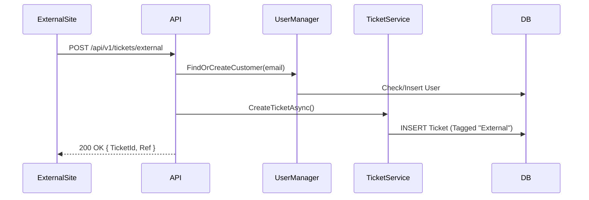

# Ticket Masala - Architecture Documentation

**Version:** 2.0  
**Date:** December 2025  
**Status:** Living Document

---

## 1. Executive Summary

Ticket Masala is a **Modular Monolith** designed for enterprise and SMB ticket management with AI augmentation. The core philosophy is **"Operational Excellence through AI Augmentation"** - using AI to eliminate human bottlenecks (dispatching, triage, forecasting) rather than replacing humans.

### Why This Architecture?

| Concern | Decision |
|---------|----------|
| **Complexity** | Modular monolith over microservices for simpler operations |
| **Privacy** | On-premise ML.NET - data never leaves the server (GDPR) |
| **Cost** | No per-token API costs, predictable budget |
| **Maintainability** | Clear separation: thin UI, smart service layer |

---

## 2. Layered Architecture

```text
┌─────────────────────────────────────────────────────────────┐
│                    Presentation Layer                        │
│              Controllers / Views / ViewModels                │
├─────────────────────────────────────────────────────────────┤
│                    Application Layer                         │
│  Services (Query/Command) │ Observers │ Factory              │
├─────────────────────────────────────────────────────────────┤
│                      Domain Layer                            │
│               Models (Ticket, Project, User)                 │
├─────────────────────────────────────────────────────────────┤
│                   Infrastructure Layer                       │
│            Repositories │ EF Core │ External APIs            │
└─────────────────────────────────────────────────────────────┘
```

### Layer Responsibilities

| Layer | Location | Role |
|-------|----------|------|
| **Presentation** | `/Controllers`, `/Views` | HTTP handling, no business logic |
| **Application** | `/Services` | Business orchestration, validation, events |
| **Domain** | `/Models` | Core entities and business rules |
| **Infrastructure** | `/Repositories`, `/Data` | Data persistence, external integrations |

---

## 3. Design Patterns

### GoF Patterns

| Pattern | Location | Purpose |
|---------|----------|---------|
| **Observer** | `Observers/` | Event-driven ticket lifecycle notifications |
| **Repository** | `Repositories/` | Abstracts data access from business logic |
| **Unit of Work** | `IUnitOfWork` | Transactional consistency across repositories |
| **Specification** | `Repositories/Specifications/` | Reusable query encapsulation |
| **Strategy** | `Services/GERDA/` | Interchangeable AI algorithms |
| **Facade** | `GerdaService` | Unified interface to 5 AI subsystems |
| **Factory** | `TicketFactory` | Consistent object creation |

### Observer Implementation

```text
ITicketObserver
├── GerdaTicketObserver       → AI processing
├── LoggingTicketObserver     → Audit logging
└── NotificationTicketObserver → User notifications
```

Events: `OnTicketCreatedAsync`, `OnTicketAssignedAsync`, `OnTicketCompletedAsync`, `OnTicketUpdatedAsync`

### Repository + Specification

| Interface | Implementation |
|-----------|---------------|
| `ITicketRepository` | `EfCoreTicketRepository` |
| `IProjectRepository` | `EfCoreProjectRepository` |
| `IUserRepository` | `EfCoreUserRepository` |
| `IUnitOfWork` | `EfCoreUnitOfWork` |

**Specifications:** `TicketsByStatusSpecification`, `UnassignedTicketsSpecification`, `OverdueTicketsSpecification`, `HighPriorityTicketsSpecification`, `PaginatedTicketsSpecification`

### GRASP Principles

| Principle | Implementation |
|-----------|---------------|
| **Information Expert** | Services own their domain logic |
| **Low Coupling** | Interface-based dependencies, DI throughout |
| **High Cohesion** | Query/Command service separation (CQRS-lite) |
| **Controller** | Thin controllers delegate to services |
| **Polymorphism** | Multiple observer implementations |
| **Pure Fabrication** | UnitOfWork, Specifications |

---

## 4. GERDA AI Subsystem

**GERDA** = Groups, Estimates, Ranks, Dispatches, Anticipates



| Module | Technique | Purpose |
|--------|-----------|---------|
| **Grouping** | K-Means Clustering | Spam & duplicate detection |
| **Estimating** | SDCA Classification | Effort prediction (points) |
| **Ranking** | WSJF Formula | Priority scoring |
| **Dispatching** | Matrix Factorization | Agent-ticket matching |
| **Anticipation** | Time Series SSA | 30-day workload forecast |

### Why Local ML.NET?

- **Privacy:** GDPR compliant - data never leaves the server
- **Cost:** No per-token API fees
- **Speed:** Millisecond predictions, no network latency
- **Independence:** No vendor lock-in

---

## 5. Data Flow

### Ticket Creation Flow



### External Ticket Submission Flow



---

## 6. Service Architecture (CQRS-lite)

```text
Controllers (thin)
    ↓
Services (business logic)
    ├── ITicketQueryService   → Read operations
    ├── ITicketCommandService → Write operations
    ├── ITicketFactory        → Object creation
    └── Observers             → Event handling
    ↓
Repositories (data access)
    ↓
Entity Framework Core
```

---

## 7. Security & Compliance

| Aspect | Implementation |
|--------|---------------|
| **Authentication** | ASP.NET Core Identity |
| **Authorization** | RBAC (Admin, Employee, Customer) |
| **Data Isolation** | Department/Tenant filtering |
| **Audit Trail** | `IAuditService` logs all CRUD operations |
| **Compliance** | ISO, SOC2 ready audit logs |

---

## 8. Deployment

| Component | Technology |
|-----------|------------|
| **Container** | Docker multi-stage build |
| **Hosting** | Fly.io with volume mounts |
| **Database** | SQLite (dev), SQL Server (scale) |
| **Config** | `masala_config.json` for runtime rules |

---

## 9. Developer Guide

### Key Entry Points

1. `Program.cs` → DI container setup
2. `Data/DbSeeder.cs` → Understand data model via test data
3. `Services/TicketService.cs` → Core business logic
4. `Services/GERDA/GerdaService.cs` → AI hub

### Adding New Features

1. Create interface in appropriate folder
2. Implement with `EfCore` prefix for data access
3. Register in `Program.cs` DI container
4. Add observers if event-driven
5. Document in this file

### Debugging Tips

- **AI not working?** Check logs for "Insufficient training data"
- **Login fails?** Check `DbSeeder` logs
- **Uploads fail?** Check write permissions on volume

---

## 10. Future Roadmap

### Current Bottlenecks

- SQLite locks under high concurrency → Migrate to SQL Server/PostgreSQL
- ML.NET memory grows with data → Consider model pruning

### Planned Improvements

- Full CQRS with separate read/write models
- Hangfire for robust background jobs
- Redis for distributed session state

---

*For questions, contact the Lead Architect.*
