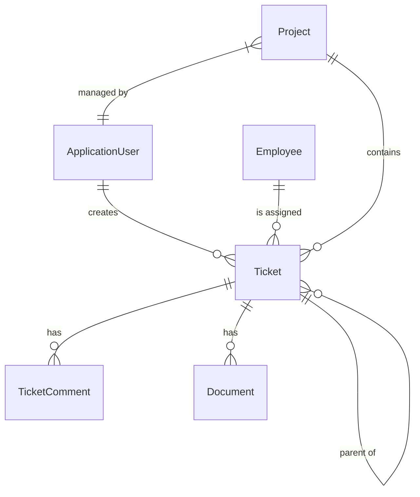

# Domain Model

Documentation for the core domain entities in Ticket Masala.

## Entity Overview



---

## Core Entities

### Ticket (Work Item)

The primary domain entity representing a unit of work.

**Location:** `TicketMasala.Domain/Entities/Ticket.cs`

```csharp
public class Ticket : BaseModel
{
    // === Core Fields ===
    public string Title { get; set; }
    public string Description { get; set; }
    public Status TicketStatus { get; set; }
    public TicketType? TicketType { get; set; }
    
    // === Dates ===
    public DateTime? CompletionTarget { get; set; }
    public DateTime? CompletionDate { get; set; }
    
    // === GERDA AI Fields ===
    public int EstimatedEffortPoints { get; set; }
    public double PriorityScore { get; set; }
    public string? GerdaTags { get; set; }
    public string? RecommendedProjectName { get; set; }
    public string? AiSummary { get; set; }
    
    // === Domain Extensibility ===
    public string DomainId { get; set; } = "IT";
    public string? WorkItemTypeCode { get; set; }
    public string CustomFieldsJson { get; set; } = "{}";
    
    // === Relationships ===
    public string? CustomerId { get; set; }
    public string? ResponsibleId { get; set; }
    public Guid? ProjectGuid { get; set; }
    public Guid? ParentTicketGuid { get; set; }
    
    // === Navigation ===
    public virtual ApplicationUser? Customer { get; set; }
    public virtual Employee? Responsible { get; set; }
    public virtual Project? Project { get; set; }
    public virtual ICollection<TicketComment> Comments { get; set; }
    public virtual ICollection<Ticket> SubTickets { get; set; }
}
```

**Key Design Decisions:**
- **Hybrid Model**: Rigid indexed columns + flexible JSON blob for custom fields
- **Domain-Aware**: `DomainId` and `WorkItemTypeCode` enable multi-domain workflows
- **AI-Ready**: GERDA fields for priority, effort, and recommendations

---

### Project (Work Container)

Groups related tickets together.

**Location:** `TicketMasala.Domain/Entities/Project.cs`

```csharp
public class Project : BaseModel
{
    public string Name { get; set; }
    public string Description { get; set; }
    public Status ProjectStatus { get; set; }
    public DateTime? CompletionTarget { get; set; }
    public DateTime? CompletionDate { get; set; }
    
    // Relationships
    public string? CustomerId { get; set; }
    public string? ProjectManagerId { get; set; }
    
    // Navigation
    public virtual ApplicationUser? Customer { get; set; }
    public virtual Employee? ProjectManager { get; set; }
    public virtual ICollection<Ticket> Tickets { get; set; }
}
```

---

### ApplicationUser

Base user entity for all system users (customers, employees, admins).

**Location:** `TicketMasala.Domain/Entities/Identity.cs`

```csharp
public class ApplicationUser : IdentityUser
{
    public string FirstName { get; set; }
    public string LastName { get; set; }
    public string Phone { get; set; }
    public string? Code { get; set; }
    
    public string FullName => $"{FirstName} {LastName}";
}
```

---

### Employee

Extends `ApplicationUser` with employee-specific properties.

```csharp
public class Employee : ApplicationUser
{
    public string? Team { get; set; }
    public EmployeeLevel Level { get; set; }
    public string? Language { get; set; }
    public List<string> Specializations { get; set; }
    public int MaxCapacityPoints { get; set; }
    public string? Region { get; set; }
    
    // Calculated properties
    public int CurrentWorkloadPoints { get; set; }
    public virtual ICollection<Ticket> AssignedTickets { get; set; }
}
```

---

## Supporting Entities

### TicketComment

```csharp
public class TicketComment : BaseModel
{
    public string Content { get; set; }
    public Guid TicketGuid { get; set; }
    public string AuthorId { get; set; }
    public bool IsInternal { get; set; }  // Hidden from customers
    
    public virtual Ticket Ticket { get; set; }
    public virtual ApplicationUser Author { get; set; }
}
```

### Document

```csharp
public class Document : BaseModel
{
    public string FileName { get; set; }
    public string ContentType { get; set; }
    public byte[] Content { get; set; }
    public Guid? TicketGuid { get; set; }
    
    public virtual Ticket? Ticket { get; set; }
}
```

### Notification

```csharp
public class Notification : BaseModel
{
    public string UserId { get; set; }
    public string Message { get; set; }
    public NotificationType Type { get; set; }
    public bool IsRead { get; set; }
    public string? Link { get; set; }
    
    public virtual ApplicationUser User { get; set; }
}
```

### DomainConfigVersion

Stores snapshots of domain configuration for ticket validation.

```csharp
public class DomainConfigVersion
{
    public int Id { get; set; }
    public string DomainId { get; set; }
    public string ConfigJson { get; set; }
    public string VersionHash { get; set; }
    public DateTime CreatedAt { get; set; }
}
```

---

## Enumerations

### Status

```csharp
public enum Status
{
    Pending,
    InProgress,
    OnHold,
    Completed,
    Cancelled
}
```

### TicketType

```csharp
public enum TicketType
{
    Issue,
    Request,
    Incident,
    Task,
    Bug
}
```

### EmployeeLevel

```csharp
public enum EmployeeLevel
{
    Support,
    ProjectManager,
    Finance,
    Admin
}
```

### NotificationType

```csharp
public enum NotificationType
{
    Info,
    Warning,
    Assignment,
    Mention,
    StatusChange
}
```

---

## BaseModel

All entities inherit from `BaseModel` for common properties.

```csharp
public abstract class BaseModel
{
    public Guid Guid { get; set; } = Guid.NewGuid();
    public DateTime CreationDate { get; set; } = DateTime.UtcNow;
    public DateTime? ModifiedDate { get; set; }
}
```

---

## Custom Fields (JSON Blob)

The `CustomFieldsJson` property stores domain-specific fields:

```json
{
  "soil_ph": 6.5,
  "sunlight_exposure": "Partial",
  "plant_species": "Rose",
  "last_watering_date": "2025-12-01"
}
```

**Accessing Custom Fields:**

```csharp
// Read
var customFields = JsonSerializer.Deserialize<Dictionary<string, JsonElement>>(
    ticket.CustomFieldsJson);

var soilPh = customFields["soil_ph"].GetDouble();

// Write
ticket.CustomFieldsJson = JsonSerializer.Serialize(new
{
    soil_ph = 7.0,
    sunlight_exposure = "Full Sun"
});
```

---

## Entity Relationships

| Entity | Relationship | Related Entity |
|--------|-------------|----------------|
| Ticket | Many-to-One | ApplicationUser (Customer) |
| Ticket | Many-to-One | Employee (Responsible) |
| Ticket | Many-to-One | Project |
| Ticket | One-to-Many | TicketComment |
| Ticket | One-to-Many | Document |
| Ticket | Self-referential | ParentTicket/SubTickets |
| Project | Many-to-One | ApplicationUser (Customer) |
| Project | Many-to-One | Employee (ProjectManager) |
| Project | One-to-Many | Ticket |

---

## EF Core Configuration

Relationships are configured in `MasalaDbContext`:

```csharp
protected override void OnModelCreating(ModelBuilder modelBuilder)
{
    modelBuilder.Entity<Ticket>(entity =>
    {
        entity.HasKey(t => t.Guid);
        
        entity.HasOne(t => t.Customer)
            .WithMany()
            .HasForeignKey(t => t.CustomerId);
            
        entity.HasOne(t => t.Responsible)
            .WithMany(e => e.AssignedTickets)
            .HasForeignKey(t => t.ResponsibleId);
            
        entity.HasOne(t => t.Project)
            .WithMany(p => p.Tickets)
            .HasForeignKey(t => t.ProjectGuid);
    });
}
```

---

## Further Reading

- [Configuration Guide](../guides/CONFIGURATION.md) - Custom field definitions
- [Detailed Architecture](DETAILED.md) - Hybrid data model design
- [Repositories](REPOSITORIES.md) - Data access patterns
