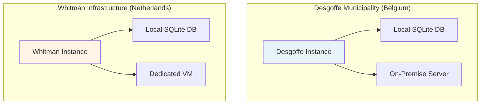
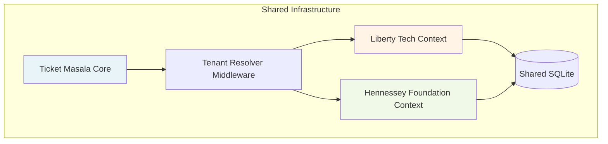

# Security & Data Sovereignty

## Overview

Ticket Masala's architecture is designed with **data sovereignty** and **security isolation** as first-class concerns. The platform supports multiple deployment strategies to meet varying regulatory and security requirements.

## Multi-Instance Strategy

### Physical Isolation (High Security)

For organizations with strict data sovereignty requirements (e.g., government agencies, healthcare), Ticket Masala supports **physically isolated deployments**:



**Characteristics:**

- **Zero Data Sharing**: Each tenant runs on completely separate infrastructure
- **Air-Gapped Deployment**: No network connectivity between instances
- **Regulatory Compliance**: Meets GDPR Article 44 (data localization)
- **Custom Security Policies**: Each instance can enforce domain-specific rules

### Logical Partitioning (Efficiency)

For organizations prioritizing cost efficiency while maintaining separation:



**Characteristics:**

- **Tenant Isolation**: Row-level security via `TenantId` foreign keys
- **Shared Resources**: Single database, single application instance
- **Cost Efficient**: Reduced infrastructure overhead
- **Bounded Contexts**: Domain-Driven Design ensures logical separation

## Security Features

### Authentication & Authorization

- **ASP.NET Core Identity**: Industry-standard authentication
- **Role-Based Access Control (RBAC)**: Granular permissions per tenant
- **Domain-Specific Roles**: Configurable via `masala_domains.yaml`

### Data Protection

- **SQLite WAL Mode**: Write-Ahead Logging for concurrent read performance
- **Entity Framework Encryption**: Sensitive fields encrypted at rest
- **Audit Logging**: All state changes tracked in `AuditLogEntry` table

### Network Security

- **HTTPS Only**: TLS 1.3 enforced
- **Rate Limiting**: Configurable per-tenant
- **CORS Policies**: Strict origin validation

## Compliance Considerations

### GDPR (EU)

- **Right to Erasure**: Soft-delete with anonymization
- **Data Portability**: Export endpoints for user data
- **Consent Management**: Tracked per-user in `UserConsent` table

### Data Residency

Physical isolation deployments can be configured to:

- Store data exclusively within specific geographic boundaries
- Prevent cross-border data transfers
- Maintain separate encryption keys per jurisdiction

## Deployment Patterns

### Pattern 1: Government/High Security

```
One Instance = One Organization
└── Desgoffe Municipality
    ├── Dedicated Fly.io Region (EU-West)
    ├── Isolated Database
    └── Custom Security Policies
```

### Pattern 2: SaaS/Multi-Tenant

```
One Instance = Multiple Organizations
├── Liberty Tech (Tenant A)
├── Hennessey Foundation (Tenant B)
└── Shared Infrastructure
    ├── Tenant Resolver Middleware
    └── Row-Level Security
```

## Best Practices

1. **Assess Requirements**: Determine if physical or logical isolation is needed
2. **Configure Domains**: Use `masala_domains.yaml` to define security policies
3. **Monitor Access**: Review audit logs regularly
4. **Update Dependencies**: Keep .NET and packages current
5. **Backup Strategy**: SQLite files should be backed up per-tenant

## Related Documentation

- [Architecture Overview](SUMMARY.md)
- [Tenant Resolution](../guides/TENANTS_VS_DOMAINS.md)
- [Configuration Guide](../guides/CONFIGURATION.md)
