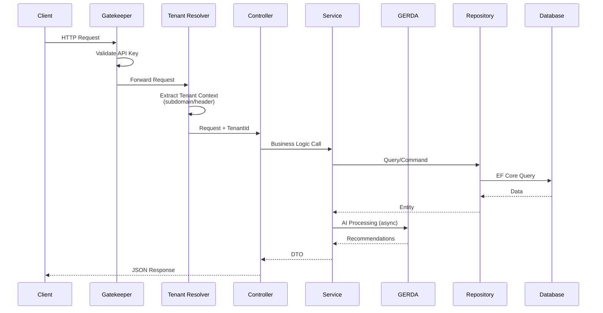

# Ticket Masala - Architecture Summary

**Quick Reference Guide** | See [Detailed Architecture](DETAILED.md) for full documentation.

---

## Architecture at a Glance

**Type:** Modular Monolith with AI Augmentation  
**Stack:** ASP.NET Core MVC + EF Core + ML.NET

```text
Presentation → Services → Repositories → Database
                  ↓
              Observers → GERDA AI
```

---

## Universal Entity Model Terminology

The system uses a **layered terminology strategy** to balance external API consistency with internal code stability.

| UEM (Public API) | Internal Code | Description |
|------------------|---------------|-------------|
| **WorkItem** | `Ticket` | Individual work unit to be processed |
| **WorkContainer** | `Project` | Collection of related work items |
| **WorkHandler** | `ApplicationUser` | Person responsible for work |

> **API Routes:** Both `/api/v1/tickets` and `/api/v1/workitems` are supported.
>
> **Views:** Labels are domain-configurable via `masala_domains.yaml` → `entity_labels`.

See [ADR-001](ADR-001-uem-terminology.md) for full rationale.

---

## Key Design Patterns

| Pattern | Purpose | Location |
|---------|---------|----------|
| **Observer** | Event-driven notifications | `Observers/` |
| **Repository + UoW** | Data access abstraction | `Repositories/` |
| **Specification** | Reusable queries | `Repositories/Specifications/` |
| **Strategy** | Swappable AI algorithms | `Services/GERDA/` |
| **Facade** | AI subsystem orchestration | `GerdaService` |
| **Factory** | Object creation | `TicketFactory` |

---

## Request Lifecycle

Understanding how a request flows through the system:



**Key Steps:**

1. **Gatekeeper**: API authentication and rate limiting
2. **Tenant Resolver**: Extracts tenant context from subdomain or header
3. **Controller**: Routes to appropriate service
4. **Service**: Executes business logic
5. **GERDA**: AI processing (non-blocking via observers)
6. **Repository**: Data access abstraction

---

## Detailed Design

### Modular Monolith

The system is designed as a modular monolith, balancing simplicity and scalability. Each module is self-contained, with clear boundaries and responsibilities.

### Key Modules

1. **Presentation Layer**: Handles user interactions.
2. **Service Layer**: Contains business logic.
3. **Repository Layer**: Manages data access.
4. **AI Layer**: Implements GERDA strategies.

---

## GERDA AI Modules

| Letter | Module | Technique |
|--------|--------|-----------|
| **G** | Grouping | K-Means (spam detection) |
| **E** | Estimating | Classification (effort) |
| **R** | Ranking | WSJF (priority) |
| **D** | Dispatching | Matrix Factorization (agent matching) |
| **A** | Anticipation | Time Series (forecast) |

---

## Service Architecture (CQRS-lite)

| Interface | Responsibility |
|-----------|---------------|
| `ITicketQueryService` | Read operations |
| `ITicketCommandService` | Write operations |
| `ITicketFactory` | Ticket creation |

---

## Quick Start for Developers

1. **`Program.cs`** → DI setup
2. **`DbSeeder.cs`** → Loads sample data from `config/seed_data.json`
3. **`TicketService.cs`** → Business logic
4. **`GerdaService.cs`** → AI hub

---

## Key Decisions

| Decision | Rationale |
|----------|-----------|
| Local ML.NET | GDPR privacy, no API costs |
| Modular Monolith | Simpler ops than microservices |
| Observer Pattern | AI processing doesn't slow UI |
| Repository Pattern | Testable, database-agnostic |

---

*Full details: [Detailed Architecture](DETAILED.md)*
