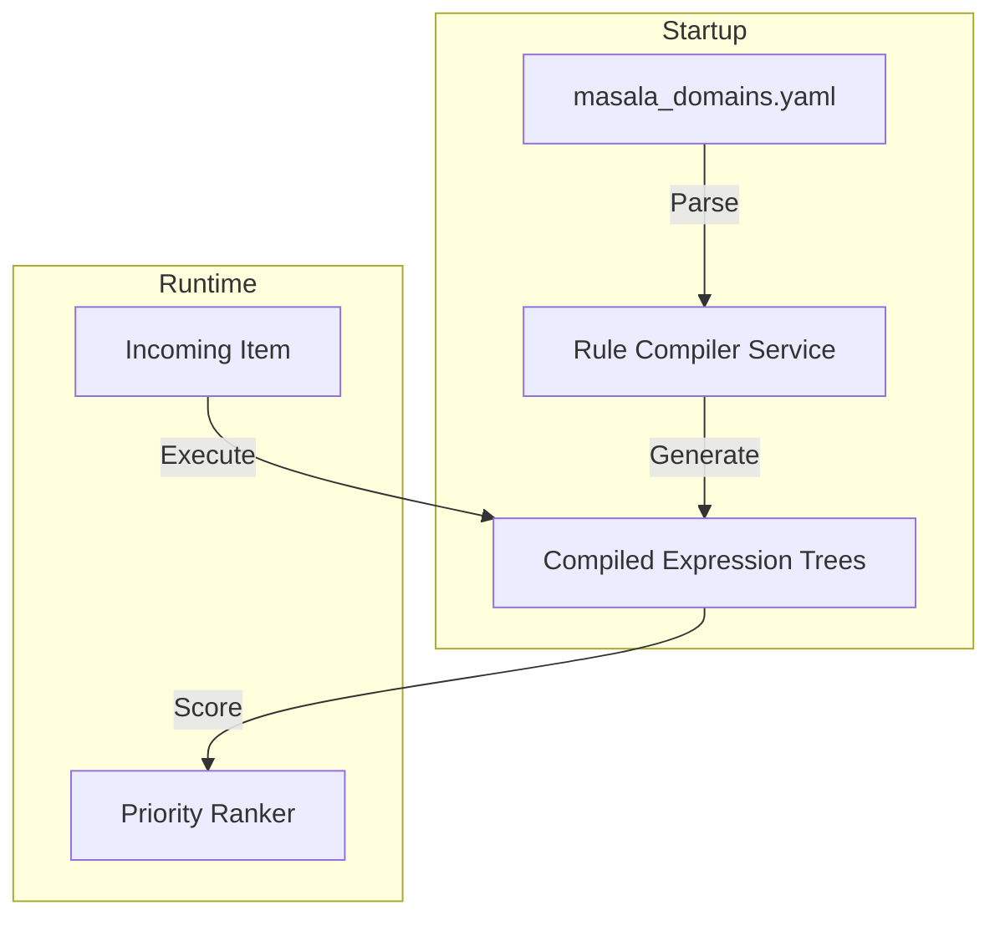

# Feature: Multi-Domain Configuration Engine

The Multi-Domain Configuration Engine is the core architectural innovation of Ticket Masala. It enables the system to operate across radically different business verticals—from Tax Offices to Landscaping Services—without requiring code changes or redeployments.

---

## The Innovation: DSL Compilation

Unlike traditional enterprise systems that rely on complex "Click-Ops" GUIs or slow runtime interpretation, Ticket Masala uses a **Domain-Specific Language (DSL)** approach:

- **Expression Tree Compilation:** YAML rules are parsed at startup and compiled directly into C# Expression Trees (`Func<WorkItem, float>`).
- **Zero Runtime Overhead:** Once compiled, business logic executes at native speed, as if it were hard-coded in C#.
- **Stateless Persistence:** Rules are immutable and stateless, ensuring thread safety and perfect reproducibility.

---

## Business Value

### The Problem
Hard-coding business logic for different domains leads to "Spaghetti Code" where internal logic is littered with `if (IsTax) { ... }` checks. This makes the system fragile, hard to test, and impossible to scale to new industries.

### The Solution: "Configuration-as-Code"
By decoupling business rules from the core engine, we provide an "Adaptive Architecture" that can be tuned by domain experts rather than software engineers.

---

## Technical Architecture



---

## Detailed Capabilities

### 1. Unified Entity Labeling
The engine allows you to customize terminology for your specific domain.
```yaml
# Examples of Domain-Aware Terminology
entity_labels:
  work_item: "Service Request"      # vs "Ticket"
  work_container: "Garden Zone"     # vs "Project"
  work_handler: "Horticulturist"    # vs "Agent"
```

### 2. Extensible Custom Fields
Define domain-specific data points (e.g., `soil_ph` for gardeners or `tax_id` for government) with built-in validation.

### 3. Dynamic Workflows
Configure state-machine transitions that enforce business rules.
- **Linear Workflows:** Standard `New → In Progress → Done`.
- **Agile Queues:** Dynamic re-prioritization and non-linear transitions.

### 4. Configuration Versioning & SHA256 Verification
Every configuration state is hashed (SHA256). Decisions made by the GERDA AI engine are linked to a specific `ConfigVersionId`, providing a complete audit trail if rules change later.

---

## Operational Scenarios

### Scenario A: Green Thumb Landscapes
- **Workflow:** Linear (Request → Quote → Planning → Execution → Sign-off).
- **Dispatch:** Skill-based (Paving Specialists vs. Planting Specialists).
- **Success:** Priority is driven by seasonal urgency.

### Scenario B: Federal Tax Operations
- **Workflow:** Priority Queue with dynamic re-ranking.
- **Dispatch:** WSJF (Weighted Shortest Job First) + Affinity routing.
- **Success:** High-risk debt cases rise to the top of the queue automatically.

---

## Success Metrics

1. **Performance:** 10,000 work items scored in <10 seconds.
2. **Flexibility:** Add a new domain by adding a YAML file; zero code changes.
3. **Auditability:** 100% of dispatch decisions linked to their governing rule set.

---

## References
- **[Configuration Guide](../guides/configuration.md)**
- **[Tenants vs Domains](../guides/tenants-vs-domains.md)**
