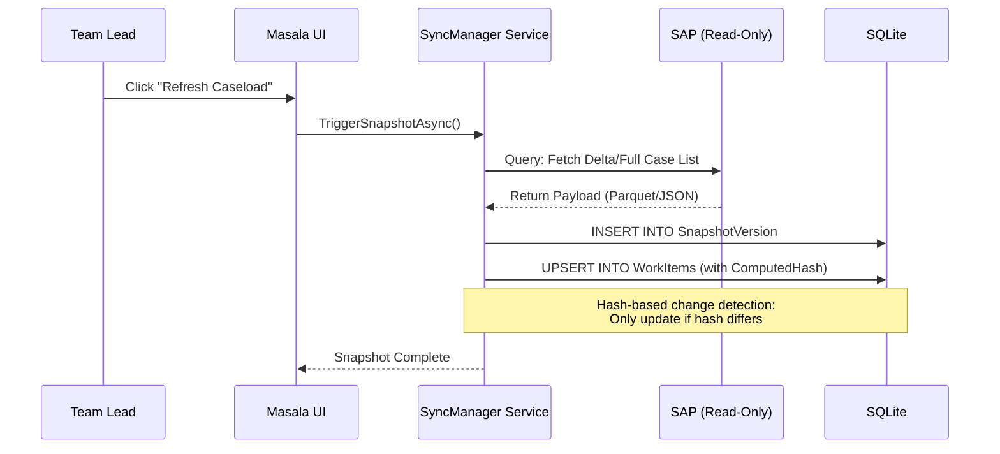

# Feature: SAP Snapshot Sync (On-Demand)

The SAP Snapshot Sync is a "Read-Only Amplifier" that bridges the gap between rigid ERP systems and agile operational workflows without compromising data integrity.

---

## The Innovation: The "Infernal Read" Strategy

Unlike traditional integrations that attempt complex bidirectional synchronization (often resulting in data corruption), Ticket Masala follows a strict **One-Way Snapshot** pattern:

- **Single Source of Truth:** SAP remains the undisputed master of data. Ticket Masala never writes back to SAP.
- **Immutable State:** Every sync creates a versioned snapshot. Once imported, the data state for that version never changes.
- **On-Demand Refresh:** Teams control exactly when they want to refresh their caseload, avoiding the unpredictability of automated polling.

---

## Business Value

### The Problem: "Excel Hell"
Without a dedicated sync bridge, teams resort to manual Excel exports. This results in:
- **PII Leakage:** Sensitive data scattered across uncontrolled spreadsheets.
- **Stale Decisions:** Operators working on outdated information.
- **Audit Gaps:** No record of what the data looked like at the moment a decision was made.

### The Solution: Definable Decision Auditing
By linking every dispatch decision to a specific `SnapshotId`, we provide a legally defensible audit trail of transparency.

---

## Technical Architecture



---

## Detailed Capabilities

### 1. Hash-Based Change Detection
The sync engine computes a hash for every incoming record. If the hash matches the local version, the record is skipped, drastically reducing database I/O and preserving metadata.

### 2. "Time Travel" Query Capability
Because we store snapshot versions, we can reconstruct the exact state of any case at any point in history.
```sql
-- Reconstruct case state as it was on Dec 1st
SELECT Data FROM WorkItem 
WHERE Id = @caseId AND SnapshotId = (
    SELECT Id FROM SnapshotVersion 
    WHERE CreatedAt <= '2025-12-01' ORDER BY CreatedAt DESC LIMIT 1
);
```

### 3. Columnar Persistence (Parquet)
For high-volume imports, the system prefers **Apache Parquet**. This allows for massive data transfers (100k+ records) with minimal memory footprint and high compression.

---

## Operational Scenarios

### For Team Leads
"Hit 'Refresh' before your morning briefing. You'll get the latest cases from SAP, and your team will work with the absolute latest priorities without needing to touch a single spreadsheet."

### For Audit & Legal
"If a decision is challenged six months from now, we can prove exactly what data the agent saw. The system preserves the snapshot state linked to that specific work item."

---

## Success Criteria

1. **Efficiency:** Import 10,000 records in <5 seconds.
2. **Data Integrity:** Zero writes back to SAP source tables.
3. **Auditability:** 100% of work items linked to a valid `SnapshotId`.

---

## Manual Ingestion (MVP)

For the initial release and demos, a **CSV Import** mechanism is provided as a lightweight alternative to the full API integration.

### Capabilities
- **Supported Formats:** `.csv`, `.xlsx`.
- **Field Mapping:** Users can map column headers (e.g., "Description", "Priority") to internal ticket fields via the UI.
- **Idempotency:** Imported tickets are treated as new "Snapshot" entries.

### Usage
1. Navigate to **Import SAP** on the Dashboard.
2. Upload a CSV export from SAP/ERP.
3. Map the columns in the wizard.
4. Click **Import**.

---

## References
- **[Gatekeeper API](../guides/gatekeeper-api.md)**
- **[Data Seeding Guide](../guides/data-seeding.md)**
