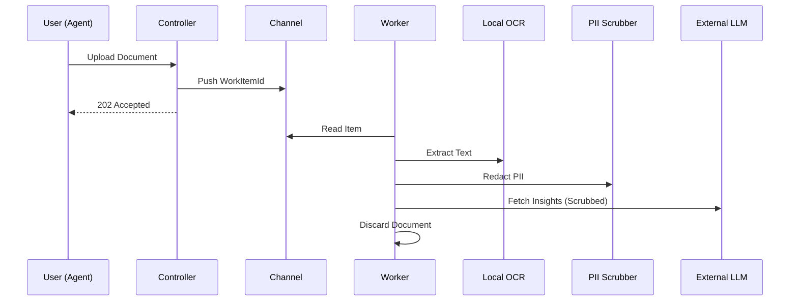

# Feature: Enrichment Pipeline (OCR/NLP/RAG)

The Enrichment Pipeline is an ephemeral processing engine that extracts intelligence from unstructured documents while strictly enforcing PII protection and cost governance.

---

## The Innovation: Ephemeral Processing

Standard AI integrations often bloat databases with binary blobs or leak sensitive data to cloud providers. Ticket Masala solves this through the **"Stream & Discard"** pattern:

- **Local-First AI:** We use **ML.NET** and **Tesseract** locally for classification and OCR, incurring zero cloud costs for the heaviest processing tasks.
- **PII Scrubbing:** Sensitive data is redacted via localized regex patterns *before* contacting any external LLM.
- **Micro-Memory:** Binary PDFs are processed in `/tmp` and immediately discarded. Only the extracted insights are persisted to the database.

---

## Business Value

### The Problem: "Shadow AI"
Agents often copy-paste sensitive tax or HR documents into public AI tools to help with summarization, creating massive GDPR liabilities and security risks.

### The Solution: Sanctioned Intelligence
We provide a governed environment where AI acts as a "Force Multiplier" for agents, not a liability.

---

## Technical Architecture



---

## Detailed Capabilities

### 1. Robust PII Scrubber
A multi-tier regex engine designed for European identification standards (NISS, VAT, IBAN, etc.).
```csharp
// Example: Redacting Belgian National Numbers (NISS)
scrubbed = NissRegex.Replace(text, "[NISS_REDACTED]");
```

### 2. Retrieval-Augmented Generation (RAG)
Before calling an LLM, the pipeline queries the local Knowledge Base (FTS5) to provide historical context.
- **Grounding:** Ensures AI suggestions are based on *your* previous successful resolutions.
- **Cost Reduction:** Detailed context allows for smaller, cheaper LLM prompts.

### 3. Governance & Budget Caps
Hard and soft caps prevent "Bill Shock."
- **Soft Cap:** Alerts admin when reaching 80% of monthly tokens.
- **Hard Cap:** Automatically disables external AI calls, falling back to local ML-only mode.

---

## Operational Scenarios

### Inbound Mail Processing
1. Scanner uploads 500 letters.
2. Pipeline extracts text and tags them (e.g., `#AddressChange`, `#Complaint`).
3. Agent sees a prioritized list with "AI Hints" for each case.

### Fraud Detection
The pipeline identifies specific risk patterns in extracted text that are often missed by human reviewers, flagging them for high-priority evaluation.

---

## Success Criteria

1. **Security:** 98%+ detection of common PII patterns.
2. **Performance:** Process a 5-page document in <10 seconds.
3. **Budget:** Zero overrides of established monthly AI spend caps.

---

## References
- **[Knowledge Base Blueprint](04-knowledge-base-twitter-style.md)**
- **[Privacy Governance Guide](06-privacy-governance.md)**
