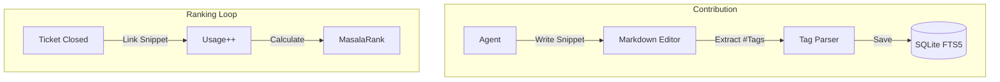

# Feature: Knowledge Base (Twitter-Style)

The Knowledge Base is a lightweight, self-ranking documentation system that replaces traditional enterprise wikis with atomic, friction-free knowledge snippets.

---

## The Innovation: MasalaRank

Traditional knowledge management fails because good content is buried under stale documentation. Ticket Masala solves this through **Usage-Based Ranking**:

- **Atomic Units:** Documentation is broken into "Tweets"—snippets of 50-300 words.
- **#Hashtag Organization:** No folders. Content is categorized via hashtags within the text.
- **MasalaRank Algorithm:** Content quality is determined by actual usage in resolved tickets:
  `Score = (UsageCount × 10) + (IsVerified × 50) + (FTS_Rank × -1)`

---

## Business Value

### The Problem: "The Wiki Trap"
Most enterprise wikis are stagnant because contribution is too difficult and search results are prioritized by date rather than relevance or quality.

### The Solution: "Living Knowledge"
We treat knowledge as a stream. High-quality, verified answers rise to the top of search results based on how often they actually help close cases.

---

## Technical Architecture



---

## Detailed Capabilities

### 1. The Atomic Editor
A simplified Markdown interface that encourages agents to share "micro-learnings" immediately after resolving a complex case.

### 2. Verified Signals
Domain experts can "Verify" a snippet (✓), giving it a permanent +50 boost in the MasalaRank algorithm and marking it as reliable for AI context injection.

### 3. FTS5 Trigram Search
Powered by SQLite's FTS5 extension with trigram tokenization, allowing for blazing-fast, typo-tolerant search across thousands of snippets.
```sql
-- Example MasalaRank Search Query
SELECT Content, (UsageCount * 10) + (CASE WHEN IsVerified THEN 50 ELSE 0 END) AS Score
FROM KnowledgeIndex
WHERE KnowledgeIndex MATCH @query
ORDER BY Score DESC;
```

---

## Operational Scenarios

### The "Anita" Problem (Quality Control)
To prevent the knowledge base from becoming "noisy," the system runs a similarity check during submission. If an agent tries to post a duplicate answer, the system warns them: *"We found 3 similar snippets. Consider clarifying theirs instead of creating a new one."*

### AI Foundation
The Enrichment Pipeline uses these verified snippets as the primary source of truth for RAG (Retrieval-Augmented Generation). The AI doesn't just guess; it cites your best internal documentation.

---

## Success Criteria

1. **Adoption:** 80% of agents contributing at least one snippet per month.
2. **Signal:** Top 3 search results are relevant in 90%+ of queries.
3. **Speed:** Search latency <50ms even with 100,000+ snippets.

---

## References
- **[Enrichment Pipeline Blueprint](03-enrichment-pipeline.md)**
- **[GERDA Dispatch Engine](05-gerda-dispatch-engine.md)**
