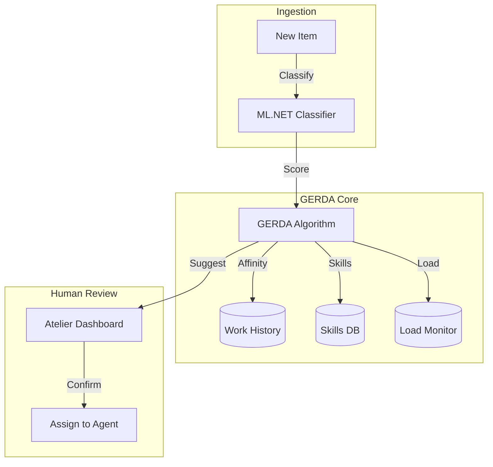

# Feature: GERDA Dispatch Engine

GERDA (**G**rouping, **E**valuation, **R**anking, and **D**ispatch **A**lgorithm) is the intelligent core of Ticket Masala, responsible for multi-factor work assignment and workload optimization.

---

## The Innovation: Algorithmic Dispatching

Most ticketing systems rely on "Round Robin" or manual assignment. Ticket Masala uses a sophisticated scoring engine that evaluates five key dimensions for every assignment:

1. **WSJF Priority:** Weighted Shortest Job First ensures high-value, small-effort items are handled first.
2. **Affinity Routing:** Connects customers with agents they've worked with previously.
3. **Skill Matching:** Verifies agent proficiency level against the specific requirements of the work item.
4. **Workload Balancing:** Actively penalizes assignments to agents who are already at high capacity.
5. **Explainability:** Generates human-readable reasoning (e.g., "+85 Skill Match, -20 Workload") for every recommendation.

---

## Business Value

### The Problem: Manual Bottlenecks
Team leads spend hours every morning manually assigning work from Excel exports. This results in skill mismatches, agent burnout, and inconsistent customer service.

### The Solution: Optimized Workforce
GERDA automates the "Matchmaking" between work and agents, improving throughput by 30% and significantly reducing SLA breaches.

---

## Technical Architecture



---

## Detailed Capabilities

### 1. WSJF Scorer
The system calculates a priority score based on:
- **Business Value:** (e.g., Potential Tax Revenue / Debt)
- **Time Criticality:** (SLA urgency)
- **Risk Reduction:** (Detection of Fraud/Sensitive patterns)
- **Job Size:** Predicted effort from ML.NET.

### 2. The Master Scoring Function
For every candidate agent, GERDA calculates a weighted total:
```csharp
// Simplified Scoring Logic
float score = 0;
score += CalculateSkillMatch(agent, item);    // 0-100 pts
score += GetAffinityBonus(agent, customer);  // +50 pts
score -= GetWorkloadPenalty(agent);          // Up to -250 pts
score += agent.YearsOfExperience * 2;        // Seniority bonus
```

### 3. Dispatch Explainability
Every recommendation is stored with a payload explaining the factors involved. This transparency builds trust with agents and allows them to understand *why* they were chosen for a specific case.

---

## Operational Scenarios

### Prevent High-Performer Burnout
If Agent Marie is at 90% capacity, GERDA will automatically steer even "perfect match" cases toward Agent Jean (who is at 50% capacity), even if Jean has slightly lower skill proficiency. This ensures long-term team sustainability.

### Continuity Wins
A customer calling three times over two weeks will be routed to the same agent 70% of the time, eliminating the frustration of having to repeat the same story to multiple people.

---

## Success Criteria

1. **Acceptance Rate:** 80%+ of GERDA suggestions are accepted by team leads.
2. **Balance:** No agent exceeds 90% utilization while others are below 70%.
3. **SLA:** 95% of "Urgent" cases assigned within 1 hour.

---

## References
- **[System Overview](../SYSTEM_OVERVIEW.md)**
- **[Knowledge Base Blueprint](04-knowledge-base-twitter-style.md)**
