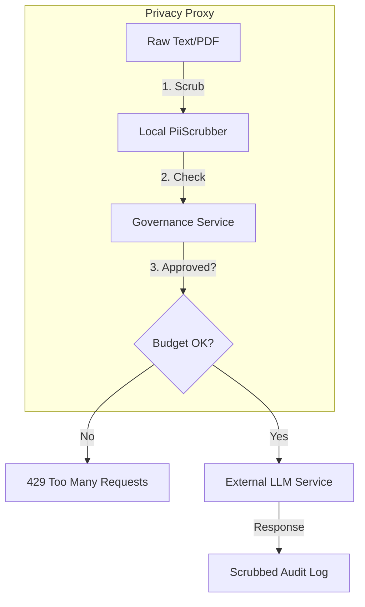

# Feature: Privacy & Governance Layer

The Privacy & Governance Layer is a comprehensive framework that enables safe AI adoption in highly regulated environments (such as government and healthcare) by enforcing strict PII scrubbing and cost controls.

---

## The Innovation: The Privacy Proxy

Instead of sending raw customer data directly to cloud AI providers, Ticket Masala acts as a **Secure Gateway**:

- **Pre-Redaction:** The system detects and scrubs PII *before* the data leaves the organizational perimeter.
- **Budget Enforcment:** Hard and soft caps are applied at the proxy level, ensuring that no single project or user can cause an unexpected bill.
- **Scrubbed Auditing:** We maintain a complete history of AI interactions, but only in their redacted form, ensuring GDPR compliance while providing full transparency.

---

## Business Value

### The Problem: Compliance Blockers
Many organizations cannot use LLMs because of the risk of PII leakage (GDPR Article 5) and the unpredictable cost of token-based pricing.

### The Solution: "Safe-to-Operate" AI
We eliminate the compliance risk by localizing the "Security Perimeter" and providing predictable maintenance costs for the AI subsystem.

---

## Technical Architecture



---

## Detailed Capabilities

### 1. PII Scrubber (Regex & Local ML)
The scubber targets patterns critical for compliance without relying on cloud services:
- **National IDs:** (e.g., NISS, VAT numbers).
- **Contact Info:** Emails and Phone numbers.
- **Financial Info:** IBANs and credit card patterns.
```csharp
// Example patterns monitored by the Scrubber
private static readonly Regex NissRegex = new(@"\d{2}\.\d{2}\.\d{2}-\d{3}\.\d{2}");
private static readonly Regex EmailRegex = new(@"[A-Z0-9._%+-]+@[A-Z0-9.-]+\.[A-Z]{2,}");
```

### 2. Governance Tiers
- **Tier 1 (Individual):** Prevents a single agent from dominating the AI resources.
- **Tier 2 (Domain/Tenant):** Protects the department budget.
- **Tier 3 (Organization):** Global hard stop to prevent critical budget overruns.

### 3. Compliance Dashboard
Provides real-time visibility into cost projections and "Risk Scores" (the percentage of intercepted PII). This allows DPOs (Data Protection Officers) to verify that the system is working as intended.

---

## Operational Scenarios

### Graceful Degradation
If the monthly budget for LLM calls is reached at 95%, the system automatically falls back to **"Local Discovery"** mode. In this state, LLM suggestions are disabled, but the Enrichment Pipeline continues to show similar historical cases from the local Knowledge Base (RAG-only mode).

### Auditing a "Redacted" Discovery
If an agent reports a weird AI suggestion, the admin can look in the `AiUsageLogs`. They will see the scrubbed input (e.g., *"Citizen [NISS_REDACTED] requested a refund"*), allowing them to debug the prompt logic without ever seeing the actual citizen's identity.

---

## Success Criteria

1. **Safety:** Pass a third-party GDPR audit with zero data leakage findings.
2. **Cost Accuracy:** AI spend remains within +/- 2% of the configured budget.
3. **Speed:** Scrubbing adds less than 50ms latency to the enrichment process.

---

## References
- **[Enrichment Pipeline Blueprint](03-enrichment-pipeline.md)**
- **[Troubleshooting Guide](../guides/troubleshooting.md)**
