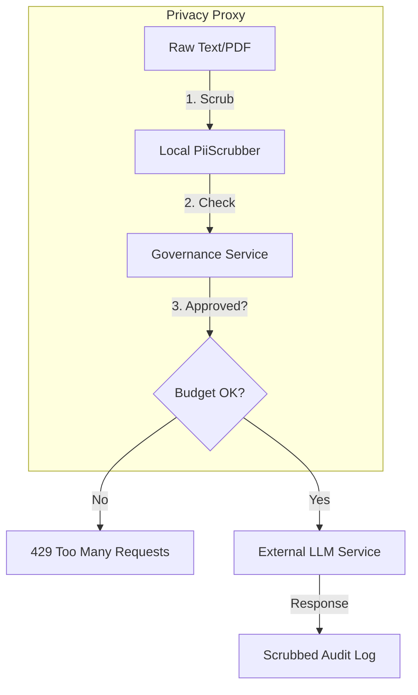

# Feature: Privacy & Governance Layer

The Privacy & Governance Layer is a comprehensive framework that enables safe AI adoption in highly regulated environments (such as government and healthcare) by enforcing strict PII scrubbing and cost controls.

---

## The Innovation: The Privacy Proxy

Instead of sending raw customer data directly to cloud AI providers, Ticket Masala acts as a **Secure Gateway**:

- **Pre-Redaction:** The system detects and scrubs PII _before_ the data leaves the organizational perimeter.
- **Budget Enforcment:** Governance is currently enforced via HTTP rate limiting policies; per-tenant token caps are part of the roadmap **(ROADMAP ITEM)**.
- **Scrubbed Auditing:** We maintain a complete history of AI interactions, but only in their redacted form, ensuring GDPR compliance while providing full transparency.

---

## Business Value

### The Problem: Compliance Blockers

Many organizations cannot use LLMs because of the risk of PII leakage (GDPR Article 5) and the unpredictable cost of token-based pricing.

### The Solution: "Safe-to-Operate" AI

We eliminate the compliance risk by localizing the "Security Perimeter" and providing predictable maintenance costs for the AI subsystem.

---

## Technical Architecture


```mermaid
graph TD
    subgraph "Privacy Proxy"
        Input[Raw Text/PDF] -->|1. Scrub| Scrubber[Local PiiScrubber]
        Scrubber -->|2. Check| Gov[Governance Service]
        Gov -->|3. Approved?| Decision{Budget OK?}
    end

    Decision -->|No| Reject[429 Too Many Requests]
    Decision -->|Yes| LLM[External LLM Service]

    LLM -->|Response| Audit[Scrubbed Audit Log]
```

---

## Detailed Capabilities

### 1. PII Scrubber (Regex & Local ML)

The scubber targets patterns critical for compliance without relying on cloud services:

- **National IDs:** (e.g., NISS, VAT numbers).
- **Contact Info:** Emails and Phone numbers.
- **Financial Info:** IBANs and credit card patterns.

```csharp
// Example patterns monitored by the Scrubber
private static readonly Regex NissRegex = new(@"\d{2}\.\d{2}\.\d{2}-\d{3}\.\d{2}");
private static readonly Regex EmailRegex = new(@"[A-Z0-9._%+-]+@[A-Z0-9.-]+\.[A-Z]{2,}");
```

### 2. Governance Tiers

The current implementation provides coarse-grained protection through request-level rate limiting (e.g., `/api` and login policies). Finer-grained tiers:

- **Tier 1 (Individual):** Per-user token budgets.
- **Tier 2 (Domain/Tenant):** Department-level caps.
- **Tier 3 (Organization):** Global hard stop
  are design targets and not yet implemented in code.

### 3. Compliance Dashboard (ROADMAP ITEM)

The envisioned Compliance Dashboard tracks AI costs and PII scrub statistics. As of now, the system exposes Prometheus metrics and logs, and a dedicated dashboard remains a roadmap item.

---

## Operational Scenarios

### Graceful Degradation

The design goal is to fall back to **"Local Discovery"** mode (RAG-only) once AI budgets are reached. The current implementation always prefers local Knowledge Base snippets and relies on rate limiting rather than explicit monthly budgets.

### Auditing a "Redacted" Discovery

The system already logs scrubbed inputs (e.g., _"Citizen [NISS_REDACTED] requested a refund"_). A dedicated `AiUsageLogs` store and UI for deep-dive auditing is a planned enhancement.

---

## Success Criteria

1. **Safety:** Pass a third-party GDPR audit with zero data leakage findings.
2. **Cost Accuracy:** AI usage is bounded by rate limiting policies; precise budget tracking per tenant is planned.
3. **Speed:** Scrubbing adds minimal latency (regex-based and fully local).

---

## References

- **[Enrichment Pipeline Blueprint](03-enrichment-pipeline.md)**
- **[Troubleshooting Guide](../guides/troubleshooting.md)**
