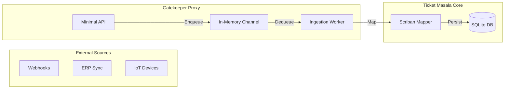

# Capability: Gatekeeper API (Scalable Ingestion)

The Gatekeeper API is a high-performance, event-driven ingestion service designed to handle massive volumes of incoming data without impacting the primary user interface.

---

## The Innovation: Event-Driven Intake

While the main Ticket Masala application focuses on user experience and orchestration, the Gatekeeper handles the "Heavy Lifting" of data ingestion:

- **Asynchronous Channels:** Uses `System.Threading.Channels` for in-memory, thread-safe queuing that can handle 100,000+ items per second.
- **Decoupled Architecture:** The API accepts the signal (202 Accepted) and returns immediately, delegating the heavy processing to background workers.
- **Scriban Mapping:** Uses the Scriban liquid-style templates to transform raw webhooks into valid domain work items without requiring code changes for every new integration.

---

## Technical Architecture



---

## Detailed Capabilities

### 1. High-Throughput /api/ingest
A single, highly optimized endpoint that prioritizes speed of acceptance over complexity of processing.
```http
POST /api/ingest
Content-Type: application/json

{
  "source": "IOT-SENSOR-01",
  "payload": { "temp": 45, "status": "alert" }
}
```

### 2. The Ingestion Worker
A robust background service that manages:
- **Rate Limiting:** Protects the main database from ingestion spikes.
- **Retry Logic:** Handles transient failures during the mapping/persistence phase.
- **Dead Letter Handling:** Logs malformed payloads for administrator review instead of failing the entire stream.

### 3. Programmable Mapping (Scriban)
Instead of static DTOs, the Gatekeeper uses Scriban templates to determine how external fields map to Ticket Masala properties. This allows you to integrate new vendors in minutes simply by updating a template.

---

## Operational Scenarios

### Bulk Migration
When importing 50,000 legacy tickets from a CSV, the Gatekeeper allows the team leads to continue using the UI without any lag. The ingestion happens "in the background" at a controlled pace.

### IoT Monitoring
If an IoT sensor triggers 100 alerts in one minute, the Gatekeeper queues them, deduplicates them via AI Grouping, and creates a single work item for the technician, preventing notification fatigue.

---

## Success Criteria

1. **Ingestion Speed:** Accept 1,000 items in <100ms.
2. **Resource Usage:** Minimal memory footprint (<100MB) during high-load ingestion.
3. **Decoupling:** Primary UI performance remains unaffected during bulk imports.

---

## References
- **[Configuration Guide](configuration.md)**
- **[System Overview](../SYSTEM_OVERVIEW.md)**
