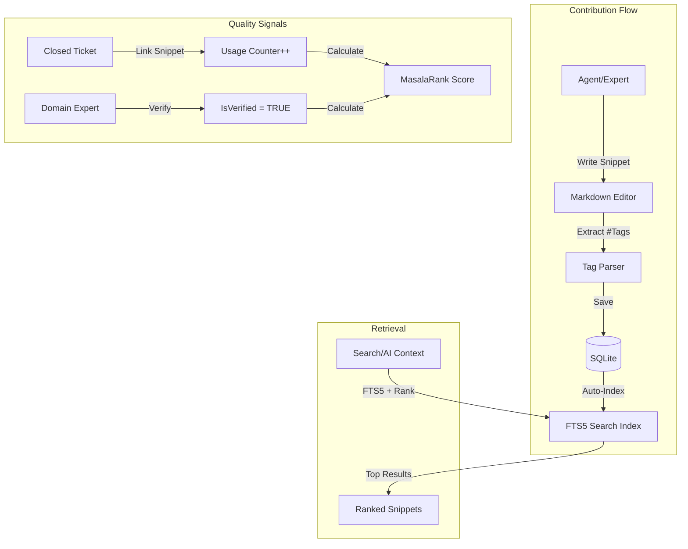

# Feature Request: Knowledge Base (Twitter-Style)

## Overview
Build a lightweight, self-organizing knowledge base modeled after Twitter: atomic snippets, hashtag organization, usage-based ranking, and verified contributors.

## Problem Statement

### The "Wiki Trap"
Traditional enterprise wikis fail because:
- **Friction:** 20-field forms discourage contribution
- **Organization Hell:** Folder hierarchies where knowledge goes to die
- **Staleness:** No mechanism to surface best answers; first result might be from 2018
- **Barrier to Entry:** Only "designated authors" can contribute

### The "Anita Problem"
- Low-quality content discourages power users
- No quality signals: good advice drowns in noise
- No feedback loop: contributors don't know if their snippet helped

## Solution: Atomic, Self-Ranking Knowledge Stream

### Core Principles
1. **Atomic Units:** A snippet is the size of a tweet (50-300 words), not a document
2. **Hashtag Organization:** No folders, just `#VAT #food #rates` tags in the text
3. **Usage-Based Ranking:** Snippets that help close tickets rise to the top
4. **Verified Signals:** Domain experts can mark high-quality content
5. **Implicit Feedback:** Linking a snippet to a resolved ticket increments its score

### Architecture



## Key Features

### 1. The "Tweet" Interface

**UI:** Single text box with live Markdown preview (using EasyMDE)

```html
<textarea id="snippet"></textarea>
<script>
var easyMDE = new EasyMDE({ 
    element: document.getElementById('snippet'),
    placeholder: "Share what you learned... (use #tags to organize)",
    maxHeight: "200px",
    spellChecker: false
});
</script>
```

**Example Snippet:**
```
For diplomatic exemptions, verify the person is on the Protocol List (updated monthly). 
If yes, no VAT applies. If no, standard rate.

#VAT #diplomatic #exemption #protocol
```

### 2. Atomic Snippet Ingestion

For bulk imports (e.g., existing MD documentation), automatically "shred" into atoms:

```python
# Pseudo-code for ingestion
def shred_document(md_file):
    sections = split_by_headers(md_file)
    for section in sections:
        snippet = {
            'content': section.text,
            'tags': extract_hashtags(section.text) + f"#{md_file.name}",
            'author': 'System',
            'language': detect_language(section.text)
        }
        db.save_snippet(snippet)
```

### 3. The MasalaRank Algorithm

**Formula:**
```
Score = (UsageCount × 10) + (IsVerified × 50) + (FTS_Rank × -1) - (Decay)
```

- **UsageCount:** How many tickets linked this snippet
- **IsVerified:** Domain expert stamp of approval
- **FTS_Rank:** SQLite BM25 text match score (negative because lower rank = better match)
- **Decay:** Age penalty (optional, for time-sensitive content)

**SQL Implementation:**
```sql
SELECT 
    s.Id, s.Content, s.Author, s.UsageCount, s.IsVerified,
    snippet(KnowledgeIndex, 0, '<mark>', '</mark>', '...', 10) as HighlightedText,
    (s.UsageCount * 10.0) + 
    (CASE WHEN s.IsVerified THEN 50 ELSE 0 END) +
    (i.rank * -1) AS MasalaRankScore
FROM KnowledgeIndex i
JOIN KnowledgeSnippets s ON s.Id = i.rowid
WHERE KnowledgeIndex MATCH ?
  AND s.LanguageCode IN (?, ?, ?)
ORDER BY MasalaRankScore DESC
LIMIT 10;
```

### 4. Multi-Language Support

**Schema:**
```sql
CREATE TABLE KnowledgeSnippets (
    Id INTEGER PRIMARY KEY,
    Content TEXT NOT NULL,
    Author TEXT NOT NULL,
    LanguageCode TEXT CHECK(LanguageCode IN ('EN', 'FR', 'NL')) NOT NULL,
    IsVerified BOOLEAN DEFAULT 0,
    UsageCount INTEGER DEFAULT 0,
    CreatedAt INTEGER DEFAULT (unixepoch())
);
```

**User Preference:**
```json
{
  "user_id": "agent_42",
  "accepted_languages": ["FR", "EN"]
}
```

**Search Filter:** Only show snippets in languages the user reads.

### 5. The "Anita Defense" Mechanisms

#### A. Duplicate Detection (Pre-Post Warning)
Before saving, run a similarity check:
```javascript
// Client-side AJAX before submit
fetch('/api/kb/check-similar', { 
    method: 'POST', 
    body: JSON.stringify({ content: easyMDE.value() })
})
.then(res => res.json())
.then(similar => {
    if (similar.count > 3) {
        showWarning(`We found ${similar.count} similar snippets. Are you adding new value?`);
    }
});
```

#### B. Verified Badge
- **Tier 0 (Community):** Any agent can post
- **Tier 1 (Verified):** Only domain experts can mark as verified
- **UI Signal:** ✓ badge next to verified snippets
- **Search Ranking:** Verified snippets get +50 points

#### C. Usage Score Visibility
Display subtle quality signals:
```
💡 "For VAT on digital services..." #VAT #digital
   by @marie_dupont | Used in 12 resolutions | ✓ Verified
```

### 6. "Reply" Threading (Optional)
Allow snippets to reference each other:
```sql
ALTER TABLE KnowledgeSnippets ADD COLUMN ParentId INTEGER REFERENCES KnowledgeSnippets(Id);
```

**Use Case:** Agent posts a snippet, expert replies with clarification.

### 7. AI Context Assembly
When enrichment pipeline needs context:
```csharp
var relevantSnippets = await _kb.SearchAsync("VAT exemption diplomat", userLanguages: ["EN", "FR"]);
var context = string.Join("\n\n---\n\n", relevantSnippets.Select(s => s.Content));

var prompt = $@"
You are a tax expert. Here is relevant knowledge from our database:

{context}

Now, answer this question: {userQuery}
";
```

## Database Schema

```sql
-- Main table
CREATE TABLE KnowledgeSnippets (
    Id INTEGER PRIMARY KEY AUTOINCREMENT,
    Content TEXT NOT NULL,
    Author TEXT NOT NULL,
    LanguageCode TEXT NOT NULL DEFAULT 'EN',
    IsVerified BOOLEAN DEFAULT 0,
    UsageCount INTEGER DEFAULT 0,
    ParentId INTEGER REFERENCES KnowledgeSnippets(Id),
    CreatedAt INTEGER DEFAULT (unixepoch()),
    CHECK(LanguageCode IN ('EN', 'FR', 'NL'))
);

-- Full-text search index
CREATE VIRTUAL TABLE KnowledgeIndex USING fts5(
    Content, 
    content='KnowledgeSnippets',
    content_rowid='Id',
    tokenize='trigram'
);

-- Auto-sync triggers
CREATE TRIGGER kb_ai AFTER INSERT ON KnowledgeSnippets BEGIN
  INSERT INTO KnowledgeIndex(rowid, Content) VALUES (new.Id, new.Content);
END;

CREATE TRIGGER kb_au AFTER UPDATE ON KnowledgeSnippets BEGIN
  INSERT INTO KnowledgeIndex(KnowledgeIndex, rowid, Content) VALUES('delete', old.Id, old.Content);
  INSERT INTO KnowledgeIndex(rowid, Content) VALUES (new.Id, new.Content);
END;

CREATE TRIGGER kb_ad AFTER DELETE ON KnowledgeSnippets BEGIN
  INSERT INTO KnowledgeIndex(KnowledgeIndex, rowid, Content) VALUES('delete', old.Id, old.Content);
END;

-- Link snippets to resolved tickets
CREATE TABLE KnowledgeLinks (
    Id INTEGER PRIMARY KEY,
    SnippetId INTEGER REFERENCES KnowledgeSnippets(Id),
    WorkItemId INTEGER REFERENCES WorkItems(Id),
    UsedByUserId TEXT NOT NULL,
    UsedAt DATETIME DEFAULT CURRENT_TIMESTAMP
);

-- Indexes
CREATE INDEX idx_kb_lang ON KnowledgeSnippets(LanguageCode);
CREATE INDEX idx_kb_verified ON KnowledgeSnippets(IsVerified);
CREATE INDEX idx_kb_usage ON KnowledgeSnippets(UsageCount DESC);
```

## Implementation Tasks

- [ ] Design and implement `KnowledgeSnippets` table with FTS5 index
- [ ] Create `KnowledgeLinks` table to track snippet-to-ticket relationships
- [ ] Build snippet submission UI with EasyMDE integration
- [ ] Implement hashtag extraction and auto-tagging
- [ ] Build MasalaRank scoring query with language filter
- [ ] Add "Check Similar" endpoint for duplicate warnings
- [ ] Create "Verify" action (restricted to domain experts role)
- [ ] Build usage tracking: when ticket closed, allow linking snippets
- [ ] Implement snippet search API with ranking
- [ ] Add snippet detail view with usage history
- [ ] Build "Reply" threading (optional enhancement)
- [ ] Create bulk ingestion script for markdown shredding
- [ ] Add language filter to user profile settings
- [ ] Build admin dashboard: top contributors, most-used snippets
- [ ] Implement "Success Translator" job for high-value snippets (optional)

## C# Service Implementation

```csharp
public class KnowledgeBaseService
{
    private readonly MasalaDbContext _db;
    private static readonly Regex TagRegex = new(@"#\w+", RegexOptions.Compiled);

    public async Task<int> PostSnippetAsync(string markdown, string author, string language)
    {
        var tags = string.Join(" ", TagRegex.Matches(markdown).Select(m => m.Value));
        
        var snippet = new KnowledgeSnippet
        {
            Content = markdown,
            Author = author,
            LanguageCode = language,
            // Tags extracted, could be stored in JSON column if needed
        };

        _db.KnowledgeSnippets.Add(snippet);
        await _db.SaveChangesAsync();
        
        return snippet.Id;
    }

    public async Task<List<SnippetDto>> SearchAsync(string query, string[] languages)
    {
        var langFilter = string.Join("','", languages);
        var safeQuery = query.Replace("'", "''");

        var sql = $@"
            SELECT 
                s.Id, s.Content, s.Author, s.UsageCount, s.IsVerified,
                snippet(KnowledgeIndex, 0, '<mark>', '</mark>', '...', 10) as Highlight,
                (s.UsageCount * 10.0) + 
                (CASE WHEN s.IsVerified THEN 50 ELSE 0 END) +
                (i.rank * -1) AS Score
            FROM KnowledgeIndex i
            JOIN KnowledgeSnippets s ON s.Id = i.rowid
            WHERE KnowledgeIndex MATCH '{safeQuery}'
              AND s.LanguageCode IN ('{langFilter}')
            ORDER BY Score DESC
            LIMIT 10";

        return await _db.Database.SqlQueryRaw<SnippetDto>(sql).ToListAsync();
    }

    public async Task RegisterUsageAsync(int snippetId, int workItemId, string userId)
    {
        _db.KnowledgeLinks.Add(new KnowledgeLink
        {
            SnippetId = snippetId,
            WorkItemId = workItemId,
            UsedByUserId = userId
        });

        await _db.Database.ExecuteSqlInterpolatedAsync(
            $"UPDATE KnowledgeSnippets SET UsageCount = UsageCount + 1 WHERE Id = {snippetId}");
        
        await _db.SaveChangesAsync();
    }

    public async Task<List<SnippetDto>> CheckSimilarAsync(string content)
    {
        // Use first 100 chars for similarity check
        var preview = content.Substring(0, Math.Min(100, content.Length));
        return await SearchAsync(preview, new[] { "EN", "FR", "NL" });
    }
}
```

## Success Criteria

1. **Low Friction:** Post a snippet in <10 seconds (type, tag, submit)
2. **High Signal:** Top 3 results are relevant in 90%+ of searches
3. **Self-Cleaning:** High-quality content surfaces automatically via MasalaRank
4. **Adoption:** 80% of agents contribute at least 1 snippet in first month
5. **Impact:** 50% of tickets link at least 1 KB snippet by month 3

## Demo Scenario

### Setup
1. Agent @john posts: "For LEZ fines, check vehicle registration date. If registered before 2020, exemption possible. #LEZ #exemption #fines"
2. Agent @marie searches "LEZ exemption"
3. John's snippet appears (UsageCount=0, not verified yet)
4. Marie uses it to resolve Ticket #12345
5. System increments UsageCount for John's snippet
6. Domain expert @pierre sees the snippet, clicks "Verify" ✓
7. Next agent searching "LEZ exemption" sees verified snippet at top with score: (1 usage × 10) + (verified × 50) = 60 points

### Expected UI
```
🔍 Search: "LEZ exemption"

Results (2):

1. ✓ "For LEZ fines, check vehicle registration date..." 
   by @john | Used in 1 resolution | Verified by @pierre | Score: 60
   [Use This] [Reply] [Edit]

2. "LEZ exemptions also apply to historic vehicles..." 
   by @anita | Never used | Score: 12
   [Use This] [Reply] [Report]
```

## Integration with Enrichment Pipeline

When enrichment worker needs context for AI prompt:
1. Query: `await _kb.SearchAsync(scrubbedText, userLanguages)`
2. Assemble top 3 snippets into context
3. Inject into LLM prompt
4. If AI suggestion leads to ticket closure, auto-link those 3 snippets (implicit usage++)

## Localization Strategy

### Phase 1 (Launch)
- Store language tag
- Filter search by user's accepted languages
- Manual translation by bilingual agents (just post same snippet in other language)

### Phase 2 (Enhancement)
- **"Success Translator" Job:** For snippets with UsageCount > 10 and IsVerified, queue for human-reviewed AI translation
- Display translation next to original with note: "Translated from FR (human-reviewed)"

## References

- Interaction 4: "Atomic Knowledge Base Design"
- Interaction 5: "Knowledge Base UI, i18n, and Quality Control"
- Interaction 6: "Module D: The Twitter Knowledge Base"
- Interaction 9: "KnowledgeRankerService implementation"
