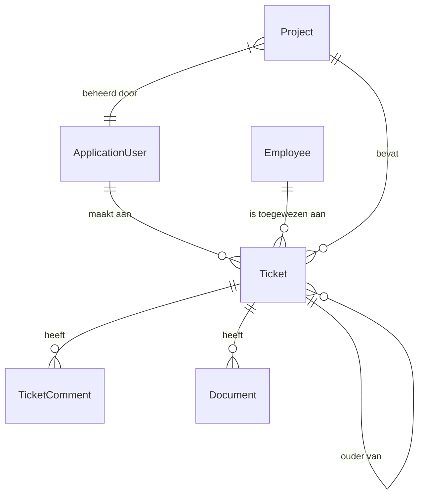

# Domeinmodel

Documentatie voor de kernentiteiten in Ticket Masala.

## Entiteitsoverzicht



---

## Kernentiteiten

### Ticket (Werkitem)

De primaire domeinentiteit die een werkeenheid vertegenwoordigt.

**Locatie:** `TicketMasala.Domain/Entities/Ticket.cs`

```csharp
public class Ticket : BaseModel
{
    // === Kernvelden ===
    public string Title { get; set; }
    public string Description { get; set; }
    public Status TicketStatus { get; set; }
    public TicketType? TicketType { get; set; }
    
    // === Data ===
    public DateTime? CompletionTarget { get; set; }
    public DateTime? CompletionDate { get; set; }
    
    // === GERDA AI-velden ===
    public int EstimatedEffortPoints { get; set; }
    public double PriorityScore { get; set; }
    public string? GerdaTags { get; set; }
    public string? RecommendedProjectName { get; set; }
    public string? AiSummary { get; set; }
    
    // === Domein Uitbreidbaarheid ===
    public string DomainId { get; set; } = "IT";
    public string? WorkItemTypeCode { get; set; }
    public string CustomFieldsJson { get; set; } = "{}";
    
    // === Relaties ===
    public string? CustomerId { get; set; }
    public string? ResponsibleId { get; set; }
    public Guid? ProjectGuid { get; set; }
    public Guid? ParentTicketGuid { get; set; }
    
    // === Navigatie ===
    public virtual ApplicationUser? Customer { get; set; }
    public virtual Employee? Responsible { get; set; }
    public virtual Project? Project { get; set; }
    public virtual ICollection<TicketComment> Comments { get; set; }
    public virtual ICollection<Ticket> SubTickets { get; set; }
}
```

**Belangrijkste Ontwerpbeslissingen:**
- **Hybride Model**: Vaste geïndexeerde kolommen + flexibele JSON-blob voor aangepaste velden.
- **Domeinbewust**: `DomainId` en `WorkItemTypeCode` maken workflowbeheer over meerdere domeinen mogelijk.
- **AI-Klaar**: GERDA-velden voor prioriteit, inspanning en aanbevelingen.

---

### Project (Werkcontainer)

Groepeert gerelateerde tickets.

**Locatie:** `TicketMasala.Domain/Entities/Project.cs`

```csharp
public class Project : BaseModel
{
    public string Name { get; set; }
    public string Description { get; set; }
    public Status ProjectStatus { get; set; }
    public DateTime? CompletionTarget { get; set; }
    public DateTime? CompletionDate { get; set; }
    
    // Relaties
    public string? CustomerId { get; set; }
    public string? ProjectManagerId { get; set; }
    
    // Navigatie
    public virtual ApplicationUser? Customer { get; set; }
    public virtual Employee? ProjectManager { get; set; }
    public virtual ICollection<Ticket> Tickets { get; set; }
}
```

---

### ApplicationUser

Basisgebruikersentiteit voor alle systeemgebruikers (klanten, medewerkers, admins).

**Locatie:** `TicketMasala.Domain/Entities/Identity.cs`

```csharp
public class ApplicationUser : IdentityUser
{
    public string FirstName { get; set; }
    public string LastName { get; set; }
    public string Phone { get; set; }
    public string? Code { get; set; }
    
    public string FullName => $"{FirstName} {LastName}";
}
```

---

### Medewerker (Employee)

Breidt `ApplicationUser` uit met medewerkersspecifieke eigenschappen.

```csharp
public class Employee : ApplicationUser
{
    public string? Team { get; set; }
    public EmployeeLevel Level { get; set; }
    public string? Language { get; set; }
    public List<string> Specializations { get; set; }
    public int MaxCapacityPoints { get; set; }
    public string? Region { get; set; }
    
    // Berekende eigenschappen
    public int CurrentWorkloadPoints { get; set; }
    public virtual ICollection<Ticket> AssignedTickets { get; set; }
}
```

---

## Ondersteunende Entiteiten

### TicketComment (Ticket-reactie)

```csharp
public class TicketComment : BaseModel
{
    public string Content { get; set; }
    public Guid TicketGuid { get; set; }
    public string AuthorId { get; set; }
    public bool IsInternal { get; set; }  // Verborgen voor klanten
    
    public virtual Ticket Ticket { get; set; }
    public virtual ApplicationUser Author { get; set; }
}
```

### Document

```csharp
public class Document : BaseModel
{
    public string FileName { get; set; }
    public string ContentType { get; set; }
    public byte[] Content { get; set; }
    public Guid? TicketGuid { get; set; }
    
    public virtual Ticket? Ticket { get; set; }
}
```

---

## Enumeraties (Enums)

### Status

```csharp
public enum Status
{
    Pending,
    InProgress,
    OnHold,
    Completed,
    Cancelled
}
```

### TicketType

```csharp
public enum TicketType
{
    Issue,
    Request,
    Incident,
    Task,
    Bug
}
```

---

## BaseModel

Alle entiteiten erven van `BaseModel` voor gemeenschappelijke eigenschappen.

```csharp
public abstract class BaseModel
{
    public Guid Guid { get; set; } = Guid.NewGuid();
    public DateTime CreationDate { get; set; } = DateTime.UtcNow;
    public DateTime? ModifiedDate { get; set; }
}
```

---

## Aangepaste Velden (JSON-blob)

De eigenschap `CustomFieldsJson` slaat domeinspecifieke velden op:

```json
{
  "soil_ph": 6.5,
  "sunlight_exposure": "Halfschaduw",
  "plant_species": "Roos",
  "last_watering_date": "2025-12-01"
}
```

---

## Entiteitrelaties

| Entiteit | Relatie | Gerelateerde Entiteit |
|----------|---------|-----------------------|
| Ticket | Veel-op-één | ApplicationUser (Klant) |
| Ticket | Veel-op-één | Employee (Verantwoordelijke) |
| Ticket | Veel-op-één | Project |
| Ticket | Eén-op-veel | TicketComment |
| Ticket | Eén-op-veel | Document |
| Ticket | Zelfreferentieel | ParentTicket/SubTickets |
| Project | Veel-op-één | ApplicationUser (Klant) |
| Project | Veel-op-één | Employee (Project Manager) |
| Project | Eén-op-veel | Ticket |

---

## Verdere Informatie

- [Configuratiegids](../guides/CONFIGURATION.md) - Definities van aangepaste velden
- [Gedetailleerde Architectuur](DETAILED.md) - Ontwerp van hybride gegevensmodel
- [Repositories](REPOSITORIES.md) - Toegangspatronen voor gegevens
