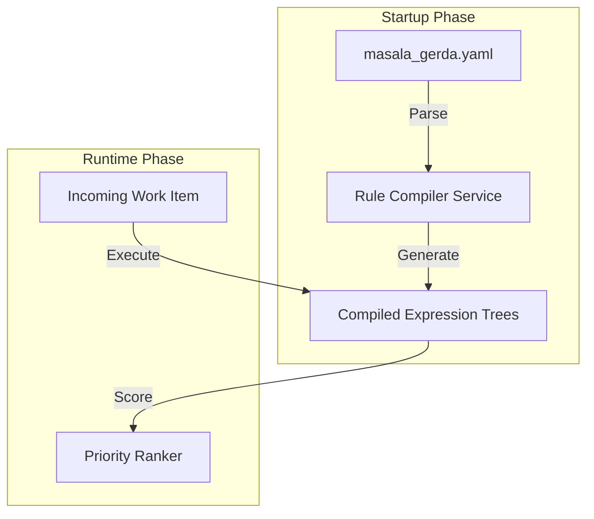

# Feature Request: Multi-Domain Configuration Engine

## Overview
Enable Ticket Masala to operate across different domains (Tax Office, HR, Landscaping, IT Support) through YAML-based configuration without code changes.

## Problem Statement
Hard-coding business logic for different domains creates:
- Spaghetti code with `if (IsTax) { ... } else if (IsGarden) { ... }` statements
- Inability to adapt to new domains without developer intervention
- Maintenance nightmare when rules change

## Solution: Domain-Specific Language (DSL) Compiler

### Core Concept
- Define business logic in `masala_gerda.yaml` files
- Parse YAML at startup and compile to C# Expression Trees (`Func<WorkItem, float>`)
- Zero runtime interpretation overhead (compile once, execute thousands of times)

### Architecture

## Key Features

### 1. YAML Schema Definition
Define domain-specific rules for:
- **Routing weights** (skill matching, workload balance, affinity)
- **Priority algorithms** (WSJF, FIFO, custom scoring)
- **State transitions** (linear workflows vs. agile queues)
- **Validation rules** (field requirements, business constraints)

### 2. Context Switcher UI
- Dropdown to select active domain configuration
- Preview of active rules and weights
- Domain-specific dashboard layouts

### 3. Configuration Versioning
- Store `YamlHash` to detect configuration changes
- Audit trail of which config version was active for each decision
- Rollback capability

## Implementation Tasks

- [ ] Design YAML schema for domain configuration
- [ ] Build YAML parser and validator
- [ ] Implement Expression Tree compiler service
- [ ] Add configuration hot-reload capability
- [ ] Create UI for domain selection and preview
- [ ] Build configuration version control system
- [ ] Write unit tests for compiled rule execution
- [ ] Performance benchmark (target: <1ms per work item scoring)

## Demo Requirements

### Demo A: "Green Thumb Landscapes"
- **Workflow:** Linear state machine (Request → Quote → Planning → Execution → Sign-off)
- **Dispatch Logic:** Skill-based (Paving vs. Planting specialists)
- **Priority:** First-come-first-served with area-based complexity scoring

### Demo B: "Federal Tax Ops"
- **Workflow:** Priority queue with dynamic re-ranking
- **Dispatch Logic:** WSJF (Weighted Shortest Job First) + Affinity routing
- **Priority:** Debt risk score × urgency × compliance deadline

## Success Criteria

1. **Performance:** 10,000 work items scored in <10 seconds on commodity hardware
2. **Flexibility:** Add new domain without touching C# codebase
3. **Transparency:** Every dispatch decision explainable via config inspection
4. **Stability:** Configuration errors caught at startup, not runtime

## Technical Constraints

- Compile-time safety: Invalid YAML must fail startup with clear error messages
- Expression Trees must be stateless (no side effects)
- Standard library only (no external DSL engines like Roslyn scripting)

## References

- Interaction 1: "The 'Landscaping vs. Tax Office' Fallacy"
- Interaction 9: "The Tale of Two Yamls"
- Architecture Diagram: "Masala v2.1 Architecture"
