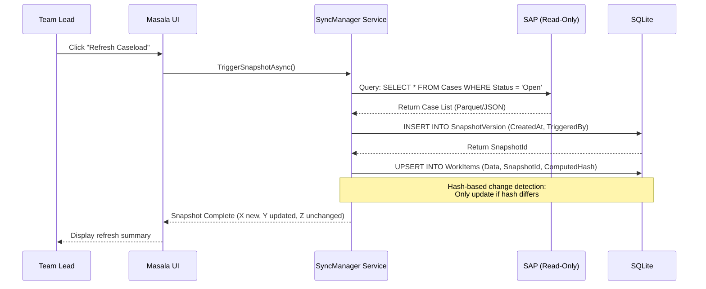

# Feature Request: SAP Snapshot Sync (On-Demand)

## Overview
Provide on-demand, read-only snapshots of SAP data for dispatching decisions while maintaining SAP as the single source of truth.

## Problem Statement

### Current State ("Excel Hell")
- Manual export of SAP case lists to Excel
- Copy-paste operations introduce errors and security risks
- Stale data: decisions made on outdated information
- No audit trail of data state at decision time
- PII exposed in uncontrolled spreadsheets

### The Risk
- **GDPR Violations:** Sensitive data in email attachments
- **Version Conflicts:** Multiple Excel files with different versions
- **Lost Context:** No record of what data looked like when decision was made

## Solution: The "Infernal Read" Collaborative Audit Tool

### Core Principles
1. **SAP is the Source of Truth:** Masala never writes back to SAP
2. **Snapshot Versioning:** Every import creates an immutable snapshot
3. **Audit Trail:** Link every dispatch decision to a snapshot version
4. **On-Demand Only:** Team leads trigger refresh, not automated polling

### Architecture



## Key Features

### 1. The Gatekeeper Service
- Polls configured SAP endpoints or file drops
- Supports multiple formats: Parquet, Typed JSON, CSV
- Validates data structure before ingestion
- Rejects malformed payloads with structured error reports

### 2. Hash-Based Change Detection
```csharp
var newHash = ComputeHash(rawData);
if (existingItem.ComputedHash != newHash) {
    existingItem.Data = rawData;
    existingItem.SnapshotId = currentSnapshotId;
    existingItem.ComputedHash = newHash;
}
```

### 3. Snapshot Audit Trail
```sql
CREATE TABLE SnapshotVersion (
    Id INTEGER PRIMARY KEY,
    CreatedAt DATETIME DEFAULT CURRENT_TIMESTAMP,
    TriggeredBy TEXT NOT NULL,
    RecordsImported INTEGER,
    RecordsUpdated INTEGER,
    RecordsUnchanged INTEGER
);

CREATE TABLE WorkItem (
    Id INTEGER PRIMARY KEY,
    Data TEXT NOT NULL, -- JSON blob
    SnapshotId INTEGER REFERENCES SnapshotVersion(Id),
    ComputedHash TEXT NOT NULL,
    Status TEXT -- Generated column from JSON
);
```

### 4. "Time Travel" Query Capability
```sql
-- What did Case #12345 look like when we made the dispatch decision on Dec 1?
SELECT Data FROM WorkItem 
WHERE Id = 12345 
  AND SnapshotId = (
    SELECT Id FROM SnapshotVersion 
    WHERE CreatedAt <= '2025-12-01' 
    ORDER BY CreatedAt DESC LIMIT 1
  );
```

## Implementation Tasks

- [ ] Build `SyncManager` service with configurable endpoints
- [ ] Implement hash-based change detection algorithm
- [ ] Create `SnapshotVersion` and link to `WorkItem` entities
- [ ] Build "Refresh Caseload" UI with progress indicator
- [ ] Add snapshot comparison view (diff between versions)
- [ ] Implement read-only enforcement (no write-back to SAP)
- [ ] Document handover format specification (Parquet schema)
- [ ] Create monitoring dashboard for sync health
- [ ] Add error handling for SAP connectivity issues

## Handover Format Specification

### Preferred: Apache Parquet
- **Why:** Type-safe, compressed, columnar format
- **Schema:** Defined by SAP team, validated by Douane service
- **Size:** 100k records ≈ 5MB compressed

### Fallback: Typed JSON
```json
{
  "snapshot_metadata": {
    "export_date": "2025-12-12T10:30:00Z",
    "sap_version": "S4HANA_2023",
    "record_count": 1523
  },
  "cases": [
    {
      "case_id": "TAX-2025-00123",
      "status": "Open",
      "debt_amount": 15000.00,
      "assigned_to": null,
      "created_at": "2025-11-15T08:00:00Z"
    }
  ]
}
```

## Integration with Douane (Validation Service)

The snapshot ingestion must pass through the **Douane validation gate**:
1. **Technical Layer:** Encoding, JSON structure, schema compliance
2. **Schema Layer:** Required fields, data types, foreign key integrity
3. **Business Layer:** Value ranges, enum validation, cross-field rules

Only validated snapshots are imported. Malformed data generates structured error reports for SAP team.

## Success Criteria

1. **Speed:** Import 10k records in <5 seconds
2. **Accuracy:** Hash-based detection catches 100% of changes
3. **Audit:** Every decision linkable to exact data state
4. **Safety:** Zero writes back to SAP, ever
5. **Reliability:** Graceful handling of SAP downtime (work from last snapshot)

## Security & Compliance

- **Access Control:** Only Team Leads and Managers can trigger sync
- **Logging:** Every snapshot creation logged with user ID and timestamp
- **Data Retention:** Snapshots older than 90 days archived or purged per GDPR
- **PII Protection:** Sensitive fields masked in UI unless user has elevated privilege

## Stakeholder Messaging

### To Management
"We eliminate 'Excel Shadow IT' and create a defensible audit trail. Every dispatch decision is now timestamped and linked to the exact data state, meeting Legal's requirements for decision transparency."

### To SAP Team
"Masala is a 'Read-Only Amplifier' for your data. We never touch the source of truth. If SAP is down, we work from the last snapshot. When SAP is back, we sync and catch up."

### To Operators
"No more copy-paste. Hit 'Refresh,' get the latest cases, and start dispatching. The system remembers what the data looked like when you made the decision, so you're protected if someone later claims 'the data was wrong.'"

## References

- Interaction 1: "SAP/Legacy Integration (The Bridge)"
- Interaction 6: "Module B: The SAP 'Snapshot' Sync"
- Architecture: "The Masala v2.1 Architecture Diagram"
