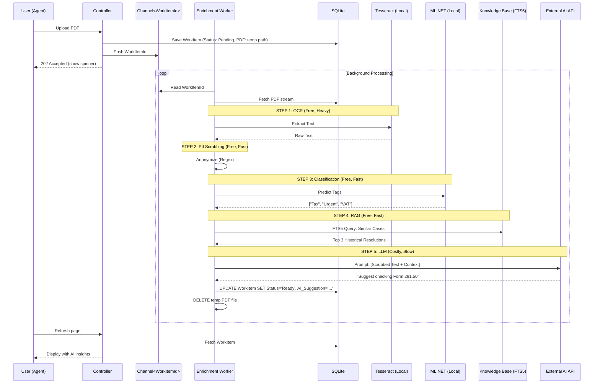
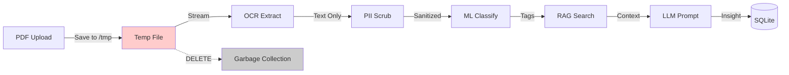

# Feature Request: Enrichment Pipeline (OCR/NLP/RAG)

## Overview
Process uploaded documents (PDFs, scanned letters) through an ephemeral pipeline that extracts text, classifies content, finds similar cases, and generates AI suggestions—without storing binary blobs.

## Problem Statement

### Current Risk: Shadow AI Usage
- Agents copy sensitive tax documents into public ChatGPT
- No PII protection, no audit trail, no cost control
- Legal and GDPR violations

### The Technical Challenge
- OCR is CPU-intensive and memory-hungry
- Running it on the main web thread causes UI freezes
- Storing PDFs in SQLite bloats the database and kills performance

## Solution: The "Ephemeral Pipeline"

### Core Principles
1. **Stream & Discard:** Never store the binary PDF, only extracted insights
2. **Background Processing:** Use `System.Threading.Channels` for async work
3. **PII Scrubbing First:** Strip sensitive data before it touches external APIs
4. **Local AI First, Cloud AI Last:** Use ML.NET for classification, LLM only for synthesis

### Architecture



## Key Features

### 1. OCR Engine (Local)
- **Technology:** Tesseract via `Charlesw.Tesseract` NuGet package
- **Constraints:**
  - Reject PDFs > 5 pages (to prevent CPU lock)
  - Bounded concurrency: max 2 OCR jobs in parallel
  - Timeout: kill OCR task after 30 seconds
  - Thread priority: `BelowNormal` to avoid starving web threads

### 2. PII Scrubber (The Anonymizer)
```csharp
public class PiiScrubber
{
    private static readonly Regex EmailRegex = new(@"[a-zA-Z0-9._%+-]+@[a-zA-Z0-9.-]+\.[a-zA-Z]{2,}", RegexOptions.Compiled);
    private static readonly Regex BeVatRegex = new(@"BE\s?0\d{9}", RegexOptions.Compiled);
    private static readonly Regex NissRegex = new(@"\d{2}\.\d{2}\.\d{2}-\d{3}\.\d{2}", RegexOptions.Compiled);
    
    public string Scrub(string text)
    {
        return NissRegex.Replace(
            BeVatRegex.Replace(
                EmailRegex.Replace(text, "[EMAIL_REDACTED]"),
                "[VAT_REDACTED]"
            ),
            "[NISS_REDACTED]"
        );
    }
}
```

### 3. ML.NET Classifier (Local)
- **Purpose:** Fast, zero-cost tagging (Department, Priority, Category)
- **Training:** Use historical Excel data or synthetic Bogus data
- **Model Format:** `.zip` file loaded at startup
- **Prediction Time:** <5ms per document

```csharp
var prediction = _mlContext.Model.CreatePredictionEngine<DocumentData, CategoryPrediction>(_model)
    .Predict(new DocumentData { Text = ocrText });
// prediction.Category = "Tax_VAT_Complaint"
```

### 4. RAG (Retrieval-Augmented Generation)
- **Knowledge Source:** SQLite FTS5 index of historical case resolutions
- **Query:** BM25 full-text search on scrubbed text
- **Output:** Top 3 similar cases with their resolutions
- **Cost:** Free, <10ms

```sql
SELECT s.Resolution, s.CaseId, rank 
FROM KnowledgeIndex i
JOIN ResolvedCases s ON s.Id = i.rowid
WHERE KnowledgeIndex MATCH ?
ORDER BY rank
LIMIT 3;
```

### 5. LLM Integration (External, Costly)
- **Prompt Engineering:**
```
You are a senior tax officer. A new case has arrived:

[SCRUBBED TEXT]

Here are 3 similar historical cases and their resolutions:
1. [Case #123]: Issue: ... Resolution: ...
2. [Case #456]: Issue: ... Resolution: ...
3. [Case #789]: Issue: ... Resolution: ...

Based ONLY on the historical resolutions, suggest a next step. Keep it under 50 words.
```

### 6. Governance Layer
- **Per-User Soft Cap:** Warning at 40 requests/hour
- **Per-User Hard Cap:** Reject at 50 requests/hour (return `429 Too Many Requests`)
- **Global Token Budget:** Track cumulative monthly token usage
- **Implementation:** `IMemoryCache` with sliding expiration

## Implementation Tasks

- [ ] Build `EnrichmentWorker` background service with bounded channel
- [ ] Integrate Tesseract OCR with page/file limits and timeouts
- [ ] Implement `PiiScrubber` service with regex patterns for BE identifiers
- [ ] Train ML.NET text classification model on sample data
- [ ] Build RAG connector to query SQLite FTS5 knowledge base
- [ ] Implement LLM prompt builder with context assembly
- [ ] Add governance service for soft/hard caps (memory cache)
- [ ] Create UI progress indicator for "Processing..." state
- [ ] Build admin dashboard for monitoring pipeline health
- [ ] Add error handling and retry logic for each pipeline stage
- [ ] Write integration tests for full pipeline flow
- [ ] Document PII patterns and update procedures

## Ephemeral Processing Flow



## Success Criteria

1. **Zero Blob Storage:** PDFs discarded after processing, database stays lean
2. **PII Protection:** 95%+ scrubbing accuracy for common patterns
3. **Performance:** Process 5-page PDF in <10 seconds end-to-end
4. **Cost Control:** Monthly AI spend capped at configured budget
5. **Resilience:** Pipeline failures don't crash web server; retries automatic

## Risk Mitigation

### The "Poisoned PDF" Attack
- **Risk:** Malicious 500-page PDF locks CPU
- **Mitigation:**
  - Reject files >10MB at upload
  - Page limit: 5 pages max
  - OCR timeout: 30 seconds hard limit
  - Kill switch: Admin can disable enrichment pipeline globally

### The "Bill Shock" Scenario
- **Risk:** Runaway LLM usage costs thousands
- **Mitigation:**
  - Hard cap per tenant
  - Real-time cost tracking dashboard
  - Alert at 80% of monthly budget
  - Auto-disable LLM at 100% budget, RAG-only mode continues

### The "GDPR Audit" Nightmare
- **Risk:** PII leak to external AI provider
- **Mitigation:**
  - Log every LLM call with scrubbed/original flag
  - Audit trail: What data was sent, when, by whom
  - Manual review: Random 5% sample of scrubbed text
  - Kill switch: Disable external AI, keep local pipeline running

## Integration Points

### With Douane (Validation Service)
- **Handoff:** Enrichment pipeline produces structured JSON
- **Validation:** Douane validates extracted data meets schema
- **Feedback:** Validation errors trigger re-processing or manual review

### With Atelier (Human-in-the-Loop UI)
- **Display:** Show AI suggestions as "hints," not commands
- **Override:** Agent can accept, reject, or modify suggestion
- **Feedback Loop:** Track suggestion acceptance rate to improve model

### With Knowledge Base
- **Bidirectional:** Pipeline queries KB for context, also contributes new insights back
- **Quality Signal:** If agent uses an AI suggestion and closes ticket successfully, boost KB snippets that were in the context

## Demo Scenario

### Setup
1. Upload scanned letter: "I moved to a new address, please update my tax file"
2. System response: "Processing... (202 Accepted)"

### Processing (Background)
1. OCR extracts: "Dear Tax Office, I have relocated to Rue de la Loi 123..."
2. PII Scrubber: "Dear Tax Office, I have relocated to [ADDRESS_REDACTED]..."
3. ML Classifier: Tags = ["Address_Change", "Routine", "Priority_Low"]
4. RAG Search: Finds 3 similar "Address Change" cases
5. LLM: "This is a standard address update. Verify new address in National Register (RN), update SAP field 'Current Address,' send confirmation letter."

### Result (UI)
```
✅ Document Processed

📝 Extracted Text: "Dear Tax Office, I have relocated to..."
🏷️  Tags: Address Change, Routine
💡 AI Suggestion: "Verify new address in RN, update SAP..."
📚 Related Cases: #TAX-2024-00453, #TAX-2024-01122, #TAX-2024-02987

[Accept Suggestion] [Modify] [Reject]
```

## References

- Interaction 2: "The Enrichment Pipeline Architecture"
- Interaction 3: "The Ephemeral Pipe"
- Interaction 6: "Module C: The Ephemeral AI Pipe"
