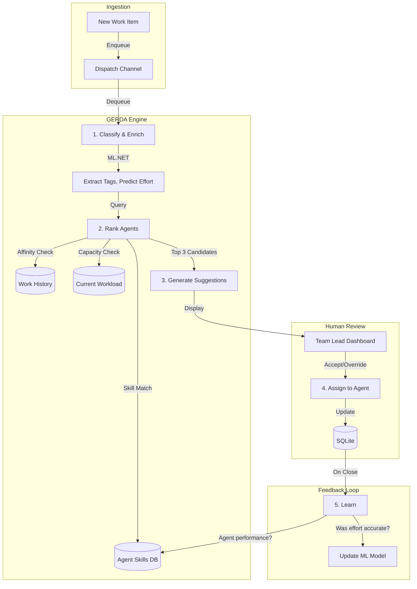

# Feature Request: GERDA Dispatch Engine

## Overview
Implement the **G**rouping, **E**valuation, **R**anking, and **D**ispatch **A**lgorithm (GERDA) for intelligent work item assignment based on multiple factors: workload, skills, affinity, priority, and SLA.

## Problem Statement

### Current State: Manual Assignment Hell
- Team leads manually assign cases from Excel lists
- No visibility into agent workload or capacity
- No skill matching: wrong agent gets wrong case
- No affinity tracking: customer calls 3 times, talks to 3 different people
- No priority intelligence: urgent cases buried under routine work

### The Risk
- **Burnout:** High performers get overloaded
- **Inefficiency:** Junior agents get complex cases they can't handle
- **Customer Frustration:** Repeat the same story to multiple agents
- **SLA Breaches:** Urgent work missed because it's not visible

## Solution: Multi-Factor Algorithmic Dispatching

### Core Algorithms

#### 1. WSJF (Weighted Shortest Job First)
**Formula:**
```
WSJF_Score = (BusinessValue + TimeCriticality + RiskReduction) / EstimatedEffort
```

**Implementation:**
```csharp
public float CalculateWsjf(WorkItem item)
{
    var businessValue = item.DebtAmount / 1000.0f; // Normalize to 0-100 scale
    var timeCriticality = DaysUntilDeadline(item) < 30 ? 100 : 50;
    var riskReduction = item.Tags.Contains("Fraud") ? 100 : 20;
    var estimatedEffort = _mlModel.PredictEffort(item); // ML.NET prediction
    
    return (businessValue + timeCriticality + riskReduction) / Math.Max(estimatedEffort, 1);
}
```

#### 2. Affinity Routing
**Goal:** Route customer back to the agent who handled them before

**Implementation:**
```sql
-- Find last agent who worked on this customer
SELECT TOP 1 AssignedTo 
FROM WorkItems 
WHERE CustomerId = @customerId 
  AND Status = 'Closed'
  AND AssignedTo IS NOT NULL
ORDER BY ClosedAt DESC;
```

**Boost:** If affinity agent is available, boost their match score by +50 points

#### 3. Skill Matching
**Schema:**
```sql
CREATE TABLE AgentSkills (
    AgentId TEXT,
    Skill TEXT, -- 'VAT', 'LEZ', 'Property_Tax'
    Proficiency INTEGER CHECK(Proficiency BETWEEN 1 AND 5)
);

CREATE TABLE WorkItemRequirements (
    WorkItemId INTEGER,
    RequiredSkill TEXT,
    MinimumProficiency INTEGER
);
```

**Matching Logic:**
```csharp
public bool HasRequiredSkills(Agent agent, WorkItem item)
{
    foreach (var req in item.RequiredSkills)
    {
        var skill = agent.Skills.FirstOrDefault(s => s.Name == req.Skill);
        if (skill == null || skill.Proficiency < req.MinimumProficiency)
            return false;
    }
    return true;
}
```

#### 4. Workload Balancing
**Capacity Model:**
```csharp
public class AgentCapacity
{
    public string AgentId { get; set; }
    public float MaxCapacity { get; set; } = 40.0f; // hours per week
    public float CurrentLoad { get; set; } // sum of estimated effort of active items
    
    public float AvailableCapacity => MaxCapacity - CurrentLoad;
    public float UtilizationRate => CurrentLoad / MaxCapacity;
}
```

**Balancing Rule:** Prefer agents with utilization < 80%

#### 5. The GERDA Master Algorithm

**Scoring Function:**
```csharp
public async Task<List<AgentMatch>> RankAgentsAsync(WorkItem item)
{
    var candidates = await _db.Agents
        .Where(a => a.IsActive && a.AvailableCapacity > 0)
        .ToListAsync();
    
    var scored = new List<AgentMatch>();
    
    foreach (var agent in candidates)
    {
        float score = 0;
        
        // 1. Skill Match (0-100)
        score += CalculateSkillMatch(agent, item);
        
        // 2. Affinity Bonus (0 or 50)
        if (agent.Id == GetLastAssignedAgent(item.CustomerId))
            score += 50;
        
        // 3. Workload Penalty (0 to -50)
        if (agent.UtilizationRate > 0.8f)
            score -= (agent.UtilizationRate - 0.8f) * 250; // Heavy penalty
        
        // 4. Experience Bonus (0-20)
        score += Math.Min(agent.YearsOfExperience * 2, 20);
        
        // 5. Same-Team Bonus (0 or 10)
        if (agent.TeamId == item.PreferredTeamId)
            score += 10;
        
        scored.Add(new AgentMatch 
        { 
            Agent = agent, 
            Score = score,
            Explanation = BuildExplanation(agent, item, score)
        });
    }
    
    return scored.OrderByDescending(m => m.Score).ToList();
}
```

## Architecture



## Key Features

### 1. Explainability Service
**Requirement:** Agents must understand WHY they got assigned a case.

**Implementation:**
```csharp
public class DispatchExplanation
{
    public string AgentName { get; set; }
    public float TotalScore { get; set; }
    public List<ScoreComponent> Breakdown { get; set; }
}

public class ScoreComponent
{
    public string Factor { get; set; } // "Skill Match", "Affinity", "Workload"
    public float Points { get; set; }
    public string Reasoning { get; set; }
}

// Example output:
// Agent: Marie Dupont (Score: 127)
//   - Skill Match: +85 (VAT Expert, 5/5 proficiency)
//   - Affinity: +50 (Handled this customer last month)
//   - Workload: -8 (82% capacity utilization)
//   - Experience: +10 (5 years in tax ops)
```

### 2. ML Effort Estimation
Train a model to predict case complexity:

**Training Data:**
```csv
CaseDescription,Tags,HistoricalEffort
"Simple address change",Address;Routine,0.5
"VAT exemption dispute with 50-page audit",VAT;Dispute;Complex,12.0
```

**Model:** ML.NET `FastTreeRegressor`

**Usage:**
```csharp
var prediction = _effortModel.Predict(new CaseData 
{ 
    Description = item.Description,
    Tags = string.Join("|", item.Tags)
});
// prediction.EstimatedHours = 3.2
```

### 3. Synthetic Data Seeder (Bogus)
For demo and training:

```csharp
public class DataSeeder
{
    public void SeedTaxCases(int count)
    {
        var faker = new Faker<WorkItem>()
            .RuleFor(w => w.Description, f => f.PickRandom(
                "Address change request",
                "VAT exemption inquiry",
                "Property tax assessment dispute",
                "LEZ fine appeal with evidence",
                "Fraud investigation referral"
            ))
            .RuleFor(w => w.DebtAmount, (f, w) => 
                w.Description.Contains("Fraud") ? f.Random.Float(50000, 500000) : f.Random.Float(100, 5000))
            .RuleFor(w => w.Priority, (f, w) => 
                w.Description.Contains("Fraud") ? "Urgent" : f.PickRandom("Routine", "Normal", "Urgent"))
            .RuleFor(w => w.CreatedAt, f => f.Date.Past(1));
        
        var cases = faker.Generate(count);
        _db.WorkItems.AddRange(cases);
        _db.SaveChanges();
    }
}
```

Generates realistic distributions: 80% routine, 15% normal, 5% urgent (Pareto principle).

### 4. Real-Time Dashboard
Display GERDA metrics:
- **Dispatch Success Rate:** % of suggestions accepted by team leads
- **Average Match Score:** Quality of agent-work pairings
- **Workload Distribution:** Histogram of agent utilization
- **SLA Compliance:** % of cases assigned within target time

## Implementation Tasks

- [ ] Design and implement `AgentSkills` and `AgentCapacity` tables
- [ ] Build WSJF priority calculator with configurable weights
- [ ] Implement affinity routing (customer-to-agent history lookup)
- [ ] Create skill matching algorithm with proficiency levels
- [ ] Build workload balancing service with capacity tracking
- [ ] Implement GERDA master scoring algorithm
- [ ] Build `DispatchExplanation` service for transparency
- [ ] Train ML.NET effort estimation model on historical data
- [ ] Create synthetic data seeder (Bogus) for demos
- [ ] Build team lead dashboard with top 3 agent suggestions
- [ ] Add "Accept/Override" UI with reasoning capture
- [ ] Implement feedback loop: track actual vs. estimated effort
- [ ] Build GERDA metrics dashboard
- [ ] Add dispatch decision audit trail
- [ ] Create A/B testing framework (manual vs. GERDA)

## Configuration (DSL Integration)

GERDA weights should be configurable via YAML:

```yaml
# masala_tax.yaml
dispatch:
  algorithm: GERDA
  weights:
    skill_match: 1.0
    affinity_bonus: 50
    workload_penalty: -250
    experience_bonus: 2.0
    same_team_bonus: 10
  
  wsjf:
    business_value_per_1k_debt: 1.0
    time_criticality_urgent: 100
    time_criticality_normal: 50
    risk_fraud: 100
    risk_routine: 20
  
  capacity:
    max_utilization: 0.85
    hours_per_week: 40
```

At startup, compile these weights into the scoring function.

## Success Criteria

1. **Accuracy:** GERDA suggestions accepted 80%+ of the time
2. **Balance:** No agent exceeds 90% utilization when others are below 70%
3. **Affinity:** 70% of repeat customers routed to same agent
4. **SLA:** 95% of urgent cases assigned within 1 hour
5. **Transparency:** 100% of agents can view and understand their assignment reasoning

## Demo Scenarios

### Scenario A: Workload Balancing
**Setup:**
- Agent A: 95% capacity (38/40 hours)
- Agent B: 60% capacity (24/40 hours)
- Both have VAT skills

**New VAT Case Arrives:**
- GERDA scores: Agent A = 85 (skill) - 37.5 (overload penalty) = 47.5
- GERDA scores: Agent B = 85 (skill) - 0 (penalty) = 85
- **Result:** Assign to Agent B

### Scenario B: Affinity Routing
**Setup:**
- Customer "Acme Corp" previously handled by Agent C
- Agent C: 75% capacity, VAT skill
- Agent D: 60% capacity, VAT skill (higher availability)

**New Acme Corp Case:**
- GERDA scores: Agent C = 85 (skill) + 50 (affinity) - 0 (penalty) = 135
- GERDA scores: Agent D = 85 (skill) + 0 (affinity) - 0 (penalty) = 85
- **Result:** Assign to Agent C (customer continuity wins)

### Scenario C: Skill Mismatch Protection
**Setup:**
- Complex fraud case requiring "Fraud Investigation" skill (proficiency ≥ 3)
- Agent E: Generalist (Fraud proficiency = 1)
- Agent F: Specialist (Fraud proficiency = 5), but 80% capacity

**New Fraud Case:**
- GERDA: Agent E = DISQUALIFIED (skill mismatch)
- GERDA: Agent F = 95 (skill) + 20 (experience) - 0 (still under threshold) = 115
- **Result:** Assign to Agent F (only qualified candidate)

## Integration Points

### With ML Effort Estimation
- GERDA uses predicted effort for WSJF calculation
- Feedback loop: track actual vs. predicted, retrain model monthly

### With Knowledge Base
- When displaying agent suggestions, show relevant KB snippets: "Agent C handled 12 similar VAT cases, see KB snippets: #456, #789"

### With SAP Snapshot
- GERDA operates on most recent snapshot data
- Decision audit trail includes snapshot version ID

### With Atelier (Review UI)
- Display GERDA suggestion with explanation
- Allow override with mandatory reasoning capture
- Track override patterns to improve algorithm

## Competitive Advantage

| Feature                     | Jira/Zendesk | ServiceNow | Masala GERDA |
| --------------------------- | ------------ | ---------- | ------------ |
| Skill-Based Routing         | ❌            | ✅ (manual) | ✅ (auto)     |
| Affinity Routing            | ❌            | ❌          | ✅            |
| Workload Balancing          | ❌            | ⚠️ (basic)  | ✅ (ML-based) |
| WSJF Priority               | ❌            | ❌          | ✅            |
| Dispatch Explainability     | ❌            | ❌          | ✅            |
| Config-Driven (No Code)     | ❌            | ❌          | ✅            |
| Local ML (No Cloud Costs)   | ❌            | ❌          | ✅            |

## References

- Interaction 1: "Intelligent ML-Based Dispatching (The Efficiency Engine)"
- Interaction 1: Priority 1 - GERDA (The Business Value)
- Architecture: "The Masala v2.1 Architecture Diagram"
- Backlog: S6-1 (GERDA Dashboard), S6-12 (Explainability), S6-18 (Algorithms)
