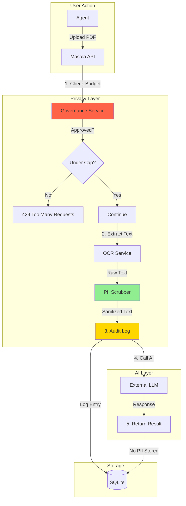

# Feature Request: Privacy & Governance Layer

## Overview
Implement a comprehensive privacy protection and governance framework to enable safe AI usage in a government context with strict GDPR compliance.

## Problem Statement

### The "Shadow AI" Crisis
- Agents copy sensitive tax documents into public ChatGPT
- PII (names, addresses, SSN, tax IDs) exposed to third-party AI providers
- No audit trail of what data was sent where
- No cost control: runaway API usage could cost thousands
- Legal liability: GDPR violations risk massive fines

### The Compliance Challenge
- **GDPR Article 5:** Data minimization—only process what's necessary
- **GDPR Article 32:** Implement appropriate technical measures for security
- **Belgian Data Protection Authority:** Requires audit trail for all PII processing
- **Budget Reality:** Government can't have surprise €5,000 OpenAI bills

## Solution: The Privacy Proxy Architecture

### Core Principles
1. **PII Scrubbing First:** Strip sensitive data before it leaves the perimeter
2. **Ephemeral Processing:** Never store PII longer than necessary
3. **Audit Everything:** Log what, when, who, and why for every AI call
4. **Cost Governance:** Hard caps to prevent bill shock
5. **Graceful Degradation:** If AI budget exhausted, fall back to local-only processing

### Architecture



## Key Features

### 1. PII Scrubber Service

**Target Patterns (Belgium-specific):**
- **National Number (NISS):** `12.34.56-789.01`
- **VAT Number:** `BE 0123456789` or `BE0123456789`
- **Email:** `john.doe@example.com`
- **Phone:** `+32 2 123 45 67`, `02/123.45.67`
- **IBAN:** `BE68 5390 0754 7034`
- **Addresses:** Street name + number patterns

**Implementation:**
```csharp
public class PiiScrubber
{
    // Compiled regexes for performance
    private static readonly Regex NissRegex = new(
        @"\d{2}\.\d{2}\.\d{2}-\d{3}\.\d{2}", 
        RegexOptions.Compiled
    );
    
    private static readonly Regex VatRegex = new(
        @"BE\s?0?\d{9,10}", 
        RegexOptions.Compiled | RegexOptions.IgnoreCase
    );
    
    private static readonly Regex EmailRegex = new(
        @"[a-zA-Z0-9._%+-]+@[a-zA-Z0-9.-]+\.[a-zA-Z]{2,}", 
        RegexOptions.Compiled
    );
    
    private static readonly Regex PhoneRegex = new(
        @"(\+32|0)\s?[1-9]\s?\d{1,2}[\s\./]?\d{2}[\s\./]?\d{2}[\s\./]?\d{2}", 
        RegexOptions.Compiled
    );
    
    private static readonly Regex IbanRegex = new(
        @"BE\d{2}\s?\d{4}\s?\d{4}\s?\d{4}", 
        RegexOptions.Compiled | RegexOptions.IgnoreCase
    );
    
    public ScrubResult Scrub(string text)
    {
        var scrubbed = text;
        var findings = new List<PiiFinding>();
        
        // Track what we found for audit
        scrubbed = NissRegex.Replace(scrubbed, match => {
            findings.Add(new PiiFinding { Type = "NISS", Original = match.Value });
            return "[NISS_REDACTED]";
        });
        
        scrubbed = VatRegex.Replace(scrubbed, match => {
            findings.Add(new PiiFinding { Type = "VAT", Original = match.Value });
            return "[VAT_REDACTED]";
        });
        
        scrubbed = EmailRegex.Replace(scrubbed, match => {
            findings.Add(new PiiFinding { Type = "Email", Original = match.Value });
            return "[EMAIL_REDACTED]";
        });
        
        scrubbed = PhoneRegex.Replace(scrubbed, "[PHONE_REDACTED]");
        scrubbed = IbanRegex.Replace(scrubbed, "[IBAN_REDACTED]");
        
        return new ScrubResult 
        { 
            ScrubbedText = scrubbed, 
            Findings = findings,
            RiskScore = CalculateRiskScore(findings)
        };
    }
    
    private float CalculateRiskScore(List<PiiFinding> findings)
    {
        // NISS = 100 points (most sensitive)
        // VAT/IBAN = 50 points
        // Email/Phone = 10 points
        var score = findings.Sum(f => f.Type switch {
            "NISS" => 100,
            "VAT" => 50,
            "IBAN" => 50,
            "Email" => 10,
            "Phone" => 10,
            _ => 0
        });
        
        return Math.Min(score, 100); // Cap at 100
    }
}

public class ScrubResult
{
    public string ScrubbedText { get; set; }
    public List<PiiFinding> Findings { get; set; }
    public float RiskScore { get; set; } // 0-100
}

public class PiiFinding
{
    public string Type { get; set; }
    public string Original { get; set; } // For audit only, never sent to AI
}
```

### 2. Governance Service (Budget Control)

**Two-Tier Cap System:**
- **Soft Cap (80% of budget):** Warning message, allow proceed
- **Hard Cap (100% of budget):** Block request, return 429

**Implementation:**
```csharp
public class GovernanceService
{
    private readonly IMemoryCache _cache;
    private const int HARD_CAP_HOURLY = 50;
    private const int SOFT_CAP_HOURLY = 40;
    private const int HARD_CAP_MONTHLY_TOKENS = 100_000;
    private const int SOFT_CAP_MONTHLY_TOKENS = 80_000;

    public async Task<BudgetCheckResult> CheckBudgetAsync(string userId, int estimatedTokens)
    {
        var hourlyKey = $"usage:hourly:{userId}:{DateTime.UtcNow:yyyyMMddHH}";
        var monthlyKey = $"usage:monthly:{DateTime.UtcNow:yyyyMM}";
        
        var hourlyUsage = _cache.GetOrCreate(hourlyKey, entry => {
            entry.AbsoluteExpiration = DateTime.UtcNow.AddHours(1);
            return 0;
        });
        
        var monthlyTokens = await _db.AiUsageLogs
            .Where(log => log.Timestamp >= DateTime.UtcNow.AddMonths(-1))
            .SumAsync(log => log.TokensUsed);
        
        // Hard cap checks
        if (hourlyUsage >= HARD_CAP_HOURLY)
            return BudgetCheckResult.Blocked("Hourly request limit exceeded");
        
        if (monthlyTokens + estimatedTokens > HARD_CAP_MONTHLY_TOKENS)
            return BudgetCheckResult.Blocked("Monthly token budget exhausted");
        
        // Soft cap warnings
        var warnings = new List<string>();
        if (hourlyUsage >= SOFT_CAP_HOURLY)
            warnings.Add($"You've used {hourlyUsage}/{HARD_CAP_HOURLY} requests this hour");
        
        if (monthlyTokens > SOFT_CAP_MONTHLY_TOKENS)
            warnings.Add($"Organization at {monthlyTokens:N0}/{HARD_CAP_MONTHLY_TOKENS:N0} tokens this month");
        
        // Increment counter
        _cache.Set(hourlyKey, hourlyUsage + 1);
        
        return warnings.Any() 
            ? BudgetCheckResult.Allowed(warnings) 
            : BudgetCheckResult.Allowed();
    }
}

public class BudgetCheckResult
{
    public bool IsAllowed { get; set; }
    public List<string> Warnings { get; set; } = new();
    public string BlockReason { get; set; }
    
    public static BudgetCheckResult Allowed(List<string> warnings = null) 
        => new() { IsAllowed = true, Warnings = warnings ?? new() };
    
    public static BudgetCheckResult Blocked(string reason) 
        => new() { IsAllowed = false, BlockReason = reason };
}
```

### 3. Audit Trail Service

**Schema:**
```sql
CREATE TABLE AiUsageLogs (
    Id INTEGER PRIMARY KEY,
    Timestamp DATETIME DEFAULT CURRENT_TIMESTAMP,
    UserId TEXT NOT NULL,
    Operation TEXT NOT NULL, -- 'Summarize', 'Classify', 'Suggest'
    
    -- Privacy
    PiiDetected BOOLEAN,
    RiskScore REAL, -- 0-100
    PiiTypes TEXT, -- JSON: ["NISS", "Email"]
    
    -- Cost
    Provider TEXT, -- 'OpenAI', 'Azure', 'Local'
    Model TEXT, -- 'gpt-4', 'gpt-3.5-turbo'
    TokensUsed INTEGER,
    EstimatedCost REAL,
    
    -- Context
    WorkItemId INTEGER,
    InputLengthChars INTEGER,
    OutputLengthChars INTEGER,
    
    -- Audit
    ScrubbedInput TEXT, -- Store scrubbed version only
    Response TEXT,
    Success BOOLEAN,
    ErrorMessage TEXT
);

CREATE INDEX idx_audit_user_time ON AiUsageLogs(UserId, Timestamp);
CREATE INDEX idx_audit_month ON AiUsageLogs(Timestamp);
```

**Logging:**
```csharp
public async Task LogAiCallAsync(AiCallLogEntry entry)
{
    var log = new AiUsageLog
    {
        UserId = entry.UserId,
        Operation = entry.Operation,
        PiiDetected = entry.ScrubResult.Findings.Any(),
        RiskScore = entry.ScrubResult.RiskScore,
        PiiTypes = JsonSerializer.Serialize(entry.ScrubResult.Findings.Select(f => f.Type)),
        Provider = "OpenAI",
        Model = entry.Model,
        TokensUsed = entry.TokensUsed,
        EstimatedCost = entry.TokensUsed * 0.00002f, // $0.02 per 1k tokens
        WorkItemId = entry.WorkItemId,
        ScrubbedInput = entry.ScrubResult.ScrubbedText, // Only scrubbed version
        Response = entry.Response,
        Success = entry.Success
    };
    
    _db.AiUsageLogs.Add(log);
    await _db.SaveChangesAsync();
}
```

### 4. Admin Dashboard

**Metrics to Display:**
- **Usage Trends:** Requests per day, tokens per month
- **Cost Projection:** "At current rate, monthly cost: €47"
- **PII Detection Rate:** "23% of requests contained PII (successfully scrubbed)"
- **Top Users:** Who uses AI most?
- **Risk Incidents:** Cases with RiskScore > 80
- **Model Distribution:** OpenAI vs. Local ML.NET

**Alerts:**
- Email admin when monthly budget hits 90%
- Alert when high-risk PII detected (NISS + Email in same document)
- Notify when user hits soft cap repeatedly

### 5. Graceful Degradation Strategy

**Fallback Modes:**

| AI Budget State | Behavior                                                               |
| --------------- | ---------------------------------------------------------------------- |
| < 50% used      | Full AI: OCR + ML.NET + LLM                                            |
| 50-80% used     | Warn users, continue                                                   |
| 80-95% used     | Disable LLM, keep local ML.NET classification                          |
| 95-100% used    | Warning: "AI budget low, only local processing available"              |
| 100%+ used      | Hard block external AI, RAG + KB search only                           |

**Implementation:**
```csharp
public async Task<string> GetAiSuggestionAsync(WorkItem item)
{
    var budget = await _governance.GetMonthlyBudgetStatusAsync();
    
    if (budget.PercentUsed < 0.95)
    {
        // Full AI pipeline
        return await _llm.GetSuggestionAsync(item);
    }
    else
    {
        // Fallback: RAG only
        var similar = await _kb.SearchAsync(item.Description, new[] {"EN", "FR"});
        return $"AI budget exhausted. Based on {similar.Count} similar cases, consider: {similar[0].Content}";
    }
}
```

## Implementation Tasks

- [ ] Build `PiiScrubber` service with Belgium-specific regex patterns
- [ ] Create `GovernanceService` with soft/hard cap enforcement
- [ ] Implement audit trail table and logging service
- [ ] Build admin dashboard for cost/usage monitoring
- [ ] Add PII detection accuracy testing (false positive/negative rates)
- [ ] Create alert system for budget thresholds
- [ ] Implement graceful degradation logic
- [ ] Build "AI Budget Status" widget for user dashboard
- [ ] Add manual review queue for high-risk scrubbing (RiskScore > 80)
- [ ] Create GDPR compliance report generator
- [ ] Document privacy architecture for Legal review
- [ ] Conduct penetration testing for PII leakage

## Testing Strategy

### 1. PII Scrubbing Unit Tests
```csharp
[Test]
public void Scrubber_DetectsNiss()
{
    var input = "Citizen 85.05.15-123.45 requested exemption";
    var result = _scrubber.Scrub(input);
    
    Assert.That(result.ScrubbedText, Does.Not.Contain("85.05.15"));
    Assert.That(result.ScrubbedText, Does.Contain("[NISS_REDACTED]"));
    Assert.That(result.Findings, Has.Count.EqualTo(1));
    Assert.That(result.Findings[0].Type, Is.EqualTo("NISS"));
}

[Test]
public void Scrubber_HandlesMultiplePiiTypes()
{
    var input = "Contact: john.doe@example.com, VAT: BE0123456789";
    var result = _scrubber.Scrub(input);
    
    Assert.That(result.Findings, Has.Count.EqualTo(2));
    Assert.That(result.RiskScore, Is.GreaterThan(50));
}
```

### 2. Governance Integration Tests
```csharp
[Test]
public async Task Governance_BlocksAtHardCap()
{
    // Simulate 50 requests in same hour
    for (int i = 0; i < 50; i++)
        await _governance.CheckBudgetAsync("user_123", 100);
    
    // 51st request should be blocked
    var result = await _governance.CheckBudgetAsync("user_123", 100);
    
    Assert.That(result.IsAllowed, Is.False);
    Assert.That(result.BlockReason, Does.Contain("limit exceeded"));
}
```

### 3. Audit Compliance Tests
```csharp
[Test]
public async Task AuditLog_NeverStoresOriginalPii()
{
    var input = "NISS: 85.05.15-123.45";
    var scrubbed = _scrubber.Scrub(input);
    
    await _audit.LogAiCallAsync(new AiCallLogEntry 
    { 
        ScrubResult = scrubbed,
        Response = "Suggestion..."
    });
    
    // Verify database
    var log = await _db.AiUsageLogs.OrderByDescending(l => l.Id).FirstAsync();
    Assert.That(log.ScrubbedInput, Does.Not.Contain("85.05.15"));
    Assert.That(log.ScrubbedInput, Does.Contain("[NISS_REDACTED]"));
}
```

## Success Criteria

1. **PII Protection:** 98%+ detection rate on test corpus
2. **Cost Control:** Zero budget overruns in first 6 months
3. **Compliance:** Pass GDPR audit with zero findings
4. **Transparency:** 100% of AI calls logged and auditable
5. **Performance:** Scrubbing adds <50ms latency

## Legal/Compliance Messaging

### To Data Protection Officer
"We implement 'Privacy by Design' per GDPR Article 25. PII is scrubbed via compiled regex patterns before leaving the secure perimeter. All AI interactions are logged with scrubbed data only, providing full audit trail without storing sensitive information. Hard budget caps prevent uncontrolled data processing."

### To Finance
"AI usage is capped at €50/month with automatic alerts at 80% threshold. Current projection based on pilot usage: €23/month average. Cost per case processed: €0.15. ROI: AI reduces manual review time by 40%, saving €2,000/month in labor costs."

### To IT Security
"External AI calls are routed through a governance proxy that enforces rate limits, logs all requests, and scrubs PII. In case of API key compromise, blast radius is limited to 50 requests/hour per user. Kill switch available to disable external AI immediately while keeping local processing operational."

## References

- Interaction 2: "The Enrichment Pipeline"
- Interaction 3: "The Governance Layer (The CFO's Best Friend)"
- Interaction 6: "We build privacy preprocessor and knowledge base integration"
- Backlog: S6-13 (Privacy, Governance & LLM Safety)
