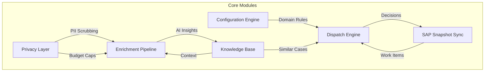

# Feature Request Documentation - Index

This directory contains structured feature request documents extracted from the architectural brainstorming sessions for the Ticket Masala / Dynamo project.

## Document Structure

Each feature document follows this template:
- **Overview:** High-level summary
- **Problem Statement:** Current pain points and risks
- **Solution:** Architectural approach and core principles
- **Key Features:** Detailed component breakdown
- **Implementation Tasks:** Concrete checklist for development
- **Success Criteria:** Measurable outcomes
- **References:** Links to original brainstorm interactions

## Core Features

### [01 - Multi-Domain Configuration Engine](./01-multi-domain-configuration.md)
**Innovation:** DSL Compiler for domain-agnostic business logic

Enable the system to operate across different verticals (Tax Office, HR, Landscaping, IT Support) through YAML-based configuration that compiles to C# Expression Trees at startup. Zero runtime interpretation overhead.

**Key Capabilities:**
- YAML → Expression Tree compilation
- Domain context switcher UI
- Configuration versioning and rollback
- Two demo configs (Landscaping vs. Tax)

**Why It Matters:** Proves the "Config-as-Code" innovation that commercial tools cannot match without breaking their consulting revenue model.

---

### [02 - SAP Snapshot Sync (On-Demand)](./02-sap-snapshot-sync.md)
**Innovation:** Immutable snapshot audit trail

Provide on-demand, read-only snapshots of SAP data with version tracking. Every dispatch decision is linked to a specific data state, creating defensible audit trail.

**Key Capabilities:**
- On-demand snapshot trigger (no auto-polling)
- Hash-based change detection
- Snapshot version linkage to work items
- "Time travel" queries (what did data look like when we decided?)

**Why It Matters:** Eliminates "Excel Hell" and Shadow IT while maintaining SAP as single source of truth. Solves data governance and GDPR audit requirements.

---

### [03 - Enrichment Pipeline (OCR/NLP/RAG)](./03-enrichment-pipeline.md)
**Innovation:** Ephemeral processing with PII protection

Process uploaded documents through a background pipeline (OCR → Classify → RAG → LLM) without storing binary blobs. Scrub PII before external API calls.

**Key Capabilities:**
- Async background worker (System.Threading.Channels)
- Local Tesseract OCR with bounded concurrency
- ML.NET text classification (zero cloud cost)
- SQLite FTS5 RAG (retrieval-augmented generation)
- LLM integration with governance caps

**Why It Matters:** Solves the "Shadow AI" crisis—agents using public ChatGPT with sensitive data. Provides sanctioned, auditable, cost-controlled AI access.

---

### [04 - Knowledge Base (Twitter-Style)](./04-knowledge-base-twitter-style.md)
**Innovation:** Self-ranking atomic knowledge stream

Lightweight KB modeled after Twitter: atomic snippets with hashtags, usage-based ranking (MasalaRank), and verified badges. No folders, no wiki friction.

**Key Capabilities:**
- Atomic snippet ingestion (50-300 words)
- Hashtag-based organization
- MasalaRank: `(UsageCount × 10) + (Verified × 50) + (FTS_Rank × -1)`
- Implicit feedback loop (link snippet → ticket → usage++)
- Multi-language support with user preference filtering

**Why It Matters:** Traditional enterprise wikis fail due to contribution friction and stale content. MasalaRank surfaces best answers automatically via collective usage patterns.

---

### [05 - GERDA Dispatch Engine](./05-gerda-dispatch-engine.md)
**Innovation:** Multi-factor algorithmic dispatching

**G**rouping, **E**valuation, **R**anking, and **D**ispatch **A**lgorithm. Intelligent work assignment based on WSJF priority, skill matching, affinity routing, and workload balancing.

**Key Capabilities:**
- WSJF (Weighted Shortest Job First) prioritization
- Affinity routing (customer → same agent)
- Skill-based matching with proficiency levels
- Workload-aware balancing (avoid overload)
- Dispatch explainability (show why agent was chosen)
- ML.NET effort estimation

**Why It Matters:** Replaces manual Excel-based assignment with data-driven optimization. Prevents burnout, improves customer experience, and reduces SLA breaches.

---

### [06 - Privacy & Governance Layer](./06-privacy-governance.md)
**Innovation:** Privacy Proxy Architecture

Comprehensive GDPR-compliant framework for AI usage: PII scrubbing (local regex), budget caps (soft/hard), audit trail, and graceful degradation.

**Key Capabilities:**
- Belgium-specific PII scrubber (NISS, VAT, IBAN, etc.)
- Two-tier budget caps (hourly + monthly)
- Complete audit trail (no PII stored in logs)
- Admin dashboard for cost/usage monitoring
- Graceful degradation (LLM → Local ML → RAG-only)

**Why It Matters:** Enables safe AI adoption in government context. Prevents GDPR violations, controls costs, and provides full auditability for compliance audits.

---

### [07 - Competitive Positioning](./07-competitive-positioning.md)
**Strategic:** Innovation defense and market positioning

Documentation of unique value proposition and moat vs. Jira/ServiceNow/Zendesk. Three-pillar innovation stack defense.

**Key Arguments:**
1. **DSL Compiler:** Config-as-Code beats "Click-Ops" GUI configuration
2. **Privacy Proxy:** Local PII scrubbing beats "trust us" vendor promises
3. **MasalaRank:** Usage-based ranking beats chronological/manual curation

**Pitch Scripts:**
- To Professor: "I'm not building a ticketing system, I'm building three novel architectural patterns"
- To IT Director: "5-year TCO: €10k (Masala) vs. €120k (Jira)"
- To Legal: "This solves the 'Shadow AI' compliance nightmare"

**Why It Matters:** Prevents the "why not use Jira?" objection and secures project approval from academic, business, and legal stakeholders.

---

## Cross-Cutting Concerns

### Technology Stack
- **Backend:** .NET 8 (C#), ASP.NET Core MVC
- **Database:** SQLite with Write-Ahead Logging (WAL), FTS5 virtual tables
- **AI/ML:** ML.NET (local), OpenAI/Azure (external with governance)
- **Background Processing:** System.Threading.Channels
- **OCR:** Tesseract (Charlesw.Tesseract NuGet)
- **Configuration:** YAML → Expression Trees

### Architectural Principles
1. **Monolith First:** Single container, single database, zero latency
2. **Compile Over Interpret:** YAML rules compiled at startup
3. **Local Over Cloud:** ML.NET before LLM, FTS5 before vector DB
4. **Ephemeral Over Persistent:** Stream & discard (PDFs), store only insights
5. **Usage Over Curation:** Implicit feedback beats manual tagging

### Integration Points

## Implementation Roadmap

### Phase 1: Core Platform (Weeks 1-4)
- [ ] SQLite schema with FTS5 indexes
- [ ] WorkItem and WorkContainer entities
- [ ] Basic MVC scaffolding
- [ ] SAP snapshot ingestion (manual trigger)
- [ ] Config loader (YAML → C# objects)

### Phase 2: Intelligence Layer (Weeks 5-8)
- [ ] GERDA dispatch algorithm (WSJF + skill match)
- [ ] ML.NET effort estimation model
- [ ] Knowledge Base (atomic snippets + FTS5)
- [ ] MasalaRank scoring implementation

### Phase 3: AI & Privacy (Weeks 9-10)
- [ ] PII scrubber service
- [ ] Governance layer (budget caps)
- [ ] Enrichment pipeline (OCR + ML + RAG + LLM)
- [ ] Audit trail and compliance dashboard

### Phase 4: Polish & Demo (Weeks 11-12)
- [ ] Two demo configs (Landscaping + Tax)
- [ ] Synthetic data seeder (Bogus)
- [ ] UI polish and responsive design
- [ ] Documentation and pitch deck

## Demo Scenarios

### Demo A: "Green Thumb Landscapes"
- **Config:** Linear workflow (Request → Quote → Planning → Execution → Sign-off)
- **Dispatch:** Skill-based (Paving specialists vs. Planting specialists)
- **Data:** Synthetic landscaping projects (mowing, terraces, pools)

### Demo B: "Federal Tax Operations"
- **Config:** Priority queue with WSJF scoring
- **Dispatch:** Affinity + workload balancing + urgency
- **Data:** Synthetic tax cases (address changes, VAT disputes, fraud investigations)

### Demo C: "Privacy Proxy in Action"
- **Setup:** Upload PDF with NISS and email
- **Result:** Show scrubbed text sent to LLM, audit log entry, cost tracking

## Success Metrics

### Academic (Professor)
- ✅ Grade ≥ 16/20
- ✅ Recognition of technical complexity and innovation
- ✅ Demonstration of Expression Tree compilation
- ✅ Live demo of config-driven domain switching

### Business (Tax Office)
- ✅ 10-agent pilot approval
- ✅ 80% adoption rate within 30 days
- ✅ 30% reduction in dispatch time (vs. manual Excel)
- ✅ Zero GDPR compliance findings in audit

### Technical
- ✅ Dispatch 10k items in <10 seconds
- ✅ KB search latency <50ms
- ✅ PII scrubbing accuracy >98%
- ✅ Zero AI budget overruns (hard cap enforced)

## References

All documents are derived from the brainstorming sessions documented in:
- `brainstorm-features.md` (parent document)
- Interactions 1-12 with Strategic Communications Lead and Principal Architect Ticket Masala

## Contributing

When adding new features:
1. Use the existing template structure
2. Include mermaid diagrams for architecture
3. Provide concrete code examples (C# or SQL)
4. Define success criteria
5. Link to original brainstorm interaction

## License & IP

This documentation is part of the Project Atom initiative. Code and architecture are proprietary to the Brussels Tax Office implementation ("Dynamo"). The generic framework ("Ticket Masala") may be open-sourced post-graduation with appropriate IP separation.
