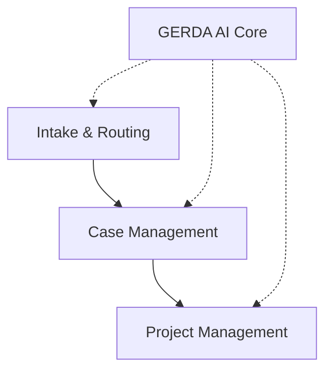

# Projectnota: Ticket Masala

> **AI-gestuurd, flexibel platform voor workflowbeheer**

---

## Inhoudsopgave

1. [Projectoverzicht](#1-projectoverzicht)
2. [Teamleden](#2-teamleden)
3. [Probleemanalyse en Oplossing](#3-probleemanalyse-en-oplossing)
4. [Technische Architectuur](#4-technische-architectuur)
5. [Gedetailleerde Analyse & Design](#5-gedetailleerde-analyse--design)
6. [Sprint-documentatie](#6-sprint-documentatie)
7. [Reflectie & Volgende Stappen](#7-reflectie--volgende-stappen)

---

## 1. Projectoverzicht

### 1.1 Elevator Pitch
Ticket Masala is een **AI-gestuurd, flexibel platform voor workflowbeheer**. Het werkt op basis van configuratie, waardoor het de vaak rigide, domeinspecifieke IT-ticketing systemen een serieuze boost geeft.

Het systeem lost het probleem van vastgelegde bedrijfslogica op door **YAML-regels om te zetten in snelle C#-code**. Bovendien maakt het gebruik van een ingebouwde AI-tool (**GERDA**) voor slimme triage en prioritering. Zo zijn maximale flexibiliteit, privacy en schaalbaarheid gegarandeerd.

### 1.2 Visie
We vervangen traditionele IT-ticketing door een flexibel platform dat diverse processen ondersteunt. Of het nu gaat om administratieve afhandeling, HR-verzoeken of technische incidenten: het systeem fungeert als een universele interface die zich aanpast zonder dat er aanvullende broncode geschreven hoeft te worden.

**Doelgroepen:**
- **Gebruikers:** Burgers en medewerkers die diensten afnemen.
- **Uitvoerders:** Supportteams en dossierbeheerders.
- **Management:** Teamleiders en afdelingshoofden verantwoordelijk voor overzicht.
- **IT-Beheer:** Systeembeheerders verantwoordelijk voor continuïteit en beheer.

### 1.3 Belangrijkste functionaliteiten
- **Dynamische configuratie:** Gebruik van YAML-regels voor domeinspecifieke workflows en logica.
- **Gegevensverwerking:** Directe extractie van gegevens via OCR, NLP en RAG.
- **Kennisbeheer:** Een zelfregulerende kennisbank met geavanceerde ranking (MasalaRank).

---

## 2. Teamleden

Ons multidisciplinaire team combineert technische expertise met domeinkennis (juridisch, beleid, risicobeheer).

| Naam | Achtergrond | Rol binnen Project |
| :--- | :--- | :--- |
| **Juan** | Jurist-Econoom, AI/Data Science | **Domain & Data Architect**: Vertaalt complexe regels naar business logica (YAML). |
| **Maarten** | Fullstack Developer (C#, TS) | **Lead Developer & Architect**: De technische motor; verantwoordelijk voor de backend en compiler. |
| **Charlotte** | Risk Specialist, Projectmanagement | **Project Manager & QA**: Bewaakt de scope, enterprise-eisen en beheert risico's (Shadow AI). |
| **Wito** | Policy Officer, Strategy Consulting | **Strategist & Integration Engineer**: Focus op sector-overstijgende inzet en backend-integratie. |

---

## 3. Probleemanalyse en Oplossing

### 3.1 Probleemdefinitie
Traditionele systemen missen flexibiliteit:
- **Rigide Datamodellen:** Hard-coded entiteiten maken simpele uitbreidingen omslachtig.
- **Onderhoudsnachtmerrie:** Bedrijfslogica begraven in 'spaghetti-code'.
- **Risico op 'Shadow AI':** Gebruikers vluchten naar publieke LLM's wegens gebrek aan veilige interne AI.
- **Prestatie-uitdagingen:** Trage extractie van niet-geïndexeerde velden uit JSON.

### 3.2 Oplossing: Architectuurmodel

1. **Intake & routering:** Dynamische intake en automatische routering van verzoeken.
2. **Case Management:** Centrale werkomgeving voor medewerkers en dossierbeheer.
3. **Project Management:** Strategisch overzicht op meta-niveau.
4. **GERDA AI (Core):**
   - **G**rouping: Clustert gerelateerde meldingen.
   - **E**stimating: Voorspelt inspanning (Story Points).
   - **R**anking: Bepaalt prioriteit en matcht vaardigheden.
   - **D**ispatching: Automatische toewijzing.
   - **A**nalyzing: Proactieve monitoring van SLA's.

---

## 4. Technische Architectuur

### 4.1 De Tech Stack
- **Backend:** .NET 10 (ASP.NET Core MVC).
- **Frontend:** Razor Views met **HTMX** (Server-Side Rendering).
- **Database:** EF Core met **SQLite** (WAL Mode) + JSONB-style indexing.
- **Infrastructuur:** Docker & Fly.io.
- **AI:** ML.NET (In-Process) + OpenAI-integratie (via Privacy Proxy).

### 4.2 Architecturale Bouwstenen
- **Modulaire Monoliet:** Geen microservices-complexiteit; "In-Process" scheiding.
- **Compiled Rule Engine:** YAML-regels worden bij startup gecompileerd naar C#-code (Expression Trees) voor O(1) performance.
- **Lite Doctrine:** Gebruik van `System.Threading.Channels` en `IMemoryCache` in plaats van zware externe brokers.

### 4.3 Risico-Mitigatie

| Risico | Oplossing |
| :--- | :--- |
| **Trage Regel-Engine** | **Compilatie**: Omzetten naar native Expression Trees. |
| **Invoer Overbelasting** | **Ontkoppeling**: Gatekeeper API met asynchrone worker. |
| **Data-lekken** | **Privacy Proxy**: PII Scrubbing vóór externe AI-verwerking. |

---

## 5. Gedetailleerde Analyse & Design

### 5.1 Design Thinking
We kozen voor een **Modular Monolith met Compiled Rule Engine**. Dit biedt de snelheid van native code met de flexibiliteit van low-code systemen.

### 5.2 Marktanalyse (SWOT)

| Sterktes | Zwaktes |
| :--- | :--- |
| O(1) Performance via compilatie | Complexiteit van versioning |
| GDPR-proof AI (Privacy Proxy) | Vereist diepe .NET expertise |
| TCO Voordeel (Geen licentiekosten) | Geen externe vendor support |

| Kansen | Bedreigingen |
| :--- | :--- |
| Vraag naar Veilige AI (anti-Shadow AI) | "Buy vs. Build" vooroordeel |
| Digitale Soevereiniteit (Overheid/MKB) | Gevestigde orde (ServiceNow/Salesforce) |

### 5.3 Universeel Entiteitsmodel (UEM)
Om domein-agnostisch te zijn, praten we intern over:
- **Work Item**: Het kleinste deel werk (Ticket/Dossier).
- **Work Container**: Verzameling items (Project/Portfolio).
- **Work Handler**: De uitvoerder (Behandelaar/Agent).
- **Customer**: De aanvrager (Burger/Cliënt).

---

## 6. Sprint-documentatie

### Sprints 1 & 2: Fundering
- **Focus:** Architectuur, UEM, authenticatie.
- **Hoogtepunten:** Rolgebaseerde beveiliging en Custom Fields Engine.

### Sprint 3: API & Workflow
- **Focus:** REST API & Rule Engine.
- **Hoogtepunten:** Deployment op Fly.io en initiële Rule Compiler.

### Sprint 4: Intelligence (GERDA)
- **Focus:** AI-integratie en zoekfunctionaliteit.
- **Hoogtepunten:** ML.NET integratie en Feature Extraction.

### Sprint 5: UX & Dashboarding
- **Focus:** KPI-visualisatie en batch-operaties.
- **Hoogtepunten:** Manager Dashboard en projectpromotie.

### Sprint 6: Finalisatie
- **Focus:** Klantenportaal en demo-gereedheid.
- **Hoogtepunten:** Data-isolatie en Landscaping Demo.

---

## 7. Reflectie & Volgende Stappen

### Geleerde Lessen
1. **De Genericiteit Paradox:** De frontend flexibel maken was uitdagender dan de backend data.
2. **Architectuur als Strategie:** De monolith-keuze was essentieel voor onze snelheid.
3. **Shadow AI:** De 'Privacy Proxy' bleek onze sterkste commerciële troef.

### Volgende Stappen (Roadmap v4.0)
- **Uitleg-API:** AI-aanbevelingen transparant maken.
- **Feedback Loop:** Het systeem laten leren van handmatige correcties.
- **Lokaal LLM:** Volledig on-premise samenvattingen draaien.

---
*Gegenereerd door het Ticket Masala Team - December 2025*
