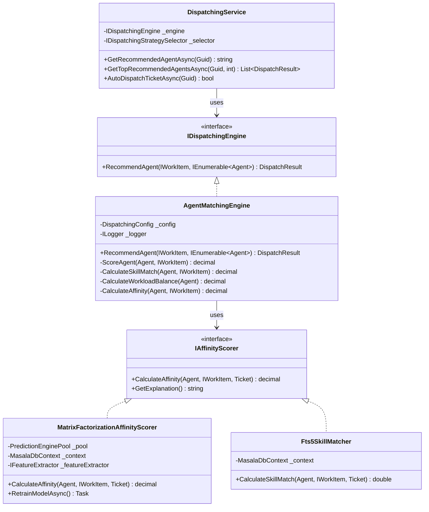

# RFC: Consolidate GERDA Dispatching Implementations

**Status**: Proposed  
**Author**: AI Architecture Review  
**Date**: 2025-04-27  
**Related**: `MatrixFactorizationDispatchingStrategy.cs`, `AgentMatchingEngine.cs`, `DispatchingService.cs`

---

## Summary

GERDA currently has **two competing dispatching implementations** that create maintenance burden and confusion. This RFC proposes consolidating to a single architecture using the **Adapter pattern**, with `AgentMatchingEngine` as the primary engine and `MatrixFactorizationDispatchingStrategy` refactored as an affinity scoring adapter.

---

## Problem Statement

### Current State (Anti-Pattern)

```
┌─────────────────────────────────────────────────────────────┐
│                    IDispatchingService                        │
│                     (single interface)                        │
└─────────────────────────────────────────────────────────────┘
                              │
                              ▼
┌─────────────────────────────────────────────────────────────┐
│              DispatchingService (orchestrator)                │
│  ┌─────────────────────────────────────────────────────────┐  │
│  │  Path A: Strategy-based                               │  │
│  │  - GetTopRecommendedAgentsAsync()                     │  │
│  │  - Uses MatrixFactorizationDispatchingStrategy        │  │
│  │  - ~400 lines of ML + FTS5 + scoring                  │  │
│  └─────────────────────────────────────────────────────────┘  │
│  ┌─────────────────────────────────────────────────────────┐  │
│  │  Path B: Generic Engine (UNUSED)                        │  │
│  │  - GetRecommendedAgentByEngine() ← private, never     │  │
│  │    called                                               │  │
│  │  - Uses AgentMatchingEngine                             │  │
│  └─────────────────────────────────────────────────────────┘  │
└─────────────────────────────────────────────────────────────┘
```

### Evidence of Confusion

**Dead code in `DispatchingService.cs`:**
```csharp
// Line ~200-230: Private method exists but is NEVER called
private DispatchResult GetRecommendedAgentByEngine(Ticket ticket, List<Agent> availableAgents)
{
    var workItem = new TicketWorkItemAdapter(ticket);
    var result = _agentMatchingEngine.RecommendAgent(workItem, availableAgents);
    // ... never integrated into main flow
}
```

**Duplicate abstractions:**
- `DispatchResult` (in `Dispatching/`) vs `DispatchResultModel` (in `Dispatching/Models/`)
- `Agent` (in `Dispatching/Models/`) vs `Employee` (domain entity)

### Impact

| Issue | Severity | Notes |
|-------|----------|-------|
| Maintenance burden | High | Two code paths to keep in sync |
| Cognitive overhead | High | Developers unclear which is "correct" |
| Test duplication | Medium | Tests needed for both paths |
| Feature divergence | Medium | New features added to wrong path |

---

## Proposed Architecture

### Target Design (Adapter Pattern)



### Key Design Decisions

1. **AgentMatchingEngine becomes the primary engine**
   - Clean, generic, well-tested
   - Configurable via `DispatchingConfig` weights
   - No ML dependencies in core logic

2. **ML becomes an `IAffinityScorer` adapter**
   - Matrix Factorization scoring extracted to separate class
   - Pluggable into the engine
   - Can be disabled/null if ML unavailable

3. **Preserve all existing capabilities**
   - ML.NET Matrix Factorization predictions
   - SQLite FTS5 skill matching
   - Multi-factor scoring (skill + workload + affinity + geo + language)
   - Explainability (reasons for each recommendation)

---

## Implementation Plan

### Phase 1: Extract Interfaces (Week 1)

```csharp
// New file: Engine/GERDA/Dispatching/IAffinityScorer.cs
public interface IAffinityScorer
{
    decimal CalculateAffinity(Agent agent, IWorkItem workItem, Ticket ticket);
    string GetExplanation(Agent agent, decimal score);
    bool IsAvailable { get; }
}

// New file: Engine/GERDA/Dispatching/ISkillMatcher.cs
public interface ISkillMatcher
{
    double CalculateSkillMatch(Agent agent, IWorkItem workItem, Ticket ticket);
    bool IsAvailable { get; }
}
```

### Phase 2: Create Adapter Implementations (Week 1-2)

**MatrixFactorizationAffinityScorer** (extract from existing strategy):
```csharp
public class MatrixFactorizationAffinityScorer : IAffinityScorer
{
    private readonly PredictionEnginePool<AgentCustomerRating, RatingPrediction> _pool;
    private readonly MasalaDbContext _context;
    
    public decimal CalculateAffinity(Agent agent, IWorkItem workItem, Ticket ticket)
    {
        // Extract ML scoring logic from MatrixFactorizationDispatchingStrategy
        var input = new AgentCustomerRating
        {
            AgentId = agent.Id,
            CustomerId = ticket.CreatorGuid.ToString()
        };
        
        var prediction = _pool.Predict("GerdaDispatchModel", input);
        return (decimal)prediction.Score;
    }
    
    public async Task RetrainModelAsync() 
    { 
        // Move retraining logic here
    }
}
```

**Fts5SkillMatcher** (extract FTS5 logic):
```csharp
public class Fts5SkillMatcher : ISkillMatcher
{
    private readonly MasalaDbContext _context;
    
    public double CalculateSkillMatch(Agent agent, IWorkItem workItem, Ticket ticket)
    {
        // Extract FTS5 query logic from MatrixFactorizationDispatchingStrategy
        // Lines ~180-210 in current implementation
    }
}
```

### Phase 3: Enhance AgentMatchingEngine (Week 2)

Modify `AgentMatchingEngine` to accept optional scorers:

```csharp
public class AgentMatchingEngine : IDispatchingEngine
{
    private readonly DispatchingConfig _config;
    private readonly IAffinityScorer? _affinityScorer;
    private readonly ISkillMatcher? _skillMatcher;
    
    public AgentMatchingEngine(
        DispatchingConfig config,
        ILogger<AgentMatchingEngine> logger,
        IAffinityScorer? affinityScorer = null,
        ISkillMatcher? skillMatcher = null)
    {
        _config = config;
        _affinityScorer = affinityScorer;
        _skillMatcher = skillMatcher;
    }
    
    private decimal CalculateAffinity(Agent agent, IWorkItem workItem, Ticket ticket)
    {
        // Use ML scorer if available, otherwise return neutral (50m)
        if (_affinityScorer?.IsAvailable == true)
        {
            return _affinityScorer.CalculateAffinity(agent, workItem, ticket);
        }
        return 50m; // Neutral when ML unavailable
    }
    
    private decimal CalculateSkillMatch(Agent agent, IWorkItem workItem, Ticket ticket)
    {
        // Use FTS5 if available, otherwise fallback to string matching
        if (_skillMatcher?.IsAvailable == true)
        {
            return (decimal)_skillMatcher.CalculateSkillMatch(agent, workItem, ticket);
        }
        // Fallback to existing regex-based matching
        return CalculateFallbackSkillMatch(agent, workItem);
    }
}
```

### Phase 4: Refactor DispatchingService (Week 3)

```csharp
public class DispatchingService : IDispatchingService
{
    private readonly IDispatchingEngine _engine;  // Single engine!
    private readonly MasalaDbContext _context;
    private readonly IDispatchingStrategySelector _strategySelector;
    
    // Remove: IStrategyFactory (no longer needed)
    // Remove: IAutoDispatchPolicy (move logic to engine)
    // Remove: IProjectManagerRecommendationService (separate concern)
    
    public async Task<List<DispatchResult>> GetTopRecommendedAgentsAsync(Guid ticketGuid, int count = 3)
    {
        var ticket = await _context.Tickets.FindAsync(ticketGuid);
        if (ticket == null) return new List<DispatchResult>();
        
        var agents = await GetAgentsForTicketAsync(ticket);
        var workItem = new TicketWorkItemAdapter(ticket);
        
        var results = new List<DispatchResult>();
        foreach (var agent in agents)
        {
            var result = _engine.RecommendAgent(workItem, new[] { agent });
            results.Add(MapToDispatchResult(result, agent));
        }
        
        return results.OrderByDescending(r => r.Score).Take(count).ToList();
    }
}
```

### Phase 5: Deprecate Legacy Strategy (Week 4)

1. Mark `MatrixFactorizationDispatchingStrategy` as `[Obsolete]`
2. Make it a thin wrapper that delegates to new components
3. Update all tests to use new architecture
4. Remove in v2.0

---

## Migration Path

### For Existing Consumers

| Current Usage | Migration | Risk |
|--------------|-----------|------|
| `IDispatchingService.GetRecommendedAgentAsync()` | No change | Low |
| `IDispatchingStrategy` implementations | Move to `IAffinityScorer` | Medium |
| `StrategyFactory` reflection | Use DI registration | Medium |
| `MatrixFactorizationDispatchingStrategy` directly | Inject `IAffinityScorer` | High |

### Backward Compatibility

```csharp
// Extension method for transition period
public static class DispatchingExtensions
{
    [Obsolete("Use IDispatchingEngine.RecommendAgent instead")]
    public static async Task<List<DispatchResult>> GetRecommendedAgentsLegacyAsync(
        this IDispatchingService service, 
        Guid ticketGuid, 
        int count = 3)
    {
        return await service.GetTopRecommendedAgentsAsync(ticketGuid, count);
    }
}
```

---

## Testing Strategy

### Unit Tests
```csharp
public class AgentMatchingEngineTests
{
    [Fact]
    public void RecommendAgent_WithHighSkillMatch_ReturnsHighScore()
    [Fact]
    public void RecommendAgent_WithHighWorkload_PenalizesScore()
    [Fact]
    public void RecommendAgent_WithAffinityScorer_UsesMLScore()
    [Fact]
    public void RecommendAgent_WithoutAffinityScorer_UsesNeutralScore()
}

public class MatrixFactorizationAffinityScorerTests
{
    [Fact]
    public void CalculateAffinity_WithValidModel_ReturnsPrediction()
    [Fact]
    public void CalculateAffinity_WithMissingModel_ReturnsZero()
    [Fact]
    public async Task RetrainModel_WithSufficientData_CreatesNewModel()
}
```

### Integration Tests
- End-to-end dispatching with real ML model
- Fallback behavior when ML unavailable
- Performance: <100ms for 50 agents

---

## Risks & Mitigations

| Risk | Likelihood | Impact | Mitigation |
|------|------------|--------|------------|
| ML model incompatibility | Medium | High | Keep old strategy as wrapper during transition |
| Performance regression | Low | Medium | Benchmark before/after; parallel scoring |
| Test breakage | High | Low | Maintain legacy tests until cleanup |
| Feature loss | Low | High | Comprehensive capability checklist |

### Capability Checklist

- [ ] ML.NET Matrix Factorization predictions
- [ ] SQLite FTS5 skill matching
- [ ] Workload-based penalty
- [ ] Multi-language matching
- [ ] Geography matching
- [ ] Explanation/reason generation
- [ ] Auto-dispatch with threshold
- [ ] Model retraining
- [ ] Fallback when ML unavailable
- [ ] Hot model reloading

---

## Success Criteria

1. **Single engine path**: `DispatchingService` calls only `IDispatchingEngine`
2. **No dead code**: `GetRecommendedAgentByEngine` method removed
3. **Test parity**: All existing tests pass with new architecture
4. **Performance**: No regression in agent scoring (<50ms per agent)
5. **Maintainability**: -30% lines of code in dispatching module

---

## Timeline

| Phase | Duration | Deliverable |
|-------|----------|-------------|
| 1: Interfaces | 3 days | PR with new interfaces |
| 2: Adapters | 5 days | PR with extracted implementations |
| 3: Engine integration | 5 days | PR with enhanced engine |
| 4: Service refactor | 5 days | PR with simplified service |
| 5: Cleanup | 2 days | PR with legacy deprecation |
| **Total** | **20 days** | **4-5 PRs, backward compatible** |

---

## Open Questions

1. Should `AgentMatchingEngine` support parallel agent scoring? (Performance vs. complexity)
2. Should we cache `IWorkItem` feature extraction across scorers?
3. How to handle strategy-specific configuration (previously in `GerdaConfig`)?

---

*Ready for review. Please comment with concerns or alternative approaches.*
