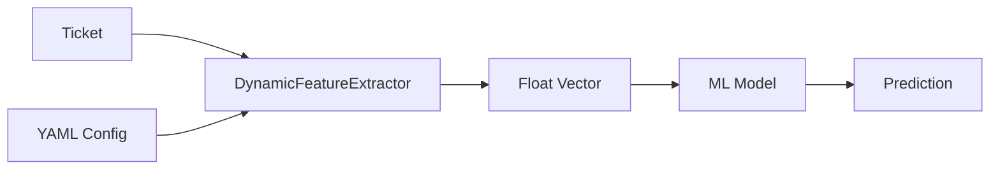

# Ticket Masala - Architecture Documentation

**Version:** 3.0 (Configuration Engine)
**Date:** December 2025
**Status:** Living Document

---

## 1. Executive Summary

Ticket Masala has evolved from a domain-specific ticketing system into a **generic, configuration-driven work management engine**. While preserving its "Modular Monolith" roots, it now embraces an **"In-Process" Architecture** to simplify operations while enabling infinite extensibility through YAML configuration.

### Core Philosophy: "Everything is Configurable"

| Concern | Old Approach (v1) | New Approach (v2) |
|---------|-------------------|-------------------|
| **Domain Logic** | Hardcoded C# classes | `masala_domains.yaml` configuration |
| **Data Schema** | Fixed SQL columns | Hybrid (SQL + JSONB) Entity Model |
| **Business Rules** | `if/else` statements | Compiled Expression Trees |
| **AI Strategy** | Hardcoded logic | Feature Extraction Pipeline + DI Factory |
| **Infrastructure** | Docker Composition | **In-Process** (.NET Channels, SQLite WAL) |

---

## 2. The "In-Process" Infrastructure (KISS)

We rely on **Logical Separation** rather than Physical Separation to reduce DevOps fatigue.

| "Enterprise" Component | Replacement (C#) | Why it works |
|------------------------|-----------------|--------------|
| **RabbitMQ** | `System.Threading.Channels` | High-performance in-memory messaging. |
| **Worker Service** | `IHostedService` | Background processing within the same OS process. |
| **Redis** | `IMemoryCache` | Zero-latency in-memory caching. |
| **PostgreSQL** | `SQLite (WAL Mode)` | Concurrent reads/writes single-file DB. |
| **Elasticsearch** | `SQLite FTS5` | Native full-text search. |

**Exit Strategy:** The domain core is agnostic to the persistence layer. EF Core provider can be swapped for SQL Server/Postgres when scaling beyond single-node capacity.

---

## 3. Configuration Extensibility

### 3.1 The Configuration Hierarchy

1. **Domain Config (`masala_domains.yaml`):** Defines entities, fields, workflows, and AI strategies.
2. **Queue Config (`masala_queues.yaml`):** Defines SLAs and operational parameters.
3. **Integration Config (`masala_integrations.yaml`):** Defines ingestion and outbound Webhooks.

### 3.2 Hybrid Data Model

Entities use a mix of structured relational columns and flexible JSON storage to support arbitrary domain fields without schema migrations.

```csharp
public class Ticket : BaseModel
{
    // Universal Fields (Indexable, Relational)
    public required Status TicketStatus { get; set; }
    public required string Description { get; set; }
    public string DomainId { get; set; } // "IT", "HR", "Legal"
    
    // Dynamic Fields (Domain-Specific)
    [Column(TypeName = "jsonb")]
    public string? CustomFieldsJson { get; set; } // {"soil_ph": 7.0, "tax_code": "US-CA"}
}
```

### 3.3 Configuration Versioning (Snapshot Strategy)

To ensure stability, business rules are versioned.

- **`DomainConfigVersion`**: Stores immutable snapshots of YAML config.
- **Ticket Link**: Tickets are linked to the `ConfigVersionId` active at their creation.
- **Rule Engine**: Validates transitions using the *exact rules* from the ticket's version.

---

## 4. Layered Architecture (Refined)

```text
┌─────────────────────────────────────────────────────────────┐
│                    Presentation Layer                        │
│              Controllers / Views / ViewModels                │
│              (Domain-Agnostic UI Components)                 │
├─────────────────────────────────────────────────────────────┤
│                    Application Layer                         │
│ Services:                                                   │
│  - DomainConfigurationService (YAML Reader)                 │
│  - RuleEngineService (Compiler)                             │
│  - DispatchingService (AI Coordinator)                      │
├─────────────────────────────────────────────────────────────┤
│                      Domain Layer                            │
│           Models (Ticket, DomainConfig, FeatureDef)          │
├─────────────────────────────────────────────────────────────┤
│                   Infrastructure Layer                       │
│    EfCoreRepositories │ DynamicFeatureExtractor │ AI Models  │
9─────────────────────────────────────────────────────────────┘
```

---

## 5. GERDA AI Subsystem (v2)

**GERDA** is now a **pluggable AI pipeline** rather than a hardcoded set of rules.

### 5.1 Strategy Factory Pattern

AI behaviors are injected dynamically based on domain configuration.

```csharp
// Config: dispatching: MatrixFactorization
var strategy = _strategyFactory.GetStrategy<IDispatchingStrategy>("MatrixFactorization");
```

### 5.2 Feature Extraction Pipeline

Instead of hardcoding "Ticket.Priority", we extract features dynamically.

1. **Configuration:** Defines input fields (`SourceField`) and transformations (`min_max`, `one_hot`).
2. **Extraction:** `DynamicFeatureExtractor` converts a Ticket into a `float[]` vector.
3. **Inference:** The Strategy uses the vector to query the ML model.



---

## 6. Service Architecture & Patterns

| Pattern | Implementation | Purpose |
|---------|----------------|---------|
| **Observer** | `Observers/` | Lifecycle hooks (auditing, notifications) |
| **Strategy** | `Services/GERDA/Strategies` | Pluggable algorithms (WSJF vs Seasonal) |
| **Factory** | `StrategyFactory` | Resolving implementations by config name |
| **Specification** | `Repositories/Specifications` | Encapsulated query logic |
| **Compiler** | `RuleCompilerService` | High-perf boolean rule evaluation |

---

## 7. Security & Compliance

- **Authentication:** ASP.NET Core Identity.
- **Tenancy:** Single-tenant, Multi-domain architecture.
- **Data Privacy:** All ML processing is **local** (In-Process/On-Prem). No external API calls for AI.

---

## 8. Development Roadmap

### Completed (v2 Baseline)

- [x] Configuration Engine (YAML -> Objects)
- [x] Hybrid Data Model (JSON Custom Fields)
- [x] Rule Compiler (Expression Trees)
- [x] Feature Extraction Pipeline

### Upcoming (v3)

- [ ] UI Localization (Domain-aware labels)
- [ ] Scriban-based Ingestion Mapper
- [ ] Event-Driven Gatekeeper API
