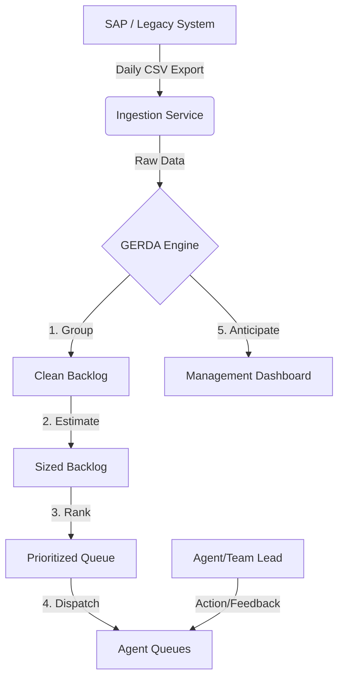

# 🦅 Project Dispatch: Intelligent Triage System (GERDA)

> **Consolidated Documentation**
>
> This document serves as the **Single Source of Truth** for "Project Dispatch" (formerly GERDA). It consolidates the Client Persona (Marc Dubois), Functional Specifications, Technical Architecture, and Roadmap into one master file.
>
> **Version:** 3.1 (Consolidated)
> **Date:** December 2025
> **Owner:** Juan Benjumea

---

## 1. Executive Summary

**Project Dispatch** is an AI-powered "Operational Overlay" designed to automate work allocation, prioritization, and capacity planning for the Brussels Fiscaliteit TAX department.

**The Narrative:** Large organizations rely on legacy "Systems of Record" (SAP) that are excellent for data storage but terrible for daily workflow management. Operations teams work blindly, manually assigning cases via spreadsheets, leading to burnout, cherry-picking, and lost revenue.

**The Solution:** Rather than replacing the €7M/year legacy stack, Dispatch builds a modern, intelligent cockpit *on top* of it. It ingests case data, applies the **G.E.R.D.A.** intelligence engine (Grouping, Estimating, Ranking, Dispatching, Anticipating), and presents a streamlined "Digital Twin" of operations to team leads and agents.

**Core Goal:** Maximize fiscal yield and protect agent capacity by delivering "The Right Case to the Right Agent at the Right Time."

---

## 2. Strategic Context & Persona: The "Why"

### User Persona: Marc Dubois (Director Project & IT)
* **Role:** IT Director at Brussels Fiscaliteit (382 FTE, €1.2B revenue managed).
* **Reality:** Reports to DG; must balance political constraints (SAP is "God") with operational crises.
* **The "€7M/Year Monster":** The current IT landscape (SAP ECC, SAP CRM, Qlik) costs €7M annually but fails to support basic efficient workflow.
* **The "Sophie Problem" (Institutional Knowledge Loss):** Expert agents (like "Sophie", 28 years tenure) are retiring. There is no system to capture their decision logic, leading to a "brain drain" where juniors make costly errors.
* **The "May Disaster" (Forecasting Failure):** In May 2024, a predictable policy change caused a 340% case spike. Because there was no forecasting, temps were hired 6 weeks too late, costing €180k in overtime and massive burnout.

### Operational Pain Points
1.  **Dispatch Chaos:** 98 team leads spend ~3 hours/day manually assigning cases (245 hours/day wasted).
2.  **Cherry Picking:** Agents pick easy cases to hit "closed case" targets, leaving complex, high-yield cases to breach SLAs.
3.  **Revenue Loss:** High-value cases (e.g., fraud investigations) are buried in the same queue as simple address changes.
4.  **No Feedback Loop:** Junior mistakes are only found when a citizen appeals (3 weeks later).

---

## 3. The Functional Solution: G.E.R.D.A. Engine

The "Secret Sauce" is the Intelligence Engine that processes the raw case backlog.

### **G — Grouping** (The Noise Filter) 🧹
*   **Problem:** One citizen sends 15 angry emails about the same issue, creating 15 tickets.
*   **Solution:** Rule-based clustering (K-Means or LINQ).
*   **Logic:** Bundle cases with same `TaxpayerId` + `Category` within 7 days.
*   **Tax Impact:** Agents handle 1 "Parent Case" instead of 15 fragments.

### **E — Estimating** (The Sizer) 📏
*   **Problem:** "1 Case" is a useless metric. A fine is 5 minutes; an audit is 5 days.
*   **Solution:** Multi-class classification model (Random Forest).
*   **Logic:** Features (`Category`, `DocCount`, `History`) $\rightarrow$ T-Shirt Size (S, M, L, XL) $\rightarrow$ **Fibonacci Points** (1, 3, 8, 13).
*   **Tax Impact:** Workforce capacity is measured in *Points*, not *Headcount*.

### **R — Ranking** (The Prioritizer) ⚖️
*   **Problem:** Cherry-picking and missed deadlines.
*   **Solution:** **Weighted Shortest Job First (WSJF)**.
*   **Formula:** $$Priority = \frac{\text{Cost of Delay (Urgency)}}{\text{Job Size (Points)}}$$
*   **Logic:** Urgent, high-revenue cases that are quick to solve rise to the top. Low-value, complex cases drop.

### **D — Dispatching** (The Matchmaker) 🤝
*   **Problem:** Junior Tom gets a case meant for Senior Sophie.
*   **Solution:** Matrix Factorization Recommender.
*   **Logic:** Affinity Score =
    *   40% **History** (Have I successfully helped this client before?)
    *   30% **Expertise** (Do I know this Tax Type?)
    *   20% **Language** (NL/FR match)
    *   10% **Region**
*   **Constraint:** Only dispatch if `CurrentWorkload < MaxCapacity`.

### **A — Anticipation** (The Weather Report) 🌦️
*   **Problem:** "We need temps" is always asked too late.
*   **Solution:** Time-series Forecasting (Prophet / SSA).
*   **Logic:** Decompose Seasonality + Trend from 3 years of history to predict 90 days out.
*   **Alert:** If `Predicted Inflow > Team Capacity` $\rightarrow$ Trigger "Director Alert".

---

## 4. Technical Architecture

Dispatch is a **White-Label .NET Core** application ("Ticket Masala") designed for modularity.

### Technology Stack
| Layer | Tech | Rationale |
| :--- | :--- | :--- |
| **Backend** | .NET 10.0 (C#) | Enterprise standard, SAP Connector compatibility. |
| **Database** | PostgreSQL / SQL Server | Relational integrity (EF Core). |
| **AI/ML** | ML.NET + Python (FastAPI) | Hybrid approach. ML.NET for embedded logic, Python for complex training. |
| **Frontend** | ASP.NET MVC / Blazor | Server-side rendering (SSR), fast, robust. |
| **Ingestion** | File Watcher $\rightarrow$ API | Starts with CSV/Excel drops (Pilot), moves to SAP API (Rollout). |

### Data Flow


### Configuration (`masala_config.json`)
Business logic is externalized to support different departments (Tax, Legal, HR) without code changes.

```json
{
  "work_queues": [
    {
      "name": "Hotel Tax",
      "categories": ["NTOF", "ENRM", "Fine"],
      "sla_defaults": { "NTOF": 30, "ENRM": 90 },
      "urgency_multipliers": { "NTOF": 2.0, "Fine": 3.0 }
    }
  ],
  "gerda_modules": {
    "dispatching": { "enabled": true, "affinity_weights": { "history": 0.4 } }
  }
}
```

---

## 5. Implementation Roadmap & Budget

### Phase 1: Pilot (The "Hacker" Phase) - Q1 2026
*   **Scope:** Tax Department (63 FTE).
*   **Integration:** **MANUAL / File-Based**.
    *   Historical Data: One-time Qlik CSV export.
    *   Daily Flow: Team leads drag-drop SAP CSV exports into Ticket Masala (15 mins/day).
*   **Cost:** ~€350k (Project Budget).
*   **Goal:** Prove ROI to unlock Phase 2.

### Phase 2: Industrialization (Rollout) - Q3 2026
*   **Scope:** Full Org (382 FTE).
*   **Integration:** **Real-time API**.
    *   Bi-directional sync with SCASEPS (SAP Case Mgmt).
    *   SSO Integration.
*   **Cost:** €800k - €1.2M.
*   **Risk:** Requires Security & Union approval.

### ROI Targets
*   **Financial:** Save **€2M/year** (Consultant reduction + Overtime elimination + SLA penalty avoidance).
*   **Operational:** Reduce dispatch time by **90%** (save 2.5 FTE/day).

---

## 6. Success Metrics (KPIs)

| Metric | Baseline (Manual) | Target (GERDA) |
| :--- | :--- | :--- |
| **Time to First Action** | 5-7 days | < 2 days |
| **SLA Breach Rate** | 23% | < 5% |
| **Coordinator Dispatch Time** | 3 hours/day | < 15 mins/day |
| **Revenue Yield** | Random | Optimized (+30%) |
| **User Adoption** | N/A | > 85% Recommendation Acceptance |

---

## 7. Stakeholders

*   **Sophie Claes (DG):** Needs a "Minister-ready success story". Political Veto.
*   **Isabelle Mertens (CFO):** Needs proven ROI. Budget Veto.
*   **Unions (ACOD/VSOA):** Need assurance it's not "surveillance". Legal Veto.
*   **"Sophie" (Expert Agent):** Needs to feel *helped*, not *replaced*. Adoption Key.

---

## Appendix A: Original Review Directive
*(From original Client Feedback interview)*

**Assignment:** Go through the entire Ticket Masala codebase, test the application, and write an honest, detailed **Gap Analysis & Review Document** (15-25 pages).
*   **Focus:** Can this actually replace the chaos? Is it technically sound?
*   **Output:** Markdown report with:
    1.  Executive Summary (Go/No-Go)
    2.  Functional Review (Must-haves vs Actuals)
    3.  Technical Review (Architecture, Scalability, Pilot Data via CSV)
    4.  Cost-Benefit Analysis
    5.  Final Recommendation (Tier 1-4)
